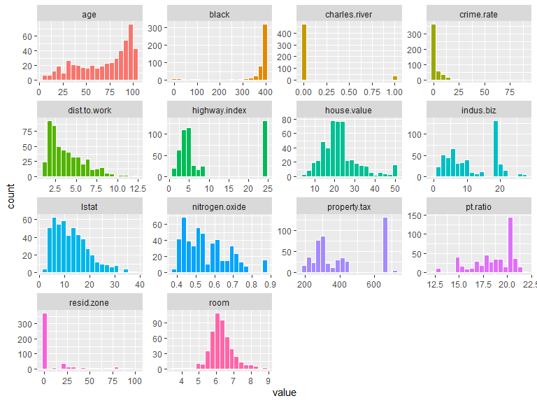
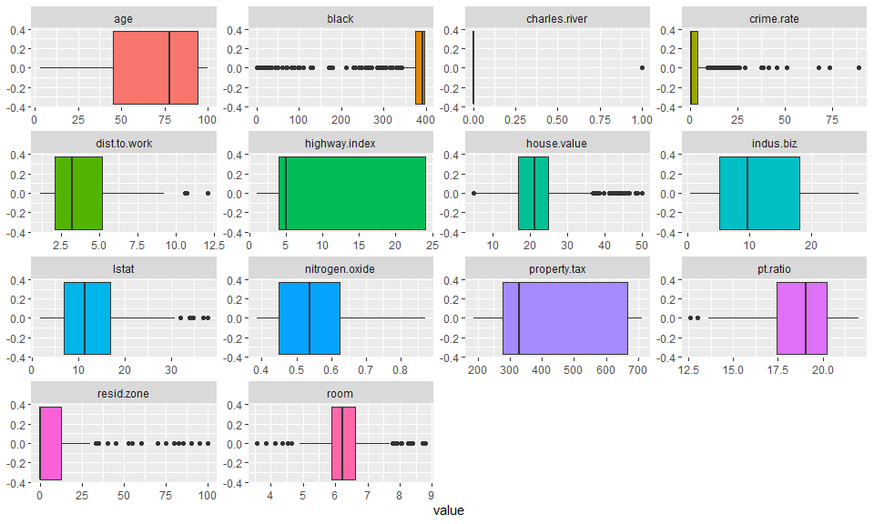
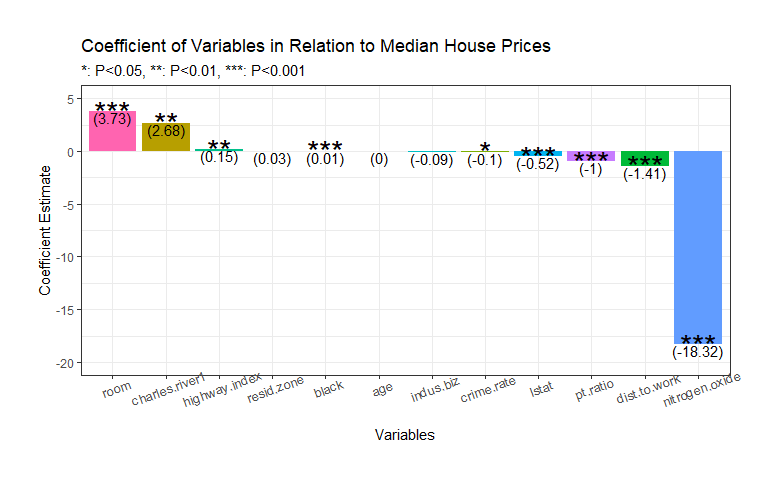
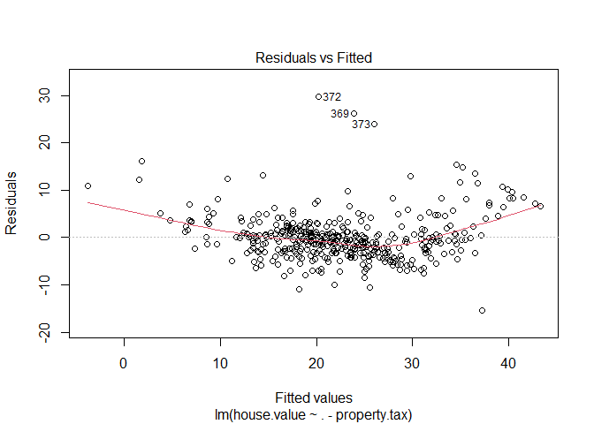
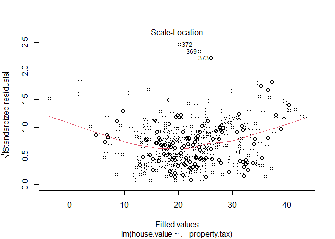
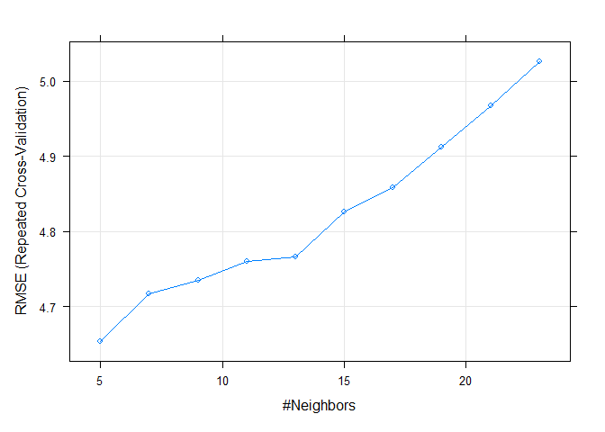
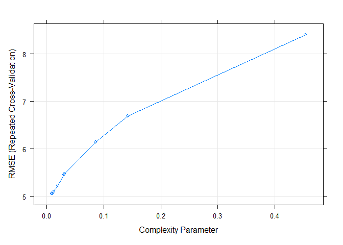
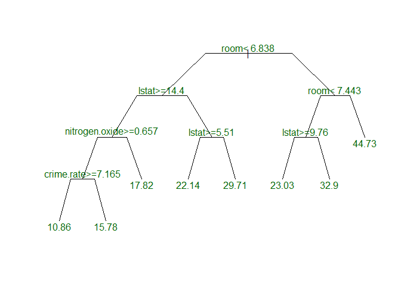
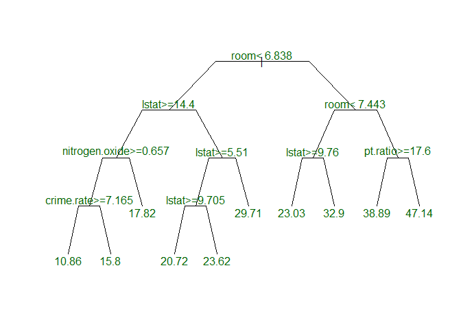
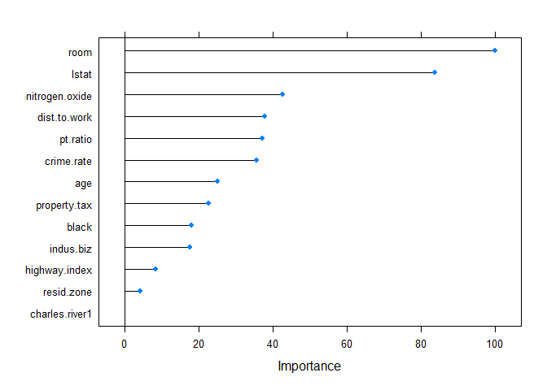

Boston House Prices - Regression Analysis in Machine Learning
================
Kar Ng
2021

-   [1 R PACKAGES](#1-r-packages)
-   [2 INTRODUCTION](#2-introduction)
-   [3 DATA PREPARATION](#3-data-preparation)
    -   [3.1 Data Import](#31-data-import)
    -   [3.2 Data Description](#32-data-description)
    -   [3.3 Data Exploration](#33-data-exploration)
-   [4 DATA CLEANING](#4-data-cleaning)
    -   [4.1 Column removal and
        factorise](#41-column-removal-and-factorise)
    -   [4.2 NA Imputation](#42-na-imputation)
-   [5 EXPLORATORY DATA ANALYSIS
    (EDA)](#5-exploratory-data-analysis-eda)
    -   [5.1 Distribution Study](#51-distribution-study)
    -   [5.2 Outliers Detection](#52-outliers-detection)
    -   [5.3 Relationships](#53-relationships)
    -   [5.4 Multicollinearity](#54-multicollinearity)
-   [5 Model Building](#5-model-building)
    -   [5.1 Train-test split](#51-train-test-split)
    -   [5.2 Multiple Linear Regression
        (MLR)](#52-multiple-linear-regression-mlr)
    -   [5.3 Assumption tests of Multiple Linear
        Regressions](#53-assumption-tests-of-multiple-linear-regressions)
    -   [5.4 Lasso](#54-lasso)
    -   [5.5 PLS](#55-pls)
    -   [5.6 KNN](#56-knn)
    -   [5.7 Decision Tree / CART](#57-decision-tree--cart)
    -   [5.8 Random Forest](#58-random-forest)
    -   [5.9 Stochastic gradient boosting (*XGBoost*
        in R)](#59-stochastic-gradient-boosting-xgboost-in-r)
    -   [6.0 Final Model Comparison](#60-final-model-comparison)
-   [6 Model for Production](#6-model-for-production)
-   [7 Conclusion](#7-conclusion)
-   [8 LEGALITY](#8-legality)
-   [9 REFERENCE](#9-reference)

------------------------------------------------------------------------


(*Picture by King of Hearts*)

------------------------------------------------------------------------

## 1 R PACKAGES

``` r
# R Libraries

library(tidyverse)
library(skimr)
library(caret)
library(MASS)
library(kableExtra)
library(qqplotr)
library(glmnet)
library(car)
library(corrplot)
library(mgcv)
library(randomForest)
library(doParallel)
library(pls)
library(tidytext)

# R setting

options(scipen = 0)
```

## 2 INTRODUCTION

This project uses a public dataset named “Boston” from the R package -
“MASS”. However, I have edited this dataset a bit to make overall
analysis a little more interesting and unique. First, I changed the
names of most of the columns into names that are more representative, it
won’t affect the analysis. Second, I induced some missing values in 2 of
the 14 columns, “black” and “lstat” and I will use R to impute the
missing values with algorithm.

In short, this Boston housing dataset studies the effects of a range of
variables on median house prices in Boston in late 70s, United States.

I will statistically analyse the dataset and make predictions with
machine learning algorithms. Then, I will find out the effects of each
variables on the median house prices and pick a model that has the
highest predictive power.

*Highlights of some upcoming graphs*


## 3 DATA PREPARATION

### 3.1 Data Import

This section import my specially edited dataset, this dataset has been
uploaded to my github.

Following is 10 rows of data randomly selected from the dataset.

``` r
boston <- read.csv("boston.csv")
sample_n(boston, 10)
```

    ##      X crime.rate resid.zone indus.biz charles.river nitrogen.oxide  room  age
    ## 1  309    0.49298        0.0      9.90             0          0.544 6.635 82.5
    ## 2   33    1.38799        0.0      8.14             0          0.538 5.950 82.0
    ## 3  186    0.06047        0.0      2.46             0          0.488 6.153 68.8
    ## 4   23    1.23247        0.0      8.14             0          0.538 6.142 91.7
    ## 5  216    0.19802        0.0     10.59             0          0.489 6.182 42.4
    ## 6  222    0.40771        0.0      6.20             1          0.507 6.164 91.3
    ## 7  202    0.03445       82.5      2.03             0          0.415 6.162 38.4
    ## 8  137    0.32264        0.0     21.89             0          0.624 5.942 93.5
    ## 9  358    3.84970        0.0     18.10             1          0.770 6.395 91.0
    ## 10  46    0.17142        0.0      6.91             0          0.448 5.682 33.8
    ##    dist.to.work highway.index property.tax pt.ratio  black lstat house.value
    ## 1        3.3175             4          304     18.4 396.90  4.54        22.8
    ## 2        3.9900             4          307     21.0 232.60 27.71        13.2
    ## 3        3.2797             3          193     17.8 387.11 13.15        29.6
    ## 4        3.9769             4          307     21.0 396.90 18.72        15.2
    ## 5        3.9454             4          277     18.6 393.63  9.47        25.0
    ## 6        3.0480             8          307     17.4 395.24 21.46        21.7
    ## 7        6.2700             2          348     14.7 393.77  7.43        24.1
    ## 8        1.9669             4          437     21.2 378.25 16.90        17.4
    ## 9        2.5052            24          666     20.2 391.34 13.27        21.7
    ## 10       5.1004             3          233     17.9 396.90 10.21        19.3

### 3.2 Data Description

The dataset has important information that may affect the price of a
house. For examples, crime rate, number of rooms in the house, nitrogen
oxides concentration, its proximity to industrial area, employment
centers, highways and etc.

Following are the description of features.

``` r
Variables <- names(boston[2:15])
Description <- c("Per capita crime rate by town.",
                 "Proportion of residential land zoned for lots over 25,000 sq.ft.",
                 "Proportion of non-retail business acres per town.",
                 "Charles River dummy variable (= 1 if tract bounds river; 0 otherwise).",
                 "Nitrogen oxides concentration (parts per 10 million).",
                 "Average number of rooms per dwelling.",
                 "Proportion of owner-occupied units built prior to 1940.",
                 "Weighted mean of distances to five Boston employment centres.",
                 "Index of accessibility to radial highways.",
                 "Full-value property-tax rate per per $10,000.",
                 "Pupil-teacher ratio by town.",
                 "1000(Bk - 0.63)^2 where Bk is the proportion of blacks by town.",
                 "lower status of the population (percent).",
                 "Median value of owner-occupied homes in per $1000s.")

data.frame(Variables, Description) %>% 
  kbl() %>% 
  kable_styling(bootstrap_options = c("hover", "bordered", "stripped"))
```

<table class="table table-hover table-bordered" style="margin-left: auto; margin-right: auto;">
<thead>
<tr>
<th style="text-align:left;">
Variables
</th>
<th style="text-align:left;">
Description
</th>
</tr>
</thead>
<tbody>
<tr>
<td style="text-align:left;">
crime.rate
</td>
<td style="text-align:left;">
Per capita crime rate by town.
</td>
</tr>
<tr>
<td style="text-align:left;">
resid.zone
</td>
<td style="text-align:left;">
Proportion of residential land zoned for lots over 25,000 sq.ft.
</td>
</tr>
<tr>
<td style="text-align:left;">
indus.biz
</td>
<td style="text-align:left;">
Proportion of non-retail business acres per town.
</td>
</tr>
<tr>
<td style="text-align:left;">
charles.river
</td>
<td style="text-align:left;">
Charles River dummy variable (= 1 if tract bounds river; 0 otherwise).
</td>
</tr>
<tr>
<td style="text-align:left;">
nitrogen.oxide
</td>
<td style="text-align:left;">
Nitrogen oxides concentration (parts per 10 million).
</td>
</tr>
<tr>
<td style="text-align:left;">
room
</td>
<td style="text-align:left;">
Average number of rooms per dwelling.
</td>
</tr>
<tr>
<td style="text-align:left;">
age
</td>
<td style="text-align:left;">
Proportion of owner-occupied units built prior to 1940.
</td>
</tr>
<tr>
<td style="text-align:left;">
dist.to.work
</td>
<td style="text-align:left;">
Weighted mean of distances to five Boston employment centres.
</td>
</tr>
<tr>
<td style="text-align:left;">
highway.index
</td>
<td style="text-align:left;">
Index of accessibility to radial highways.
</td>
</tr>
<tr>
<td style="text-align:left;">
property.tax
</td>
<td style="text-align:left;">
Full-value property-tax rate per per $10,000.
</td>
</tr>
<tr>
<td style="text-align:left;">
pt.ratio
</td>
<td style="text-align:left;">
Pupil-teacher ratio by town.
</td>
</tr>
<tr>
<td style="text-align:left;">
black
</td>
<td style="text-align:left;">
1000(Bk - 0.63)^2 where Bk is the proportion of blacks by town.
</td>
</tr>
<tr>
<td style="text-align:left;">
lstat
</td>
<td style="text-align:left;">
lower status of the population (percent).
</td>
</tr>
<tr>
<td style="text-align:left;">
house.value
</td>
<td style="text-align:left;">
Median value of owner-occupied homes in per $1000s.
</td>
</tr>
</tbody>
</table>

### 3.3 Data Exploration

The dataset has 506 rows of observations and 14 columns of variables.
All variables are numerically associated.

``` r
glimpse(boston) 
```

    ## Rows: 506
    ## Columns: 15
    ## $ X              <int> 1, 2, 3, 4, 5, 6, 7, 8, 9, 10, 11, 12, 13, 14, 15, 16, ~
    ## $ crime.rate     <dbl> 0.00632, 0.02731, 0.02729, 0.03237, 0.06905, 0.02985, 0~
    ## $ resid.zone     <dbl> 18.0, 0.0, 0.0, 0.0, 0.0, 0.0, 12.5, 12.5, 12.5, 12.5, ~
    ## $ indus.biz      <dbl> 2.31, 7.07, 7.07, 2.18, 2.18, 2.18, 7.87, 7.87, 7.87, 7~
    ## $ charles.river  <int> 0, 0, 0, 0, 0, 0, 0, 0, 0, 0, 0, 0, 0, 0, 0, 0, 0, 0, 0~
    ## $ nitrogen.oxide <dbl> 0.538, 0.469, 0.469, 0.458, 0.458, 0.458, 0.524, 0.524,~
    ## $ room           <dbl> 6.575, 6.421, 7.185, 6.998, 7.147, 6.430, 6.012, 6.172,~
    ## $ age            <dbl> 65.2, 78.9, 61.1, 45.8, 54.2, 58.7, 66.6, 96.1, 100.0, ~
    ## $ dist.to.work   <dbl> 4.0900, 4.9671, 4.9671, 6.0622, 6.0622, 6.0622, 5.5605,~
    ## $ highway.index  <int> 1, 2, 2, 3, 3, 3, 5, 5, 5, 5, 5, 5, 5, 4, 4, 4, 4, 4, 4~
    ## $ property.tax   <int> 296, 242, 242, 222, 222, 222, 311, 311, 311, 311, 311, ~
    ## $ pt.ratio       <dbl> 15.3, 17.8, 17.8, 18.7, 18.7, 18.7, 15.2, 15.2, 15.2, 1~
    ## $ black          <dbl> 396.90, 396.90, 392.83, 394.63, 396.90, NA, 395.60, 396~
    ## $ lstat          <dbl> 4.98, 9.14, 4.03, 2.94, 5.33, 5.21, 12.43, 19.15, 29.93~
    ## $ house.value    <dbl> 24.0, 21.6, 34.7, 33.4, 36.2, 28.7, 22.9, 27.1, 16.5, 1~

However, from the data description, “charles.river” is either 0 or 1,
and therefore it should be a categorical variable with a factor type in
R. The first variable has to be removed, and it will be done in the next
data cleaning section.

There are 12 and 17 missing data in the “black” and “lstat” column.
Fortunately, the completeness of these two variables are 97.6% and
96.6%. It is a matter of choice whether one wants to remove these values
or apply imputation techniques. I will go with the later as it is my
purpose of inducing these missing values.

``` r
skim_without_charts(boston)
```

<table style="width: auto;" class="table table-condensed">
<caption>
Data summary
</caption>
<thead>
<tr>
<th style="text-align:left;">
</th>
<th style="text-align:left;">
</th>
</tr>
</thead>
<tbody>
<tr>
<td style="text-align:left;">
Name
</td>
<td style="text-align:left;">
boston
</td>
</tr>
<tr>
<td style="text-align:left;">
Number of rows
</td>
<td style="text-align:left;">
506
</td>
</tr>
<tr>
<td style="text-align:left;">
Number of columns
</td>
<td style="text-align:left;">
15
</td>
</tr>
<tr>
<td style="text-align:left;">
\_\_\_\_\_\_\_\_\_\_\_\_\_\_\_\_\_\_\_\_\_\_\_
</td>
<td style="text-align:left;">
</td>
</tr>
<tr>
<td style="text-align:left;">
Column type frequency:
</td>
<td style="text-align:left;">
</td>
</tr>
<tr>
<td style="text-align:left;">
numeric
</td>
<td style="text-align:left;">
15
</td>
</tr>
<tr>
<td style="text-align:left;">
\_\_\_\_\_\_\_\_\_\_\_\_\_\_\_\_\_\_\_\_\_\_\_\_
</td>
<td style="text-align:left;">
</td>
</tr>
<tr>
<td style="text-align:left;">
Group variables
</td>
<td style="text-align:left;">
None
</td>
</tr>
</tbody>
</table>

**Variable type: numeric**

<table>
<thead>
<tr>
<th style="text-align:left;">
skim\_variable
</th>
<th style="text-align:right;">
n\_missing
</th>
<th style="text-align:right;">
complete\_rate
</th>
<th style="text-align:right;">
mean
</th>
<th style="text-align:right;">
sd
</th>
<th style="text-align:right;">
p0
</th>
<th style="text-align:right;">
p25
</th>
<th style="text-align:right;">
p50
</th>
<th style="text-align:right;">
p75
</th>
<th style="text-align:right;">
p100
</th>
</tr>
</thead>
<tbody>
<tr>
<td style="text-align:left;">
X
</td>
<td style="text-align:right;">
0
</td>
<td style="text-align:right;">
1.00
</td>
<td style="text-align:right;">
253.50
</td>
<td style="text-align:right;">
146.21
</td>
<td style="text-align:right;">
1.00
</td>
<td style="text-align:right;">
127.25
</td>
<td style="text-align:right;">
253.50
</td>
<td style="text-align:right;">
379.75
</td>
<td style="text-align:right;">
506.00
</td>
</tr>
<tr>
<td style="text-align:left;">
crime.rate
</td>
<td style="text-align:right;">
0
</td>
<td style="text-align:right;">
1.00
</td>
<td style="text-align:right;">
3.61
</td>
<td style="text-align:right;">
8.60
</td>
<td style="text-align:right;">
0.01
</td>
<td style="text-align:right;">
0.08
</td>
<td style="text-align:right;">
0.26
</td>
<td style="text-align:right;">
3.68
</td>
<td style="text-align:right;">
88.98
</td>
</tr>
<tr>
<td style="text-align:left;">
resid.zone
</td>
<td style="text-align:right;">
0
</td>
<td style="text-align:right;">
1.00
</td>
<td style="text-align:right;">
11.36
</td>
<td style="text-align:right;">
23.32
</td>
<td style="text-align:right;">
0.00
</td>
<td style="text-align:right;">
0.00
</td>
<td style="text-align:right;">
0.00
</td>
<td style="text-align:right;">
12.50
</td>
<td style="text-align:right;">
100.00
</td>
</tr>
<tr>
<td style="text-align:left;">
indus.biz
</td>
<td style="text-align:right;">
0
</td>
<td style="text-align:right;">
1.00
</td>
<td style="text-align:right;">
11.14
</td>
<td style="text-align:right;">
6.86
</td>
<td style="text-align:right;">
0.46
</td>
<td style="text-align:right;">
5.19
</td>
<td style="text-align:right;">
9.69
</td>
<td style="text-align:right;">
18.10
</td>
<td style="text-align:right;">
27.74
</td>
</tr>
<tr>
<td style="text-align:left;">
charles.river
</td>
<td style="text-align:right;">
0
</td>
<td style="text-align:right;">
1.00
</td>
<td style="text-align:right;">
0.07
</td>
<td style="text-align:right;">
0.25
</td>
<td style="text-align:right;">
0.00
</td>
<td style="text-align:right;">
0.00
</td>
<td style="text-align:right;">
0.00
</td>
<td style="text-align:right;">
0.00
</td>
<td style="text-align:right;">
1.00
</td>
</tr>
<tr>
<td style="text-align:left;">
nitrogen.oxide
</td>
<td style="text-align:right;">
0
</td>
<td style="text-align:right;">
1.00
</td>
<td style="text-align:right;">
0.55
</td>
<td style="text-align:right;">
0.12
</td>
<td style="text-align:right;">
0.38
</td>
<td style="text-align:right;">
0.45
</td>
<td style="text-align:right;">
0.54
</td>
<td style="text-align:right;">
0.62
</td>
<td style="text-align:right;">
0.87
</td>
</tr>
<tr>
<td style="text-align:left;">
room
</td>
<td style="text-align:right;">
0
</td>
<td style="text-align:right;">
1.00
</td>
<td style="text-align:right;">
6.28
</td>
<td style="text-align:right;">
0.70
</td>
<td style="text-align:right;">
3.56
</td>
<td style="text-align:right;">
5.89
</td>
<td style="text-align:right;">
6.21
</td>
<td style="text-align:right;">
6.62
</td>
<td style="text-align:right;">
8.78
</td>
</tr>
<tr>
<td style="text-align:left;">
age
</td>
<td style="text-align:right;">
0
</td>
<td style="text-align:right;">
1.00
</td>
<td style="text-align:right;">
68.57
</td>
<td style="text-align:right;">
28.15
</td>
<td style="text-align:right;">
2.90
</td>
<td style="text-align:right;">
45.02
</td>
<td style="text-align:right;">
77.50
</td>
<td style="text-align:right;">
94.07
</td>
<td style="text-align:right;">
100.00
</td>
</tr>
<tr>
<td style="text-align:left;">
dist.to.work
</td>
<td style="text-align:right;">
0
</td>
<td style="text-align:right;">
1.00
</td>
<td style="text-align:right;">
3.80
</td>
<td style="text-align:right;">
2.11
</td>
<td style="text-align:right;">
1.13
</td>
<td style="text-align:right;">
2.10
</td>
<td style="text-align:right;">
3.21
</td>
<td style="text-align:right;">
5.19
</td>
<td style="text-align:right;">
12.13
</td>
</tr>
<tr>
<td style="text-align:left;">
highway.index
</td>
<td style="text-align:right;">
0
</td>
<td style="text-align:right;">
1.00
</td>
<td style="text-align:right;">
9.55
</td>
<td style="text-align:right;">
8.71
</td>
<td style="text-align:right;">
1.00
</td>
<td style="text-align:right;">
4.00
</td>
<td style="text-align:right;">
5.00
</td>
<td style="text-align:right;">
24.00
</td>
<td style="text-align:right;">
24.00
</td>
</tr>
<tr>
<td style="text-align:left;">
property.tax
</td>
<td style="text-align:right;">
0
</td>
<td style="text-align:right;">
1.00
</td>
<td style="text-align:right;">
408.24
</td>
<td style="text-align:right;">
168.54
</td>
<td style="text-align:right;">
187.00
</td>
<td style="text-align:right;">
279.00
</td>
<td style="text-align:right;">
330.00
</td>
<td style="text-align:right;">
666.00
</td>
<td style="text-align:right;">
711.00
</td>
</tr>
<tr>
<td style="text-align:left;">
pt.ratio
</td>
<td style="text-align:right;">
0
</td>
<td style="text-align:right;">
1.00
</td>
<td style="text-align:right;">
18.46
</td>
<td style="text-align:right;">
2.16
</td>
<td style="text-align:right;">
12.60
</td>
<td style="text-align:right;">
17.40
</td>
<td style="text-align:right;">
19.05
</td>
<td style="text-align:right;">
20.20
</td>
<td style="text-align:right;">
22.00
</td>
</tr>
<tr>
<td style="text-align:left;">
black
</td>
<td style="text-align:right;">
12
</td>
<td style="text-align:right;">
0.98
</td>
<td style="text-align:right;">
355.85
</td>
<td style="text-align:right;">
92.24
</td>
<td style="text-align:right;">
0.32
</td>
<td style="text-align:right;">
374.71
</td>
<td style="text-align:right;">
391.38
</td>
<td style="text-align:right;">
396.12
</td>
<td style="text-align:right;">
396.90
</td>
</tr>
<tr>
<td style="text-align:left;">
lstat
</td>
<td style="text-align:right;">
17
</td>
<td style="text-align:right;">
0.97
</td>
<td style="text-align:right;">
12.59
</td>
<td style="text-align:right;">
7.16
</td>
<td style="text-align:right;">
1.73
</td>
<td style="text-align:right;">
6.86
</td>
<td style="text-align:right;">
11.32
</td>
<td style="text-align:right;">
16.94
</td>
<td style="text-align:right;">
37.97
</td>
</tr>
<tr>
<td style="text-align:left;">
house.value
</td>
<td style="text-align:right;">
0
</td>
<td style="text-align:right;">
1.00
</td>
<td style="text-align:right;">
22.53
</td>
<td style="text-align:right;">
9.20
</td>
<td style="text-align:right;">
5.00
</td>
<td style="text-align:right;">
17.02
</td>
<td style="text-align:right;">
21.20
</td>
<td style="text-align:right;">
25.00
</td>
<td style="text-align:right;">
50.00
</td>
</tr>
</tbody>
</table>

Alternatively, I can examine missing data in the dataset by following
code.

``` r
colSums(is.na(boston))
```

    ##              X     crime.rate     resid.zone      indus.biz  charles.river 
    ##              0              0              0              0              0 
    ## nitrogen.oxide           room            age   dist.to.work  highway.index 
    ##              0              0              0              0              0 
    ##   property.tax       pt.ratio          black          lstat    house.value 
    ##              0              0             12             17              0

Following is a summary summarises some basic descriptive statistics of
the dataset.

``` r
summary(boston)
```

    ##        X           crime.rate         resid.zone       indus.biz    
    ##  Min.   :  1.0   Min.   : 0.00632   Min.   :  0.00   Min.   : 0.46  
    ##  1st Qu.:127.2   1st Qu.: 0.08205   1st Qu.:  0.00   1st Qu.: 5.19  
    ##  Median :253.5   Median : 0.25651   Median :  0.00   Median : 9.69  
    ##  Mean   :253.5   Mean   : 3.61352   Mean   : 11.36   Mean   :11.14  
    ##  3rd Qu.:379.8   3rd Qu.: 3.67708   3rd Qu.: 12.50   3rd Qu.:18.10  
    ##  Max.   :506.0   Max.   :88.97620   Max.   :100.00   Max.   :27.74  
    ##                                                                     
    ##  charles.river     nitrogen.oxide        room            age        
    ##  Min.   :0.00000   Min.   :0.3850   Min.   :3.561   Min.   :  2.90  
    ##  1st Qu.:0.00000   1st Qu.:0.4490   1st Qu.:5.886   1st Qu.: 45.02  
    ##  Median :0.00000   Median :0.5380   Median :6.208   Median : 77.50  
    ##  Mean   :0.06917   Mean   :0.5547   Mean   :6.285   Mean   : 68.57  
    ##  3rd Qu.:0.00000   3rd Qu.:0.6240   3rd Qu.:6.623   3rd Qu.: 94.08  
    ##  Max.   :1.00000   Max.   :0.8710   Max.   :8.780   Max.   :100.00  
    ##                                                                     
    ##   dist.to.work    highway.index     property.tax      pt.ratio    
    ##  Min.   : 1.130   Min.   : 1.000   Min.   :187.0   Min.   :12.60  
    ##  1st Qu.: 2.100   1st Qu.: 4.000   1st Qu.:279.0   1st Qu.:17.40  
    ##  Median : 3.207   Median : 5.000   Median :330.0   Median :19.05  
    ##  Mean   : 3.795   Mean   : 9.549   Mean   :408.2   Mean   :18.46  
    ##  3rd Qu.: 5.188   3rd Qu.:24.000   3rd Qu.:666.0   3rd Qu.:20.20  
    ##  Max.   :12.127   Max.   :24.000   Max.   :711.0   Max.   :22.00  
    ##                                                                   
    ##      black            lstat        house.value   
    ##  Min.   :  0.32   Min.   : 1.73   Min.   : 5.00  
    ##  1st Qu.:374.71   1st Qu.: 6.86   1st Qu.:17.02  
    ##  Median :391.38   Median :11.32   Median :21.20  
    ##  Mean   :355.85   Mean   :12.59   Mean   :22.53  
    ##  3rd Qu.:396.12   3rd Qu.:16.94   3rd Qu.:25.00  
    ##  Max.   :396.90   Max.   :37.97   Max.   :50.00  
    ##  NA's   :12       NA's   :17

*Insights*

-   I can see that there are missing values in the “black” and “lstat”
    as represented by “NA”.

-   The feature “charles.river” is a binary type with either 0 or 1.

## 4 DATA CLEANING

This part convert the dataset into a analysis-ready format for machine
learning.

Depending on context, my usual cleaning techniques include but not
limited to the following:

-   Renaming of columns and levels if required.  
-   Long-wide structure transformation if required.  
-   Replacing NA by any appropriate imputation means.  
-   Removing variables that do not contribute or irrelevant to the
    prediction of the responding variable.  
-   Removing variables that have too many missing values (generally said
    a 60% missing values).  
-   Removing rows that have many missing values.  
-   Factorise variables (or known as features).  
-   Feature engineering if required.

Cleaning task of this dataset identified from previous section:

-   Remove the first column “x”.  
-   Convert “charles.river” from integer into factor.  
-   Imputation and create new associated features.

### 4.1 Column removal and factorise

Following code remove first column “X” which is the row ID, and
factorise the binary column, “charles.river”.

``` r
boston <- boston %>% 
  dplyr::select(-1) %>% 
  mutate(charles.river = as.factor(charles.river))
```

### 4.2 NA Imputation

I am applying *caret* function for this imputation. I will first convert
the factor variable “charles river” in the dataset into dummy data as it
is required by the package *caret* imputation to work.

``` r
# Dummy transformation of factorised Charles river because caret function only work with dummy data.  

dummy.variable <-  dummyVars(~., data = boston[, -14])
boston.dummy <- dummy.variable %>% predict(boston[, -14])
```

Assessing again the number of missing values in this transformed
dataset.

``` r
colSums(is.na(boston.dummy)) 
```

    ##      crime.rate      resid.zone       indus.biz charles.river.0 charles.river.1 
    ##               0               0               0               0               0 
    ##  nitrogen.oxide            room             age    dist.to.work   highway.index 
    ##               0               0               0               0               0 
    ##    property.tax        pt.ratio           black           lstat 
    ##               0               0              12              17

Now, I am building an imputation model that uses all columns in the
dataset and to predict these missing values, by the method of “Bag
Decision Tree”.

``` r
# Imputation

imputation.model <- preProcess(boston.dummy, method = "bagImpute")
imputed.boston <- imputation.model %>% predict(boston.dummy)
```

And the missing values have been filled up by imputation.

``` r
colSums(is.na(imputed.boston))
```

    ##      crime.rate      resid.zone       indus.biz charles.river.0 charles.river.1 
    ##               0               0               0               0               0 
    ##  nitrogen.oxide            room             age    dist.to.work   highway.index 
    ##               0               0               0               0               0 
    ##    property.tax        pt.ratio           black           lstat 
    ##               0               0               0               0

Over-writing the original “black” and “lstat” with the newly imputed new
“black” and “lstat” columns.

``` r
boston$black <- imputed.boston[, 13]
boston$lstat <- imputed.boston[, 14]
```

Now, there is no more missing values in the data.

``` r
colSums(is.na(boston))
```

    ##     crime.rate     resid.zone      indus.biz  charles.river nitrogen.oxide 
    ##              0              0              0              0              0 
    ##           room            age   dist.to.work  highway.index   property.tax 
    ##              0              0              0              0              0 
    ##       pt.ratio          black          lstat    house.value 
    ##              0              0              0              0

Since the purpose of this project is to assess the effects of each of
these variables in predicting the median house prices. I will keep all
variables at this point. I will make variable selection again in later
analysis.

Now, the dataset is ready for next stage.

## 5 EXPLORATORY DATA ANALYSIS (EDA)

Transforming the data frame for effective EDA.

``` r
bos <- boston %>% 
  gather(key = "key", value = "value") %>% 
  mutate(value = as.numeric(value))
```

### 5.1 Distribution Study

This part is important in studying at the distribution of the data of
each variable (or feature). In general, any non-skewed distribution that
closes to a Gaussian distribution would be useful for the prediction of
the house value. They would have good relation with the responding
variable.

``` r
ggplot(bos, aes(x = value, fill = key)) +
  geom_histogram(colour = "white", bins = 20) +
  facet_wrap(~ key, scale = "free") +
  theme(legend.position = "none")
```

<!-- --> Insight:

-   The *charles.river* has a binary distribution with value of either 1
    or 0.  
-   The *rm* has a distribution that close to Gaussian distribution.  
-   The y variable *house.value* has a near Gaussian distribution which
    is a good sign.  
-   Many variables except *chas* and *rm* seems to have skewed to both
    directions.

This part would help in manually selection of features when trying to
make the prediction based on traditional linear regression that
sensitive to outliers. Outliers are probably the reasons causing these
skews. However, choosing a type of machine learning model that robust to
outliers, such as decision tree, will be an alternative powerful option.

### 5.2 Outliers Detection

This section uses boxplot as an alternative visualization of outliers.

``` r
ggplot(bos, aes(x = value, fill = key)) +
  geom_boxplot() +
  facet_wrap(~ key, scale = "free") +
  theme(legend.position = "none")
```

<!-- -->

Outliers exists in many variables include *black, crim, dis, lstat,
medv, ptratio, zn,* and even in the Gaussian distribtued *rm*。

The distribution and box plots show that the assumptions of linear
regression have been violated and thus a non-linear regression would
perform better than linear regression algorithm, such as KNN, decision
tree,

### 5.3 Relationships

In relation to median house prices, visualisation shows that:

``` r
bos2 <- boston %>% 
  mutate(charles.river = as.numeric(charles.river)) %>% 
  pivot_longer(c(1:13), names_to = "variable", values_to = "result") %>% 
  arrange(variable)

# plot

ggplot(bos2, aes(x = result, y = house.value, colour = variable)) +
  geom_point(alpha = 0.5) +
  facet_wrap(~variable, scales = "free_x", ncol = 3) +
  theme_bw() +
  theme(legend.position = "none",
        plot.title = element_text(face = "bold", size = 14, hjust = 0.5, vjust = 2),
        strip.text = element_text(size = 10)) +
  geom_smooth(se = F) +
  labs(x = "Variables",
       y = "Median House Price, /$1000",
       title = "The Impact of Environmental Features on Median House Prices")
```

<!-- -->

Insights:

-   The variables that related (either positive or negative) the most
    with the median house prices are “room”, “lstat”, pt.ratio, and
    probably resid.zone.

-   Relationships of other variables with the median house price are not
    as much.

-   The relationship between the median house prices and each of the
    independent variables is not linear.

### 5.4 Multicollinearity

This section tests for the existence of multicollinearity within the
dataset. It is a problem when two or more predictor variables are
correlated with each other. One of the assumption of linear regression
is to have predictor variables independent from each other.

Therefore, multicollinearity can violate this assumption. The existence
of multicollinearity will increase the standard errors of coefficients
estimates in the linear regression model, and eventually the 95%
Confidence interval and finally affect the accuracy of P-values of each
variables. These P-values are the statistical metrics that we use to
evaluate the significance of relationships between predictors variables
with the responding variable.

A correlogram is carried out to study the interaction between each pair
of the independent variables.

``` r
boston_cor <- boston %>% 
  mutate(charles.river = as.numeric(charles.river)) %>% 
  cor()

corrplot::corrplot(boston_cor, method = "number", type = "lower")
```

<!-- -->

Generally speaking, an absolute correlation value that around and higher
than 50% indicates a moderate correlation. The closer to 1 in either
positive or negative direction, the higher the relationship between the
two variables. As a rule thumb, multicollinearity problem is an issue
when the correlation between the two independent variables exceed 0.8 or
-0.8.

Therefore, multicollinearity issue is likely an issue between “highway
index” and “property tax”. They have a correlation degree of 0.91. To
avoid multicollinearity problem, one should avoid the coexistence of
these two variables in a model. This can be achieved by manual selection
or auto-selection by machine learning algorithms. Alternatively, a
machine learning algorithm that immune to multicollinearity should be
selected as one of the model choices during predictive evaluation.

An alternative, popular multicollinearity detection method, called
variance inflation factor (VIF) will be performed in next section. This
method requires a model to be built. VIF will further confirm the result
of multicollinearity detection by this correlogram.

## 5 Model Building

### 5.1 Train-test split

This section create data partitions into 80% of train set and 20% test
set. The train set will be used to build models and the test set will be
used to evaluate the performance of models.

``` r
set.seed(123)

# Create data partition

train.index <- boston$house.value %>% createDataPartition(p = 0.8, list = F)

# Get train and test set

train.data <- boston[train.index, ]
test.data <- boston[-train.index, ]
```

### 5.2 Multiple Linear Regression (MLR)

A multiple linear regression is created to study the effect of each
variables on the median house prices.

``` r
# Using original dataset to include all data into this model

model_mlr <- lm(house.value ~., data = train.data)
```

As mentioned, a VIF is performed. A VIF that exceed 5 indicates a
problematic amount of collinearity (James et al. 2014). The result
matches the outcome from the previous correlogram which also indicating
that highway.index and property.tax should not be coexist in a linear
regression model to avoid the issue of multicollinearity.

``` r
vif(model_mlr)
```

    ##     crime.rate     resid.zone      indus.biz  charles.river nitrogen.oxide 
    ##       1.850279       2.322754       3.955217       1.066781       4.449173 
    ##           room            age   dist.to.work  highway.index   property.tax 
    ##       1.950783       3.219681       4.064030       8.151024       9.660518 
    ##       pt.ratio          black          lstat 
    ##       1.851243       1.355735       3.183101

Following are two linear models built with the exception of either
highway.index or property.tax. Their adjusted R-Squared will be compared
and the model with the higher adjusted R2 will be selected.

``` r
model2 <- lm(house.value ~. - highway.index , data = train.data)

summary(model2)
```

    ## 
    ## Call:
    ## lm(formula = house.value ~ . - highway.index, data = train.data)
    ## 
    ## Residuals:
    ##     Min      1Q  Median      3Q     Max 
    ## -15.204  -2.647  -0.568   1.519  30.265 
    ## 
    ## Coefficients:
    ##                  Estimate Std. Error t value Pr(>|t|)    
    ## (Intercept)     2.996e+01  5.626e+00   5.325 1.70e-07 ***
    ## crime.rate     -5.522e-02  3.942e-02  -1.401  0.16210    
    ## resid.zone      3.176e-02  1.655e-02   1.919  0.05570 .  
    ## indus.biz      -8.720e-02  7.038e-02  -1.239  0.21610    
    ## charles.river1  2.767e+00  9.725e-01   2.845  0.00467 ** 
    ## nitrogen.oxide -1.484e+01  4.480e+00  -3.313  0.00101 ** 
    ## room            3.917e+00  4.694e-01   8.344 1.23e-15 ***
    ## age             2.939e-04  1.611e-02   0.018  0.98546    
    ## dist.to.work   -1.422e+00  2.399e-01  -5.928 6.70e-09 ***
    ## property.tax    2.365e-03  2.726e-03   0.868  0.38614    
    ## pt.ratio       -8.555e-01  1.539e-01  -5.559 5.01e-08 ***
    ## black           9.991e-03  3.037e-03   3.290  0.00109 ** 
    ## lstat          -5.170e-01  6.264e-02  -8.253 2.35e-15 ***
    ## ---
    ## Signif. codes:  0 '***' 0.001 '**' 0.01 '*' 0.05 '.' 0.1 ' ' 1
    ## 
    ## Residual standard error: 4.994 on 394 degrees of freedom
    ## Multiple R-squared:  0.712,  Adjusted R-squared:  0.7032 
    ## F-statistic: 81.17 on 12 and 394 DF,  p-value: < 2.2e-16

``` r
model3 <- lm(house.value ~. - property.tax , data = train.data)

summary(model3)
```

    ## 
    ## Call:
    ## lm(formula = house.value ~ . - property.tax, data = train.data)
    ## 
    ## Residuals:
    ##      Min       1Q   Median       3Q      Max 
    ## -15.4847  -2.9822  -0.5215   1.6722  29.3614 
    ## 
    ## Coefficients:
    ##                  Estimate Std. Error t value Pr(>|t|)    
    ## (Intercept)     34.804341   5.753725   6.049 3.39e-09 ***
    ## crime.rate      -0.096447   0.040321  -2.392 0.017226 *  
    ## resid.zone       0.028069   0.015999   1.754 0.080129 .  
    ## indus.biz       -0.092565   0.066248  -1.397 0.163129    
    ## charles.river1   2.684508   0.958187   2.802 0.005335 ** 
    ## nitrogen.oxide -18.323594   4.448146  -4.119 4.63e-05 ***
    ## room             3.733228   0.467605   7.984 1.57e-14 ***
    ## age              0.003685   0.015956   0.231 0.817495    
    ## dist.to.work    -1.408771   0.237088  -5.942 6.20e-09 ***
    ## highway.index    0.152299   0.047849   3.183 0.001574 ** 
    ## pt.ratio        -0.999051   0.154129  -6.482 2.71e-10 ***
    ## black            0.011132   0.003008   3.701 0.000245 ***
    ## lstat           -0.521433   0.061915  -8.422 6.99e-16 ***
    ## ---
    ## Signif. codes:  0 '***' 0.001 '**' 0.01 '*' 0.05 '.' 0.1 ' ' 1
    ## 
    ## Residual standard error: 4.936 on 394 degrees of freedom
    ## Multiple R-squared:  0.7187, Adjusted R-squared:  0.7101 
    ## F-statistic: 83.88 on 12 and 394 DF,  p-value: < 2.2e-16

The model without property.tax (model2) has higher adjusted R-squared
(R2) at 70.89 as compared to 70.20 of the previous model without
highway.index. Additionally, the RSE of this model is 4.947 which is
lower than the previous model (model 2) with property tax of 5.005.
Therefore, property.tax should be dropped to avoid multicollinearity.

**Model performance**

-   P-value of the F-Statistics of this model is &lt; 0.05, indicating
    that there is at least of the predictor variable is significantly
    related to the median house prices.

-   The Adjusted R-squared of this model is 0.7089, which is a good
    value indicating that this multiple linear regression model is able
    to explain 71.12% of the variation in the median house prices.

-   The Residual standard error (RSE) is 4.927, This corresponds to an
    error rate of 21.97%, which is acceptable but high enough to
    investigate a better model for prediction.

``` r
4.927/mean(Boston$medv)
```

    ## [1] 0.218659

**Insights from coefficient estimates**

Following visualisation indicates the coefficient strength and
significance level of each variable in relation to the median house
price.

``` r
# set up df

coef_plot <- data.frame(summary(model3)$coef) %>% 
  rownames_to_column(var = "variable") %>% 
  filter(variable != "(Intercept)") %>% 
  rename(P_value = "Pr...t..") %>% 
  mutate(sig = case_when(P_value < 0.05 & P_value > 0.01 ~ "*",
                         P_value < 0.01 & P_value > 0.001 ~ "**",
                         P_value < 0.001 ~ "***",
                         TRUE ~ " "))

# plot

plot_mlr <- ggplot(coef_plot, aes(y = Estimate, x = fct_reorder(variable, -Estimate), fill = variable)) +
  geom_bar(stat = "identity") +
  theme_bw() +
  theme(legend.position = "none",
        axis.text.x = element_text(angle = 20, size = 10),
        plot.margin = unit(c(1,1,1,1), "cm")) +
  geom_text(aes(label = paste0("(", round(Estimate, 2), ")")), vjust = 1 ) +
  geom_text(aes(label = sig), size = 8) +
  labs(x = "Variables", 
       y = "Coefficient Estimate",
       subtitle = "*: P<0.05, **: P<0.01, ***: P<0.001",
       title = "Coefficient of Variables in Relation to Median House Prices")+
  scale_y_continuous(lim = c(-20, 5), breaks = seq(-20, 5, 5))


plot_mlr
```

<!-- --> Insights
from this section:

-   Variables “resid.zone”, “age”, and “indus.biz” do not have
    significant effect with the median house prices.

-   Variable “room” has the highest significant positive impact on
    median house prices.

-   Variable “nitrogen oxide” has the highest significant negative
    impact on median house prices.

### 5.3 Assumption tests of Multiple Linear Regressions

This section describes whether the assumptions of linear regression is
fulfilled.

-   The relationship between independent variables and the responding
    variable is non-linear.

``` r
plot(model3, 1)
```

<!-- -->

-   The second assumption is that independent variables should be
    independent from each other. There is multicollinearity problem
    between “rad” and “tax”.

-   Following plot of standardised residual against the fitted values
    show that the amount of error is not similar at each data point of
    the linear model and therefore it has a feature of
    heteroscedasticity. A desired trend is straight line line across the
    middle of the plot.

``` r
plot(model3, 3)
```

<!-- --> \* There is
also no multivariate normality shown by a standard Q-Q plot below formed
by the multiple linear regression model. An ideal trend would be having
all points falling near the straight line in the middle of the plot.

``` r
plot(model3, 2)
```

<!-- -->

This dataset has a non-parametric characteristics and therefore a
non-parameter machine learning prediction model should be selected.

### 5.4 Lasso

This section I will still apply a parametric algorithm, Lasso
regression, to check out how would the L1-norm lambda regularisation of
this method in its predictive power. The performance metrics of this
method will also be used as a baseline model to compared with
non-parametric algorithm that I am going to apply later.

``` r
set.seed(123)

# build the model

model_lasso <- train(house.value ~., data = boston,
                     method = "glmnet",
                     trControl = trainControl(method = "repeatedcv",
                                              number = 10,
                                              repeats = 3),
                     tuneGrid = expand.grid(alpha = 1,
                                            lambda = 10^seq(-3, 3, length = 100)))
```

From the lasso, I built a grid that contains many lambda value, and it
seems like the best one will close to 0. A best lambda value is the one
that having the lowest RMSE.

``` r
plot(model_lasso)
```

<!-- -->

R *caret* package automatically identified the best lambda for me which
is 0.0284.

``` r
model_lasso$bestTune
```

    ##    alpha     lambda
    ## 25     1 0.02848036

Interesting, many materials state that Lasso regression should be used
when there is multicollinearity issue in the dataset because Lasso will
select 1 variable from the highly correlated group. However it is not
happening in my case. The “highway.index” and “property.tax” are
correlated with a VIF above 5 and therefore they should not coexist in a
model as it WOULD affect the accuracy of the coefficients.

``` r
coef(model_lasso$finalModel, model_lasso$bestTune$lambda)
```

    ## 14 x 1 sparse Matrix of class "dgCMatrix"
    ##                           s1
    ## (Intercept)     3.328874e+01
    ## crime.rate     -9.726921e-02
    ## resid.zone      4.095167e-02
    ## indus.biz       .           
    ## charles.river1  2.703926e+00
    ## nitrogen.oxide -1.661584e+01
    ## room            3.970854e+00
    ## age            -4.397392e-04
    ## dist.to.work   -1.387345e+00
    ## highway.index   2.507296e-01
    ## property.tax   -9.839848e-03
    ## pt.ratio       -9.365621e-01
    ## black           1.025205e-02
    ## lstat          -4.941711e-01

It is likely that a the best lambda is determined based on the lowest
point of RMSE. Therefore, I initiate a trade-off here. I manually
selected the lambda value that will exclude either one from the high
correlated group.

``` r
# build the model

model_lasso <- train(house.value ~., data = boston,
                     method = "glmnet",
                     trControl = trainControl(method = "repeatedcv",
                                              number = 10,
                                              repeats = 3),
                     tuneGrid = expand.grid(alpha = 1,
                                            lambda = 0.19)) # I manually found that lambda 0.19 have property.tax removed that is highly correlated with highway.index


coef(model_lasso$finalModel, model_lasso$bestTune$lambda)
```

    ## 14 x 1 sparse Matrix of class "dgCMatrix"
    ##                           s1
    ## (Intercept)     22.612235661
    ## crime.rate      -0.041871791
    ## resid.zone       0.016989709
    ## indus.biz       -0.010193760
    ## charles.river1   2.482085360
    ## nitrogen.oxide -10.032132272
    ## room             4.304678533
    ## age              .          
    ## dist.to.work    -0.849217839
    ## highway.index    0.005544948
    ## property.tax     .          
    ## pt.ratio        -0.833231153
    ## black            0.008735411
    ## lstat           -0.493180455

Following compute the R2 and RMSE of Lasso from predicting the test
data. It will be recorded in the last section for a grand model
comparison.

``` r
# predictions

prediction_lasso <- model_lasso %>% predict(test.data)

# model performance

R2_lasso <- caret::R2(prediction_lasso, test.data$house.value)
RMSE_lasso <- RMSE(prediction_lasso, test.data$house.value)

R2_lasso
```

    ## [1] 0.7653185

``` r
RMSE_lasso
```

    ## [1] 4.65962

### 5.5 PLS

A principle component technique is applied in this section, called
Partial Least Squares (PLS). PLS is a method that can avoid
multicollinearity between PLS summarises the predictors into a few new
variables called principle component. Then, these new variables are fit
to linear regression model.

``` r
set.seed(123)

model_pls <- train(house.value ~., data = train.data,
                   method = "pls",
                   scale = TRUE,
                   trControl = trainControl(method = "repeatedcv",
                                            number = 10, 
                                            repeats = 3),
                   tuneLength = 10)
```

This is a plot showing the how are the numbers of principal components
(PCs) in relation to RMSE. The lower the RMSE, the lower the model. The
optimum level of PC should be around 8 to 10.

``` r
plot(model_pls)
```

<!-- -->

R can help to identify the best number of components (ncomp) to be used
in the model, which is 9. This value will be automatically set as the
default ncomp to be used during prediction.

``` r
model_pls$bestTune
```

    ##   ncomp
    ## 9     9

Internally, this model captures 90.88% of variation in the 9 components
and 72.29% of the outcome variation.

``` r
summary(model_pls$finalModel)
```

    ## Data:    X dimension: 407 13 
    ##  Y dimension: 407 1
    ## Fit method: oscorespls
    ## Number of components considered: 9
    ## TRAINING: % variance explained
    ##           1 comps  2 comps  3 comps  4 comps  5 comps  6 comps  7 comps
    ## X           46.92    57.25    64.46    69.94    75.74    79.79    83.20
    ## .outcome    48.86    69.23    70.71    71.69    72.10    72.24    72.33
    ##           8 comps  9 comps
    ## X           85.83    90.88
    ## .outcome    72.40    72.41

In predicting the test variable, PLS has done a little better job than
lasso in terms of R2 and RMSE. These metrics will be recorded for final
grand comparison.

``` r
# Predictions

predictions_pls <- model_pls %>% predict(test.data)

# Model performance

caret::R2(predictions_pls, test.data$house.value)
```

    ## [1] 0.7689151

``` r
caret::RMSE(predictions_pls, test.data$house.value)
```

    ## [1] 4.527849

### 5.6 KNN

K-Nearest Neighbors (KNN) is the very first non-parametric model to be
implemented. It does not need to comply with parametric assumptions as
well as the collinearity issue. However, this methods uses the
neighboring points to make the estimation during prediction.

``` r
model_knn <- train(house.value ~., data = boston,
                   method = "knn",
                   trControl = trainControl(method = "repeatedcv", 
                                            number = 10,
                                            repeats = 3),
                   preProcess = c("center", "scale"),
                   tuneLength = 10
                   )
```

Grabbing the nearest 5 neighboring points during internal estimation and
prediction had the lowest RMSE. Therefore, it is the optimum “k” nearest
point that this model will be used during prediction of the test
dataset.

``` r
plot(model_knn)
```

<!-- -->

``` r
model_knn$bestTune
```

    ##   k
    ## 1 5

Great, the result has an significant improvement from the parameter
options.

``` r
# Predictions

predictions_knn <- model_knn %>% predict(test.data)

# Model performance

caret::R2(predictions_knn, test.data$house.value)
```

    ## [1] 0.8842527

``` r
caret::RMSE(predictions_knn, test.data$house.value)
```

    ## [1] 3.46711

### 5.7 Decision Tree / CART

Decision tree, also known as CART (Classification and Regression Tree)
is my second non-parametric machine learning algorithm that work best in
condition when there is highly non-linear relationship between the
predictors and the responding variable. Decision tree has a upside-down
tree-like structure with decision rules in each of the branch to guide
the prediction of new observations.

I am expecting a better result because decision tree tend to prefer a
situation that a few of variables in the variables list are more
powerful than the others. This house dataset has this characteristic.
Few of the powerful features are nitrogen.oxide, room, and
charles.river. This method also immune to multicollinearity.

``` r
set.seed(123)

model_DT <- train(house.value ~., data = train.data,
                  method = "rpart", 
                  trControl = trainControl(method = "repeatedcv", 
                                            number = 10,
                                            repeats = 3),
                  tuneLength = 10)   # Specifying the number of possible cp values for pruning, default is 3. 
```

Complexity parameter (CP) is the index set to prune the tree to avoid
overfitting. The best CP detected is 0.0086 with the lowest RMSE.

``` r
plot(model_DT)
```

<!-- -->

``` r
model_DT$bestTune
```

    ##            cp
    ## 3 0.009888246

Following decision tree can help to visualise the important decisions to
be made during each split.

``` r
par(xpd = NA)
plot(model_DT$finalModel, uniform = T, branch = 0.5, compress = T)
text(model_DT$finalModel, col = "darkgreen", fancy = F)
```

<!-- -->

Decision tree specifies the variable “room” as the root node (the node
at the very top) after out trying all variables. It indicates that
“room” leads to the purest two branches compared to other variables. It
also means that the information gain for the variable “room” is the
highest. We know more about median house prices after looking at “room”
compared to other variables. In regression decision tree, the value of
each split cutoff point is selected so that residual sum of squared
error (RSS) is minimised.

This computation is iterated at each resulting branches on sub-samples
resulting from individual parent nodes until either maximum depth of the
tree or when pure branches are reached - this process is known as
recursive partitioning.

Following is an alternative visual showing the exact same information
however it shows the number of samples and associated proportion during
each split. It is not very important but is an additional information.

``` r
library(rattle)
```

    ## Loading required package: bitops

    ## 
    ## Attaching package: 'bitops'

    ## The following object is masked from 'package:Matrix':
    ## 
    ##     %&%

    ## Rattle: A free graphical interface for data science with R.
    ## Version 5.4.0 Copyright (c) 2006-2020 Togaware Pty Ltd.
    ## Type 'rattle()' to shake, rattle, and roll your data.

    ## 
    ## Attaching package: 'rattle'

    ## The following object is masked from 'package:randomForest':
    ## 
    ##     importance

``` r
fancyRpartPlot(model_DT$finalModel, palettes = "Oranges")
```

<!-- -->

Following is the decision rules in the model.

``` r
model_DT$finalModel
```

    ## n= 407 
    ## 
    ## node), split, n, deviance, yval
    ##       * denotes terminal node
    ## 
    ##  1) root 407 34125.5800 22.51057  
    ##    2) room< 6.8375 334 12681.2200 19.62695  
    ##      4) lstat>=14.4 146  3819.0980 15.30411  
    ##        8) nitrogen.oxide>=0.657 69   884.1099 12.49855  
    ##         16) crime.rate>=7.16463 46   350.9915 10.85870 *
    ##         17) crime.rate< 7.16463 23   162.0191 15.77826 *
    ##        9) nitrogen.oxide< 0.657 77  1905.1950 17.81818 *
    ##      5) lstat< 14.4 188  4015.0520 22.98404  
    ##       10) lstat>=5.51 167  2262.0950 22.13832 *
    ##       11) lstat< 5.51 21   683.6381 29.70952 *
    ##    3) room>=6.8375 73  5959.9890 35.70411  
    ##      6) room< 7.443 49  2037.2070 31.28367  
    ##       12) lstat>=9.76 8   440.5750 23.02500 *
    ##       13) lstat< 9.76 41   944.5190 32.89512 *
    ##      7) room>=7.443 24  1010.4700 44.72917 *

``` r
# predictions

prediction_DT <- model_DT %>% predict(test.data)

# Model performance

caret::R2(prediction_DT, test.data$house.value)
```

    ## [1] 0.7695494

``` r
caret::RMSE(prediction_DT, test.data$house.value)
```

    ## [1] 4.480737

Decision tree is a powerful machine learning algorithm however, it do
come with its disadvantages. It is because that only one tree is built
and therefore its result is highly relied on the training set that used
in the split of the decision tree. Therefore there might be significant
impact on the tree if there is a small change in the dataset. The lower
result above (79.58%) might be because that the decision tree was not
generalise well and overfited the training data.

To solve this problem, next section I will build many trees to do a
better prediction, it is known as random forest. I will hope to see a
boost in prediction accuracy on the test dataset.

### 5.8 Random Forest

Random forest is known as an ensemble learning or method because it
aggregates hundreds of decision trees, averaging the internally built
models, and creating a final high-performance predictive model compared
to decision tree.

This section will grow a high “data-diversity” random forest like many
other projects in the world that used Random forest. All trees will not
be completely the same. It is because of 2 popular techniques (James et
al. 2014, P. Bruce and Bruce 2017):

-   1.  each of the tree randomly grabs a data subset from the input
        training dataset and averaging the models’ results, it is known
        as bagging or bootstrap aggregating) and,

-   2.  each of the tree will have a smaller randomly given group of
        variables for them to choose when they do their split in their
        nodes, it is known as bootstrap sampling.

``` r
set.seed(123)

model_rf <- train(house.value ~., data = train.data,
               method = "rf",
               trControl = trainControl(method = "repeatedcv",
                                        number = 10,
                                        repeats = 3), 
               importance = T)

model_rf$finalModel
```

    ## 
    ## Call:
    ##  randomForest(x = x, y = y, mtry = min(param$mtry, ncol(x)), importance = ..1) 
    ##                Type of random forest: regression
    ##                      Number of trees: 500
    ## No. of variables tried at each split: 7
    ## 
    ##           Mean of squared residuals: 13.98129
    ##                     % Var explained: 83.33

By default, 500 trees were grown to build the random forest model with
their results averaged. The internal accuracy is 83.29%, which is
considered very good. You will see a much better at 89.9% later when I
predict on the test dataset.

The optimum number (mtry) of predictor variables randomly selected as
variables of choice during each split is 7, automatically discovered by
the *caret* package.

``` r
model_rf$bestTune
```

    ##   mtry
    ## 2    7

The prediction result of this random forest model with the test data is:

``` r
# Make predictions

predictions <- model_rf %>% predict(test.data)

# Model performance

caret::R2(predictions, test.data$house.value)
```

    ## [1] 0.9048515

``` r
caret::RMSE(predictions, test.data$house.value)
```

    ## [1] 2.971583

Plotting the variance importance plot of random forest and having
following result. This “importance” plot tells you which variables are
importance in term of their predictive power in relative to each other.
The higher the importance ranking of one variable in the importance
plot, the higher its impact on the outcome variables. It is also
associated with an increase in significance level (lower P-value).

``` r
plot(varImp(model_rf))
```

<!-- -->

This graph created by the powerful random forest algorithm is useful in
telling us how far the important features are away from the unimportant
ones. I can see that “lstat” which is the proportion of lower status of
the population in the community and the number of room by “room” are the
two most important features in predicting the median house prices.

This result is the same as the results of multiple regression regression
in previous section which also showing lstat and room are the two most
important features based on P-value. See following summary.

``` r
options(scipen = 999)

summary(model_mlr)$coef %>% 
  data.frame() %>% 
  rename(P_Value = Pr...t..) %>% 
  arrange(P_Value) %>% 
  dplyr::select(Estimate, P_Value) %>%  
  mutate(Significance.ordered = case_when(P_Value < 0.05 & P_Value > 0.01 ~ "* (< 0.05)",
                                  P_Value < 0.01 & P_Value > 0.001 ~ "** (< 0.01)",
                                  P_Value < 0.001 ~ "*** (< 0.001)",
                                  TRUE ~ " ")) %>% 
  arrange(P_Value) %>% 
  rownames_to_column(var = "features") %>%
  mutate("no." = row_number()) %>% 
  relocate("no.", .before = features) %>% 
  filter(features != "(Intercept)") %>% 
  kbl(caption = "Results from multiple linear regression model") %>% 
  kable_paper() 
```

<table class=" lightable-paper" style='font-family: "Arial Narrow", arial, helvetica, sans-serif; margin-left: auto; margin-right: auto;'>
<caption>
Results from multiple linear regression model
</caption>
<thead>
<tr>
<th style="text-align:right;">
no.
</th>
<th style="text-align:left;">
features
</th>
<th style="text-align:right;">
Estimate
</th>
<th style="text-align:right;">
P\_Value
</th>
<th style="text-align:left;">
Significance.ordered
</th>
</tr>
</thead>
<tbody>
<tr>
<td style="text-align:right;">
1
</td>
<td style="text-align:left;">
lstat
</td>
<td style="text-align:right;">
-0.5201850
</td>
<td style="text-align:right;">
0.0000000
</td>
<td style="text-align:left;">
\*\*\* (&lt; 0.001)
</td>
</tr>
<tr>
<td style="text-align:right;">
2
</td>
<td style="text-align:left;">
room
</td>
<td style="text-align:right;">
3.6375809
</td>
<td style="text-align:right;">
0.0000000
</td>
<td style="text-align:left;">
\*\*\* (&lt; 0.001)
</td>
</tr>
<tr>
<td style="text-align:right;">
4
</td>
<td style="text-align:left;">
pt.ratio
</td>
<td style="text-align:right;">
-0.9681712
</td>
<td style="text-align:right;">
0.0000000
</td>
<td style="text-align:left;">
\*\*\* (&lt; 0.001)
</td>
</tr>
<tr>
<td style="text-align:right;">
5
</td>
<td style="text-align:left;">
dist.to.work
</td>
<td style="text-align:right;">
-1.4083219
</td>
<td style="text-align:right;">
0.0000000
</td>
<td style="text-align:left;">
\*\*\* (&lt; 0.001)
</td>
</tr>
<tr>
<td style="text-align:right;">
6
</td>
<td style="text-align:left;">
highway.index
</td>
<td style="text-align:right;">
0.3263608
</td>
<td style="text-align:right;">
0.0000408
</td>
<td style="text-align:left;">
\*\*\* (&lt; 0.001)
</td>
</tr>
<tr>
<td style="text-align:right;">
7
</td>
<td style="text-align:left;">
nitrogen.oxide
</td>
<td style="text-align:right;">
-17.2378359
</td>
<td style="text-align:right;">
0.0001164
</td>
<td style="text-align:left;">
\*\*\* (&lt; 0.001)
</td>
</tr>
<tr>
<td style="text-align:right;">
8
</td>
<td style="text-align:left;">
black
</td>
<td style="text-align:right;">
0.0108568
</td>
<td style="text-align:right;">
0.0003109
</td>
<td style="text-align:left;">
\*\*\* (&lt; 0.001)
</td>
</tr>
<tr>
<td style="text-align:right;">
9
</td>
<td style="text-align:left;">
property.tax
</td>
<td style="text-align:right;">
-0.0122882
</td>
<td style="text-align:right;">
0.0057756
</td>
<td style="text-align:left;">
\*\* (&lt; 0.01)
</td>
</tr>
<tr>
<td style="text-align:right;">
10
</td>
<td style="text-align:left;">
crime.rate
</td>
<td style="text-align:right;">
-0.0979998
</td>
<td style="text-align:right;">
0.0146882
</td>
<td style="text-align:left;">

-   (&lt; 0.05)
    </td>
    </tr>
    <tr>
    <td style="text-align:right;">
    11
    </td>
    <td style="text-align:left;">
    charles.river1
    </td>
    <td style="text-align:right;">
    2.3228600
    </td>
    <td style="text-align:right;">
    0.0158831
    </td>
    <td style="text-align:left;">

    -   (&lt; 0.05)
        </td>
        </tr>
        <tr>
        <td style="text-align:right;">
        12
        </td>
        <td style="text-align:left;">
        resid.zone
        </td>
        <td style="text-align:right;">
        0.0384475
        </td>
        <td style="text-align:right;">
        0.0188179
        </td>
        <td style="text-align:left;">

        -   (&lt; 0.05)
            </td>
            </tr>
            <tr>
            <td style="text-align:right;">
            13
            </td>
            <td style="text-align:left;">
            age
            </td>
            <td style="text-align:right;">
            0.0050269
            </td>
            <td style="text-align:right;">
            0.7509778
            </td>
            <td style="text-align:left;">
            </td>
            </tr>
            <tr>
            <td style="text-align:right;">
            14
            </td>
            <td style="text-align:left;">
            indus.biz
            </td>
            <td style="text-align:right;">
            -0.0181721
            </td>
            <td style="text-align:right;">
            0.7979869
            </td>
            <td style="text-align:left;">
            </td>
            </tr>
            </tbody>
            </table>

``` r
options(scipen = 1)
```

These results of these two algorithms are not supposed to be the same,
for example, the relationships between features and the responding
variables in this project is non-linear and the result from multiple
linear regression may not be so correct as compared to random forest
that can digest non-linearity. Results from both algorithm can be
similar (not entire the same) only if predictive power of features are
really outcompete others in a significance way.

“lstat” and “room” are instead supported by the results of the both
algorithms, and therefore it is robust to say “lstat” and “room” are the
two most important features in the prediction of median house prices.

### 5.9 Stochastic gradient boosting (*XGBoost* in R)

This section builds an alternative forest, known as “XGBoost”. Compared
to random forest, many trees will also be grown in XGBoost “forest”.
However, trees are now grown sequentially, one by one, by using
information from previously grown trees with an aim to minimise the
error from the previous models (James et al. 2014). Therefore, trees
will become better and better with lesser and lesser error.

In the following, I am applying the *caret* package to combine with the
*xgboost* package to automatically find the best tuning parameters and
fit the final best boosted tree.

``` r
set.seed(123)

model_xgb <- train(house.value ~., data = train.data,
                   method = "xgbTree",
                   trControl = trainControl(method = "repeatedcv",
                                        number = 10,
                                        repeats = 3) 
                   )
```

This *caret* codes help to search a numbers of tuning parameters as
shown below.

``` r
model_xgb
```

    ## eXtreme Gradient Boosting 
    ## 
    ## 407 samples
    ##  13 predictor
    ## 
    ## No pre-processing
    ## Resampling: Cross-Validated (10 fold, repeated 3 times) 
    ## Summary of sample sizes: 366, 367, 366, 366, 366, 366, ... 
    ## Resampling results across tuning parameters:
    ## 
    ##   eta  max_depth  colsample_bytree  subsample  nrounds  RMSE      Rsquared 
    ##   0.3  1          0.6               0.50        50      4.170127  0.7880415
    ##   0.3  1          0.6               0.50       100      4.156735  0.7877537
    ##   0.3  1          0.6               0.50       150      4.194537  0.7823761
    ##   0.3  1          0.6               0.75        50      4.129172  0.7913074
    ##   0.3  1          0.6               0.75       100      4.101941  0.7933085
    ##   0.3  1          0.6               0.75       150      4.124886  0.7901704
    ##   0.3  1          0.6               1.00        50      4.146326  0.7880626
    ##   0.3  1          0.6               1.00       100      4.116484  0.7912526
    ##   0.3  1          0.6               1.00       150      4.121387  0.7911620
    ##   0.3  1          0.8               0.50        50      4.162988  0.7897570
    ##   0.3  1          0.8               0.50       100      4.066287  0.7967120
    ##   0.3  1          0.8               0.50       150      4.059245  0.7974288
    ##   0.3  1          0.8               0.75        50      4.131955  0.7889055
    ##   0.3  1          0.8               0.75       100      4.166980  0.7850253
    ##   0.3  1          0.8               0.75       150      4.163668  0.7847501
    ##   0.3  1          0.8               1.00        50      4.124546  0.7896861
    ##   0.3  1          0.8               1.00       100      4.129239  0.7891436
    ##   0.3  1          0.8               1.00       150      4.138655  0.7889339
    ##   0.3  2          0.6               0.50        50      3.778688  0.8192513
    ##   0.3  2          0.6               0.50       100      3.706525  0.8250361
    ##   0.3  2          0.6               0.50       150      3.693553  0.8262908
    ##   0.3  2          0.6               0.75        50      3.739527  0.8221340
    ##   0.3  2          0.6               0.75       100      3.639100  0.8288124
    ##   0.3  2          0.6               0.75       150      3.588384  0.8334708
    ##   0.3  2          0.6               1.00        50      3.767644  0.8208265
    ##   0.3  2          0.6               1.00       100      3.626253  0.8317619
    ##   0.3  2          0.6               1.00       150      3.591546  0.8340700
    ##   0.3  2          0.8               0.50        50      3.780266  0.8199309
    ##   0.3  2          0.8               0.50       100      3.694306  0.8268509
    ##   0.3  2          0.8               0.50       150      3.681793  0.8276826
    ##   0.3  2          0.8               0.75        50      3.670932  0.8336022
    ##   0.3  2          0.8               0.75       100      3.548491  0.8440035
    ##   0.3  2          0.8               0.75       150      3.510885  0.8462873
    ##   0.3  2          0.8               1.00        50      3.730983  0.8242696
    ##   0.3  2          0.8               1.00       100      3.623164  0.8324777
    ##   0.3  2          0.8               1.00       150      3.574516  0.8356910
    ##   0.3  3          0.6               0.50        50      3.646501  0.8393174
    ##   0.3  3          0.6               0.50       100      3.601934  0.8414516
    ##   0.3  3          0.6               0.50       150      3.585673  0.8419101
    ##   0.3  3          0.6               0.75        50      3.662010  0.8319633
    ##   0.3  3          0.6               0.75       100      3.641285  0.8335207
    ##   0.3  3          0.6               0.75       150      3.631674  0.8344736
    ##   0.3  3          0.6               1.00        50      3.585486  0.8387948
    ##   0.3  3          0.6               1.00       100      3.562995  0.8397179
    ##   0.3  3          0.6               1.00       150      3.564702  0.8394970
    ##   0.3  3          0.8               0.50        50      3.671453  0.8345947
    ##   0.3  3          0.8               0.50       100      3.620037  0.8389663
    ##   0.3  3          0.8               0.50       150      3.607109  0.8398537
    ##   0.3  3          0.8               0.75        50      3.564062  0.8394572
    ##   0.3  3          0.8               0.75       100      3.526104  0.8422196
    ##   0.3  3          0.8               0.75       150      3.512017  0.8429078
    ##   0.3  3          0.8               1.00        50      3.447148  0.8499000
    ##   0.3  3          0.8               1.00       100      3.414513  0.8521646
    ##   0.3  3          0.8               1.00       150      3.422147  0.8511965
    ##   0.4  1          0.6               0.50        50      4.207256  0.7860996
    ##   0.4  1          0.6               0.50       100      4.200983  0.7870065
    ##   0.4  1          0.6               0.50       150      4.154610  0.7894350
    ##   0.4  1          0.6               0.75        50      4.235284  0.7840750
    ##   0.4  1          0.6               0.75       100      4.228301  0.7809011
    ##   0.4  1          0.6               0.75       150      4.226576  0.7790604
    ##   0.4  1          0.6               1.00        50      4.187758  0.7832833
    ##   0.4  1          0.6               1.00       100      4.118796  0.7897003
    ##   0.4  1          0.6               1.00       150      4.137578  0.7878719
    ##   0.4  1          0.8               0.50        50      4.174527  0.7885634
    ##   0.4  1          0.8               0.50       100      4.126798  0.7908629
    ##   0.4  1          0.8               0.50       150      4.139839  0.7906797
    ##   0.4  1          0.8               0.75        50      4.183500  0.7838141
    ##   0.4  1          0.8               0.75       100      4.168206  0.7854514
    ##   0.4  1          0.8               0.75       150      4.160548  0.7857119
    ##   0.4  1          0.8               1.00        50      4.125517  0.7880182
    ##   0.4  1          0.8               1.00       100      4.115813  0.7899519
    ##   0.4  1          0.8               1.00       150      4.106285  0.7910705
    ##   0.4  2          0.6               0.50        50      3.884069  0.8136387
    ##   0.4  2          0.6               0.50       100      3.785799  0.8214896
    ##   0.4  2          0.6               0.50       150      3.746066  0.8242734
    ##   0.4  2          0.6               0.75        50      3.707520  0.8287179
    ##   0.4  2          0.6               0.75       100      3.623509  0.8341836
    ##   0.4  2          0.6               0.75       150      3.612747  0.8342351
    ##   0.4  2          0.6               1.00        50      3.758410  0.8195650
    ##   0.4  2          0.6               1.00       100      3.674846  0.8255727
    ##   0.4  2          0.6               1.00       150      3.655098  0.8269006
    ##   0.4  2          0.8               0.50        50      3.758128  0.8267059
    ##   0.4  2          0.8               0.50       100      3.680621  0.8313350
    ##   0.4  2          0.8               0.50       150      3.669382  0.8330322
    ##   0.4  2          0.8               0.75        50      3.657160  0.8322083
    ##   0.4  2          0.8               0.75       100      3.607329  0.8358325
    ##   0.4  2          0.8               0.75       150      3.592890  0.8373473
    ##   0.4  2          0.8               1.00        50      3.749623  0.8245279
    ##   0.4  2          0.8               1.00       100      3.647790  0.8318508
    ##   0.4  2          0.8               1.00       150      3.611597  0.8345148
    ##   0.4  3          0.6               0.50        50      3.859032  0.8176383
    ##   0.4  3          0.6               0.50       100      3.810304  0.8213052
    ##   0.4  3          0.6               0.50       150      3.814574  0.8204120
    ##   0.4  3          0.6               0.75        50      3.664294  0.8335520
    ##   0.4  3          0.6               0.75       100      3.651317  0.8352648
    ##   0.4  3          0.6               0.75       150      3.666925  0.8339555
    ##   0.4  3          0.6               1.00        50      3.583223  0.8390848
    ##   0.4  3          0.6               1.00       100      3.580588  0.8392029
    ##   0.4  3          0.6               1.00       150      3.586876  0.8388715
    ##   0.4  3          0.8               0.50        50      3.829594  0.8181832
    ##   0.4  3          0.8               0.50       100      3.824949  0.8177066
    ##   0.4  3          0.8               0.50       150      3.846340  0.8161486
    ##   0.4  3          0.8               0.75        50      3.613957  0.8335311
    ##   0.4  3          0.8               0.75       100      3.601199  0.8333591
    ##   0.4  3          0.8               0.75       150      3.600359  0.8331938
    ##   0.4  3          0.8               1.00        50      3.487390  0.8499930
    ##   0.4  3          0.8               1.00       100      3.478254  0.8504478
    ##   0.4  3          0.8               1.00       150      3.491537  0.8494131
    ##   MAE     
    ##   2.917175
    ##   2.827874
    ##   2.838551
    ##   2.843709
    ##   2.771587
    ##   2.734030
    ##   2.876623
    ##   2.806810
    ##   2.770750
    ##   2.939895
    ##   2.825916
    ##   2.802249
    ##   2.847071
    ##   2.816003
    ##   2.786891
    ##   2.869895
    ##   2.811022
    ##   2.785170
    ##   2.612048
    ##   2.572455
    ##   2.552568
    ##   2.573992
    ##   2.464102
    ##   2.421229
    ##   2.564126
    ##   2.439978
    ##   2.404285
    ##   2.599337
    ##   2.527795
    ##   2.532627
    ##   2.508029
    ##   2.407212
    ##   2.383296
    ##   2.522319
    ##   2.428845
    ##   2.384928
    ##   2.542014
    ##   2.531392
    ##   2.514837
    ##   2.463474
    ##   2.439640
    ##   2.429970
    ##   2.397460
    ##   2.375582
    ##   2.381504
    ##   2.549058
    ##   2.508027
    ##   2.509961
    ##   2.423793
    ##   2.403578
    ##   2.408533
    ##   2.357442
    ##   2.331469
    ##   2.337121
    ##   2.966730
    ##   2.917582
    ##   2.858821
    ##   2.927778
    ##   2.837464
    ##   2.794936
    ##   2.882630
    ##   2.796708
    ##   2.770937
    ##   2.967636
    ##   2.856397
    ##   2.848462
    ##   2.932325
    ##   2.837006
    ##   2.796402
    ##   2.867539
    ##   2.815769
    ##   2.783343
    ##   2.693192
    ##   2.612358
    ##   2.561231
    ##   2.599917
    ##   2.529357
    ##   2.519763
    ##   2.540475
    ##   2.474065
    ##   2.448913
    ##   2.608559
    ##   2.534152
    ##   2.518925
    ##   2.521120
    ##   2.469242
    ##   2.453184
    ##   2.485660
    ##   2.416202
    ##   2.390595
    ##   2.660302
    ##   2.616814
    ##   2.648271
    ##   2.524843
    ##   2.521238
    ##   2.523219
    ##   2.426118
    ##   2.438480
    ##   2.445657
    ##   2.614335
    ##   2.624205
    ##   2.637003
    ##   2.450865
    ##   2.453151
    ##   2.453275
    ##   2.380612
    ##   2.377536
    ##   2.388028
    ## 
    ## Tuning parameter 'gamma' was held constant at a value of 0
    ## Tuning
    ##  parameter 'min_child_weight' was held constant at a value of 1
    ## RMSE was used to select the optimal model using the smallest value.
    ## The final values used for the model were nrounds = 100, max_depth = 3, eta
    ##  = 0.3, gamma = 0, colsample_bytree = 0.8, min_child_weight = 1 and subsample
    ##  = 1.

The final values used for the model were nrounds = 100, max\_depth = 3,
eta = 0.4, gamma = 0, colsample\_bytree = 0.8, min\_child\_weight = 1
and subsample = 1.

``` r
model_xgb$bestTune
```

    ##    nrounds max_depth eta gamma colsample_bytree min_child_weight subsample
    ## 53     100         3 0.3     0              0.8                1         1

Making prediction on the test data using this xgb\_model.

``` r
# predictions

predictions <- model_xgb %>% predict(test.data)

# model performance

caret::R2(predictions, test.data$house.value)
```

    ## [1] 0.8987755

``` r
caret::RMSE(predictions, test.data$house.value)
```

    ## [1] 2.998717

This model has result that is not too far away from random forest. Next
section will create a graph to compare the performance metrics of all
machine learning models.

### 6.0 Final Model Comparison

``` r
# set up dataframe

Model <- c("Lasso", 
           "PLS",
            "KNN",
           "Decision Tree",
           "Random Forest",
           "XGBoost")

R2_value <- c(0.7652148,
              0.7687147,
              0.8841925,
              0.7953629,
              0.8996801,
              0.8844266)
              
RMSE_value <- c(4.663365,
                4.531626,
                3.46252,
                4.217293,
                3.038207, 
                3.190433
                )

models <- data.frame(Model, R2_value, RMSE_value)

models <- models %>% 
  mutate(R2_percentage = round(R2_value*100, 2),
         Error_rate_percent = RMSE_value/mean(test.data$house.value),
         Error_rate_percent = round(Error_rate_percent * 100,2)) %>% 
  pivot_longer(c(4:5), names_to = "metrics", values_to = "results") %>% 
  mutate(Model = reorder_within(x = Model, by = results, within = metrics))
  

# plot

ggplot(models, aes(x = fct_reorder(Model, -results), y = results, fill = metrics)) +
  geom_bar(stat = "identity") +
  facet_wrap(~metrics, scale = "free_x") +
  theme_bw() +
  theme(legend.position = "none",
        axis.text.x = element_text(angle = 10),
        plot.title = element_text(face = "bold")) +
  scale_x_reordered() +
  labs(x = "Models",
       y = "%",
       title = "Comparing Performance Metrics of All ML Models") +
  geom_text(aes(label = paste0(results, "%"), vjust = 1.5))
```

<!-- -->

From this result, I conclude that random forest algorithm has the
highest prediction performance on the test dataset in this project. It
has the highest good R-squared value (R2, %) at 89.97%, or 90%.

This R-squared value means that the predicted outcome values by the
Random Forest using the test dataset has a high correlation with the
observed values in the test dataset. Alternatively, \~90% similar.
Random forest has also the lowest prediction error rate at 13.43% (RMSE
divided by the mean of the y variables in test dataset).

## 6 Model for Production

Saving the random forest model for model production with RShiny.

``` r
saveRDS(model_rf, "boston_rf_model.rds")
```

Saving the random forest model for model production with RShiny.

``` r
write_csv(train.data, "train.csv")
```

``` r
iris[, -1]
```

    ##     Sepal.Width Petal.Length Petal.Width    Species
    ## 1           3.5          1.4         0.2     setosa
    ## 2           3.0          1.4         0.2     setosa
    ## 3           3.2          1.3         0.2     setosa
    ## 4           3.1          1.5         0.2     setosa
    ## 5           3.6          1.4         0.2     setosa
    ## 6           3.9          1.7         0.4     setosa
    ## 7           3.4          1.4         0.3     setosa
    ## 8           3.4          1.5         0.2     setosa
    ## 9           2.9          1.4         0.2     setosa
    ## 10          3.1          1.5         0.1     setosa
    ## 11          3.7          1.5         0.2     setosa
    ## 12          3.4          1.6         0.2     setosa
    ## 13          3.0          1.4         0.1     setosa
    ## 14          3.0          1.1         0.1     setosa
    ## 15          4.0          1.2         0.2     setosa
    ## 16          4.4          1.5         0.4     setosa
    ## 17          3.9          1.3         0.4     setosa
    ## 18          3.5          1.4         0.3     setosa
    ## 19          3.8          1.7         0.3     setosa
    ## 20          3.8          1.5         0.3     setosa
    ## 21          3.4          1.7         0.2     setosa
    ## 22          3.7          1.5         0.4     setosa
    ## 23          3.6          1.0         0.2     setosa
    ## 24          3.3          1.7         0.5     setosa
    ## 25          3.4          1.9         0.2     setosa
    ## 26          3.0          1.6         0.2     setosa
    ## 27          3.4          1.6         0.4     setosa
    ## 28          3.5          1.5         0.2     setosa
    ## 29          3.4          1.4         0.2     setosa
    ## 30          3.2          1.6         0.2     setosa
    ## 31          3.1          1.6         0.2     setosa
    ## 32          3.4          1.5         0.4     setosa
    ## 33          4.1          1.5         0.1     setosa
    ## 34          4.2          1.4         0.2     setosa
    ## 35          3.1          1.5         0.2     setosa
    ## 36          3.2          1.2         0.2     setosa
    ## 37          3.5          1.3         0.2     setosa
    ## 38          3.6          1.4         0.1     setosa
    ## 39          3.0          1.3         0.2     setosa
    ## 40          3.4          1.5         0.2     setosa
    ## 41          3.5          1.3         0.3     setosa
    ## 42          2.3          1.3         0.3     setosa
    ## 43          3.2          1.3         0.2     setosa
    ## 44          3.5          1.6         0.6     setosa
    ## 45          3.8          1.9         0.4     setosa
    ## 46          3.0          1.4         0.3     setosa
    ## 47          3.8          1.6         0.2     setosa
    ## 48          3.2          1.4         0.2     setosa
    ## 49          3.7          1.5         0.2     setosa
    ## 50          3.3          1.4         0.2     setosa
    ## 51          3.2          4.7         1.4 versicolor
    ## 52          3.2          4.5         1.5 versicolor
    ## 53          3.1          4.9         1.5 versicolor
    ## 54          2.3          4.0         1.3 versicolor
    ## 55          2.8          4.6         1.5 versicolor
    ## 56          2.8          4.5         1.3 versicolor
    ## 57          3.3          4.7         1.6 versicolor
    ## 58          2.4          3.3         1.0 versicolor
    ## 59          2.9          4.6         1.3 versicolor
    ## 60          2.7          3.9         1.4 versicolor
    ## 61          2.0          3.5         1.0 versicolor
    ## 62          3.0          4.2         1.5 versicolor
    ## 63          2.2          4.0         1.0 versicolor
    ## 64          2.9          4.7         1.4 versicolor
    ## 65          2.9          3.6         1.3 versicolor
    ## 66          3.1          4.4         1.4 versicolor
    ## 67          3.0          4.5         1.5 versicolor
    ## 68          2.7          4.1         1.0 versicolor
    ## 69          2.2          4.5         1.5 versicolor
    ## 70          2.5          3.9         1.1 versicolor
    ## 71          3.2          4.8         1.8 versicolor
    ## 72          2.8          4.0         1.3 versicolor
    ## 73          2.5          4.9         1.5 versicolor
    ## 74          2.8          4.7         1.2 versicolor
    ## 75          2.9          4.3         1.3 versicolor
    ## 76          3.0          4.4         1.4 versicolor
    ## 77          2.8          4.8         1.4 versicolor
    ## 78          3.0          5.0         1.7 versicolor
    ## 79          2.9          4.5         1.5 versicolor
    ## 80          2.6          3.5         1.0 versicolor
    ## 81          2.4          3.8         1.1 versicolor
    ## 82          2.4          3.7         1.0 versicolor
    ## 83          2.7          3.9         1.2 versicolor
    ## 84          2.7          5.1         1.6 versicolor
    ## 85          3.0          4.5         1.5 versicolor
    ## 86          3.4          4.5         1.6 versicolor
    ## 87          3.1          4.7         1.5 versicolor
    ## 88          2.3          4.4         1.3 versicolor
    ## 89          3.0          4.1         1.3 versicolor
    ## 90          2.5          4.0         1.3 versicolor
    ## 91          2.6          4.4         1.2 versicolor
    ## 92          3.0          4.6         1.4 versicolor
    ## 93          2.6          4.0         1.2 versicolor
    ## 94          2.3          3.3         1.0 versicolor
    ## 95          2.7          4.2         1.3 versicolor
    ## 96          3.0          4.2         1.2 versicolor
    ## 97          2.9          4.2         1.3 versicolor
    ## 98          2.9          4.3         1.3 versicolor
    ## 99          2.5          3.0         1.1 versicolor
    ## 100         2.8          4.1         1.3 versicolor
    ## 101         3.3          6.0         2.5  virginica
    ## 102         2.7          5.1         1.9  virginica
    ## 103         3.0          5.9         2.1  virginica
    ## 104         2.9          5.6         1.8  virginica
    ## 105         3.0          5.8         2.2  virginica
    ## 106         3.0          6.6         2.1  virginica
    ## 107         2.5          4.5         1.7  virginica
    ## 108         2.9          6.3         1.8  virginica
    ## 109         2.5          5.8         1.8  virginica
    ## 110         3.6          6.1         2.5  virginica
    ## 111         3.2          5.1         2.0  virginica
    ## 112         2.7          5.3         1.9  virginica
    ## 113         3.0          5.5         2.1  virginica
    ## 114         2.5          5.0         2.0  virginica
    ## 115         2.8          5.1         2.4  virginica
    ## 116         3.2          5.3         2.3  virginica
    ## 117         3.0          5.5         1.8  virginica
    ## 118         3.8          6.7         2.2  virginica
    ## 119         2.6          6.9         2.3  virginica
    ## 120         2.2          5.0         1.5  virginica
    ## 121         3.2          5.7         2.3  virginica
    ## 122         2.8          4.9         2.0  virginica
    ## 123         2.8          6.7         2.0  virginica
    ## 124         2.7          4.9         1.8  virginica
    ## 125         3.3          5.7         2.1  virginica
    ## 126         3.2          6.0         1.8  virginica
    ## 127         2.8          4.8         1.8  virginica
    ## 128         3.0          4.9         1.8  virginica
    ## 129         2.8          5.6         2.1  virginica
    ## 130         3.0          5.8         1.6  virginica
    ## 131         2.8          6.1         1.9  virginica
    ## 132         3.8          6.4         2.0  virginica
    ## 133         2.8          5.6         2.2  virginica
    ## 134         2.8          5.1         1.5  virginica
    ## 135         2.6          5.6         1.4  virginica
    ## 136         3.0          6.1         2.3  virginica
    ## 137         3.4          5.6         2.4  virginica
    ## 138         3.1          5.5         1.8  virginica
    ## 139         3.0          4.8         1.8  virginica
    ## 140         3.1          5.4         2.1  virginica
    ## 141         3.1          5.6         2.4  virginica
    ## 142         3.1          5.1         2.3  virginica
    ## 143         2.7          5.1         1.9  virginica
    ## 144         3.2          5.9         2.3  virginica
    ## 145         3.3          5.7         2.5  virginica
    ## 146         3.0          5.2         2.3  virginica
    ## 147         2.5          5.0         1.9  virginica
    ## 148         3.0          5.2         2.0  virginica
    ## 149         3.4          5.4         2.3  virginica
    ## 150         3.0          5.1         1.8  virginica

(In Progress)

## 7 Conclusion

## 8 LEGALITY

The purpose of this project is for educational and skills demonstration
ONLY.

## 9 REFERENCE

Boston thumbnail picture By King of Hearts - Own work, CC BY-SA 4.0,
<https://commons.wikimedia.org/w/index.php?curid=62981160>

Belsley D.A., Kuh, E. and Welsch, R.E. (1980) Regression Diagnostics.
Identifying Influential Data and Sources of Collinearity. New York:
Wiley.

Brownlee J 2016, *How to Work Through a Regression Machine Learning
Project in Weka*, viewed 26 September 2021,
<https://machinelearningmastery.com/regression-machine-learning-tutorial-weka/>

Data Professor 2020, *Web Apps in R: Building the Machine Learning Web
Application in R \| Shiny Tutorial Ep 4*, viewed 4 October 2021,
<https://www.youtube.com/watch?v=ceg7MMQNln8&t=847s>

Harrison, D. and Rubinfeld, D.L. (1978) Hedonic prices and the demand
for clean air. J. Environ. Economics and Management 5, 81–102.

James, Gareth, Daniela Witten, Trevor Hastie, and Robert Tibshirani.
2014. An Introduction to Statistical Learning: With Applications in R .
Springer Publishing Company, Incorporated.

Minitab Blog Editor 2013, *Enough Is Enough! Handling Multicollinearity
in Regression Analysis*, viewed 25 September 2021,
<https://blog.minitab.com/en/understanding-statistics/handling-multicollinearity-in-regression-analysis>

Sivakumar C 2017, *<https://rpubs.com/chocka314/251613>*, viewed 28
September 2021, <https://rpubs.com/chocka314/251613>

<https://cran.r-project.org/web/packages/MASS/MASS.pdf>
