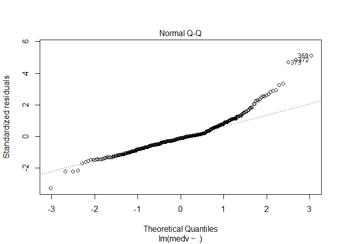
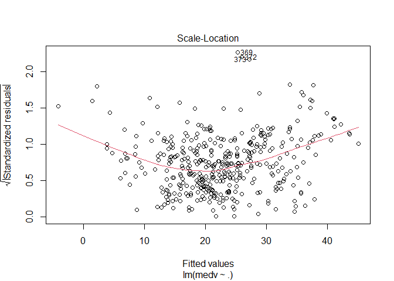
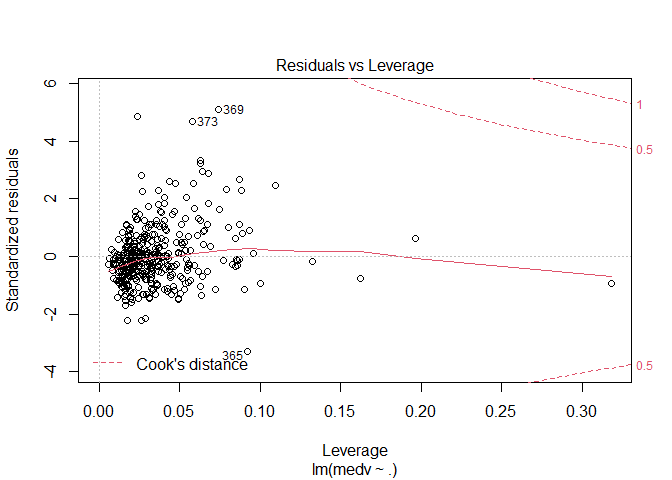

Boston House Prices - Regression Analysis with Machine Learning
================
Kar Ng
2021

-   [1 R PACKAGES](#1-r-packages)
-   [2 INTRODUCTION](#2-introduction)
-   [3 DATA PROCESSING](#3-data-processing)
    -   [3.1 Data Import](#31-data-import)
    -   [3.2 Data Description](#32-data-description)
    -   [3.3 Data Exploration](#33-data-exploration)
-   [4 EXPLORATORY DATA ANALYSIS
    (EDA)](#4-exploratory-data-analysis-eda)
    -   [4.1 Distribution Study](#41-distribution-study)
    -   [4.2 Outliers Detection](#42-outliers-detection)
    -   [4.3 Relationships](#43-relationships)
-   [5 Model building](#5-model-building)
    -   [5.1 Preliminary Variable
        Selection](#51-preliminary-variable-selection)
    -   [5.2 Train-test split](#52-train-test-split)
    -   [5.3 Multiple Linear Regression
        (MLR)](#53-multiple-linear-regression-mlr)
    -   [5.4 Multicollinearity
        Detection](#54-multicollinearity-detection)
    -   [5.5](#55)
    -   [5.5 Lasso](#55-lasso)
-   [6 Model Productionisation](#6-model-productionisation)
-   [7 Conclusion](#7-conclusion)
-   [8 LEGALITY](#8-legality)
-   [9 REFERENCE](#9-reference)

------------------------------------------------------------------------


------------------------------------------------------------------------

## 1 R PACKAGES

``` r
# R Libraries

library(tidyverse)
library(skimr)
library(caret)
library(MASS)
library(kableExtra)
library(qqplotr)
library(glmnet)
library(car)
library(corrplot)
library(mgcv)

# R setting

options(scipen = 999)
```

## 2 INTRODUCTION

This project uses a public dataset named “Boston” from the R package -
“MASS”. It is a dataset studies the effects of a range of variables on
median house prices in Boston in late 70s, United States.

I will statistically analyse the dataset with machine learning
algorithms. I will find out the effects of each variables on the median
house prices and build a model that can make predictions of house prices
correctly.

## 3 DATA PROCESSING

### 3.1 Data Import

Following codes import the dataset from the MASS package. Random
sampling of 10 rows of data from the dataset:

``` r
data("Boston", package = "MASS")
sample_n(Boston, 10)
```

    ##        crim zn indus chas   nox    rm  age    dis rad tax ptratio  black lstat
    ## 1   0.13158  0 10.01    0 0.547 6.176 72.5 2.7301   6 432    17.8 393.30 12.04
    ## 2   0.03659 25  4.86    0 0.426 6.302 32.2 5.4007   4 281    19.0 396.90  6.72
    ## 3   4.42228  0 18.10    0 0.584 6.003 94.5 2.5403  24 666    20.2 331.29 21.32
    ## 4   2.14918  0 19.58    0 0.871 5.709 98.5 1.6232   5 403    14.7 261.95 15.79
    ## 5  10.83420  0 18.10    0 0.679 6.782 90.8 1.8195  24 666    20.2  21.57 25.79
    ## 6   6.28807  0 18.10    0 0.740 6.341 96.4 2.0720  24 666    20.2 318.01 17.79
    ## 7   0.06263  0 11.93    0 0.573 6.593 69.1 2.4786   1 273    21.0 391.99  9.67
    ## 8   9.92485  0 18.10    0 0.740 6.251 96.6 2.1980  24 666    20.2 388.52 16.44
    ## 9   1.65660  0 19.58    0 0.871 6.122 97.3 1.6180   5 403    14.7 372.80 14.10
    ## 10  5.66998  0 18.10    1 0.631 6.683 96.8 1.3567  24 666    20.2 375.33  3.73
    ##    medv
    ## 1  21.2
    ## 2  24.8
    ## 3  19.1
    ## 4  19.4
    ## 5   7.5
    ## 6  14.9
    ## 7  22.4
    ## 8  12.6
    ## 9  21.5
    ## 10 50.0

### 3.2 Data Description

The dataset has important information that may affect the price of a
house. For examples, crime rate, number of rooms in the house, nitrogen
oxides concentration, its proximity to industrial area, employment
centers, highways and etc.

``` r
Variables <- names(Boston)
Description <- c("Per capita crime rate by town.",
                 "Proportion of residential land zoned for lots over 25,000 sq.ft.",
                 "Proportion of non-retail business acres per town.",
                 "Charles River dummy variable (= 1 if tract bounds river; 0 otherwise).",
                 "Nitrogen oxides concentration (parts per 10 million).",
                 "Average number of rooms per dwelling.",
                 "Proportion of owner-occupied units built prior to 1940.",
                 "Weighted mean of distances to five Boston employment centres.",
                 "Index of accessibility to radial highways.",
                 "Full-value property-tax rate per per $10,000.",
                 "Pupil-teacher ratio by town.",
                 "1000(Bk - 0.63)^2 where Bk is the proportion of blacks by town.",
                 "Owner status of the population (percent).",
                 "Median value of owner-occupied homes in per $1000s.")

data.frame(Variables, Description) %>% 
  kbl() %>% 
  kable_styling(bootstrap_options = c("hover", "bordered", "stripped"))
```

<table class="table table-hover table-bordered" style="margin-left: auto; margin-right: auto;">
<thead>
<tr>
<th style="text-align:left;">
Variables
</th>
<th style="text-align:left;">
Description
</th>
</tr>
</thead>
<tbody>
<tr>
<td style="text-align:left;">
crim
</td>
<td style="text-align:left;">
Per capita crime rate by town.
</td>
</tr>
<tr>
<td style="text-align:left;">
zn
</td>
<td style="text-align:left;">
Proportion of residential land zoned for lots over 25,000 sq.ft.
</td>
</tr>
<tr>
<td style="text-align:left;">
indus
</td>
<td style="text-align:left;">
Proportion of non-retail business acres per town.
</td>
</tr>
<tr>
<td style="text-align:left;">
chas
</td>
<td style="text-align:left;">
Charles River dummy variable (= 1 if tract bounds river; 0 otherwise).
</td>
</tr>
<tr>
<td style="text-align:left;">
nox
</td>
<td style="text-align:left;">
Nitrogen oxides concentration (parts per 10 million).
</td>
</tr>
<tr>
<td style="text-align:left;">
rm
</td>
<td style="text-align:left;">
Average number of rooms per dwelling.
</td>
</tr>
<tr>
<td style="text-align:left;">
age
</td>
<td style="text-align:left;">
Proportion of owner-occupied units built prior to 1940.
</td>
</tr>
<tr>
<td style="text-align:left;">
dis
</td>
<td style="text-align:left;">
Weighted mean of distances to five Boston employment centres.
</td>
</tr>
<tr>
<td style="text-align:left;">
rad
</td>
<td style="text-align:left;">
Index of accessibility to radial highways.
</td>
</tr>
<tr>
<td style="text-align:left;">
tax
</td>
<td style="text-align:left;">
Full-value property-tax rate per per $10,000.
</td>
</tr>
<tr>
<td style="text-align:left;">
ptratio
</td>
<td style="text-align:left;">
Pupil-teacher ratio by town.
</td>
</tr>
<tr>
<td style="text-align:left;">
black
</td>
<td style="text-align:left;">
1000(Bk - 0.63)^2 where Bk is the proportion of blacks by town.
</td>
</tr>
<tr>
<td style="text-align:left;">
lstat
</td>
<td style="text-align:left;">
Owner status of the population (percent).
</td>
</tr>
<tr>
<td style="text-align:left;">
medv
</td>
<td style="text-align:left;">
Median value of owner-occupied homes in per $1000s.
</td>
</tr>
</tbody>
</table>

### 3.3 Data Exploration

The dataset has 506 rows of observations and 14 columns of variables.
All variables in the dataset are in numerical format.

``` r
skim_without_charts(Boston)
```

<table style="width: auto;" class="table table-condensed">
<caption>
Data summary
</caption>
<thead>
<tr>
<th style="text-align:left;">
</th>
<th style="text-align:left;">
</th>
</tr>
</thead>
<tbody>
<tr>
<td style="text-align:left;">
Name
</td>
<td style="text-align:left;">
Boston
</td>
</tr>
<tr>
<td style="text-align:left;">
Number of rows
</td>
<td style="text-align:left;">
506
</td>
</tr>
<tr>
<td style="text-align:left;">
Number of columns
</td>
<td style="text-align:left;">
14
</td>
</tr>
<tr>
<td style="text-align:left;">
\_\_\_\_\_\_\_\_\_\_\_\_\_\_\_\_\_\_\_\_\_\_\_
</td>
<td style="text-align:left;">
</td>
</tr>
<tr>
<td style="text-align:left;">
Column type frequency:
</td>
<td style="text-align:left;">
</td>
</tr>
<tr>
<td style="text-align:left;">
numeric
</td>
<td style="text-align:left;">
14
</td>
</tr>
<tr>
<td style="text-align:left;">
\_\_\_\_\_\_\_\_\_\_\_\_\_\_\_\_\_\_\_\_\_\_\_\_
</td>
<td style="text-align:left;">
</td>
</tr>
<tr>
<td style="text-align:left;">
Group variables
</td>
<td style="text-align:left;">
None
</td>
</tr>
</tbody>
</table>

**Variable type: numeric**

<table>
<thead>
<tr>
<th style="text-align:left;">
skim\_variable
</th>
<th style="text-align:right;">
n\_missing
</th>
<th style="text-align:right;">
complete\_rate
</th>
<th style="text-align:right;">
mean
</th>
<th style="text-align:right;">
sd
</th>
<th style="text-align:right;">
p0
</th>
<th style="text-align:right;">
p25
</th>
<th style="text-align:right;">
p50
</th>
<th style="text-align:right;">
p75
</th>
<th style="text-align:right;">
p100
</th>
</tr>
</thead>
<tbody>
<tr>
<td style="text-align:left;">
crim
</td>
<td style="text-align:right;">
0
</td>
<td style="text-align:right;">
1
</td>
<td style="text-align:right;">
3.61
</td>
<td style="text-align:right;">
8.60
</td>
<td style="text-align:right;">
0.01
</td>
<td style="text-align:right;">
0.08
</td>
<td style="text-align:right;">
0.26
</td>
<td style="text-align:right;">
3.68
</td>
<td style="text-align:right;">
88.98
</td>
</tr>
<tr>
<td style="text-align:left;">
zn
</td>
<td style="text-align:right;">
0
</td>
<td style="text-align:right;">
1
</td>
<td style="text-align:right;">
11.36
</td>
<td style="text-align:right;">
23.32
</td>
<td style="text-align:right;">
0.00
</td>
<td style="text-align:right;">
0.00
</td>
<td style="text-align:right;">
0.00
</td>
<td style="text-align:right;">
12.50
</td>
<td style="text-align:right;">
100.00
</td>
</tr>
<tr>
<td style="text-align:left;">
indus
</td>
<td style="text-align:right;">
0
</td>
<td style="text-align:right;">
1
</td>
<td style="text-align:right;">
11.14
</td>
<td style="text-align:right;">
6.86
</td>
<td style="text-align:right;">
0.46
</td>
<td style="text-align:right;">
5.19
</td>
<td style="text-align:right;">
9.69
</td>
<td style="text-align:right;">
18.10
</td>
<td style="text-align:right;">
27.74
</td>
</tr>
<tr>
<td style="text-align:left;">
chas
</td>
<td style="text-align:right;">
0
</td>
<td style="text-align:right;">
1
</td>
<td style="text-align:right;">
0.07
</td>
<td style="text-align:right;">
0.25
</td>
<td style="text-align:right;">
0.00
</td>
<td style="text-align:right;">
0.00
</td>
<td style="text-align:right;">
0.00
</td>
<td style="text-align:right;">
0.00
</td>
<td style="text-align:right;">
1.00
</td>
</tr>
<tr>
<td style="text-align:left;">
nox
</td>
<td style="text-align:right;">
0
</td>
<td style="text-align:right;">
1
</td>
<td style="text-align:right;">
0.55
</td>
<td style="text-align:right;">
0.12
</td>
<td style="text-align:right;">
0.38
</td>
<td style="text-align:right;">
0.45
</td>
<td style="text-align:right;">
0.54
</td>
<td style="text-align:right;">
0.62
</td>
<td style="text-align:right;">
0.87
</td>
</tr>
<tr>
<td style="text-align:left;">
rm
</td>
<td style="text-align:right;">
0
</td>
<td style="text-align:right;">
1
</td>
<td style="text-align:right;">
6.28
</td>
<td style="text-align:right;">
0.70
</td>
<td style="text-align:right;">
3.56
</td>
<td style="text-align:right;">
5.89
</td>
<td style="text-align:right;">
6.21
</td>
<td style="text-align:right;">
6.62
</td>
<td style="text-align:right;">
8.78
</td>
</tr>
<tr>
<td style="text-align:left;">
age
</td>
<td style="text-align:right;">
0
</td>
<td style="text-align:right;">
1
</td>
<td style="text-align:right;">
68.57
</td>
<td style="text-align:right;">
28.15
</td>
<td style="text-align:right;">
2.90
</td>
<td style="text-align:right;">
45.02
</td>
<td style="text-align:right;">
77.50
</td>
<td style="text-align:right;">
94.07
</td>
<td style="text-align:right;">
100.00
</td>
</tr>
<tr>
<td style="text-align:left;">
dis
</td>
<td style="text-align:right;">
0
</td>
<td style="text-align:right;">
1
</td>
<td style="text-align:right;">
3.80
</td>
<td style="text-align:right;">
2.11
</td>
<td style="text-align:right;">
1.13
</td>
<td style="text-align:right;">
2.10
</td>
<td style="text-align:right;">
3.21
</td>
<td style="text-align:right;">
5.19
</td>
<td style="text-align:right;">
12.13
</td>
</tr>
<tr>
<td style="text-align:left;">
rad
</td>
<td style="text-align:right;">
0
</td>
<td style="text-align:right;">
1
</td>
<td style="text-align:right;">
9.55
</td>
<td style="text-align:right;">
8.71
</td>
<td style="text-align:right;">
1.00
</td>
<td style="text-align:right;">
4.00
</td>
<td style="text-align:right;">
5.00
</td>
<td style="text-align:right;">
24.00
</td>
<td style="text-align:right;">
24.00
</td>
</tr>
<tr>
<td style="text-align:left;">
tax
</td>
<td style="text-align:right;">
0
</td>
<td style="text-align:right;">
1
</td>
<td style="text-align:right;">
408.24
</td>
<td style="text-align:right;">
168.54
</td>
<td style="text-align:right;">
187.00
</td>
<td style="text-align:right;">
279.00
</td>
<td style="text-align:right;">
330.00
</td>
<td style="text-align:right;">
666.00
</td>
<td style="text-align:right;">
711.00
</td>
</tr>
<tr>
<td style="text-align:left;">
ptratio
</td>
<td style="text-align:right;">
0
</td>
<td style="text-align:right;">
1
</td>
<td style="text-align:right;">
18.46
</td>
<td style="text-align:right;">
2.16
</td>
<td style="text-align:right;">
12.60
</td>
<td style="text-align:right;">
17.40
</td>
<td style="text-align:right;">
19.05
</td>
<td style="text-align:right;">
20.20
</td>
<td style="text-align:right;">
22.00
</td>
</tr>
<tr>
<td style="text-align:left;">
black
</td>
<td style="text-align:right;">
0
</td>
<td style="text-align:right;">
1
</td>
<td style="text-align:right;">
356.67
</td>
<td style="text-align:right;">
91.29
</td>
<td style="text-align:right;">
0.32
</td>
<td style="text-align:right;">
375.38
</td>
<td style="text-align:right;">
391.44
</td>
<td style="text-align:right;">
396.22
</td>
<td style="text-align:right;">
396.90
</td>
</tr>
<tr>
<td style="text-align:left;">
lstat
</td>
<td style="text-align:right;">
0
</td>
<td style="text-align:right;">
1
</td>
<td style="text-align:right;">
12.65
</td>
<td style="text-align:right;">
7.14
</td>
<td style="text-align:right;">
1.73
</td>
<td style="text-align:right;">
6.95
</td>
<td style="text-align:right;">
11.36
</td>
<td style="text-align:right;">
16.96
</td>
<td style="text-align:right;">
37.97
</td>
</tr>
<tr>
<td style="text-align:left;">
medv
</td>
<td style="text-align:right;">
0
</td>
<td style="text-align:right;">
1
</td>
<td style="text-align:right;">
22.53
</td>
<td style="text-align:right;">
9.20
</td>
<td style="text-align:right;">
5.00
</td>
<td style="text-align:right;">
17.02
</td>
<td style="text-align:right;">
21.20
</td>
<td style="text-align:right;">
25.00
</td>
<td style="text-align:right;">
50.00
</td>
</tr>
</tbody>
</table>

There are also no missing data in the dataset as indicated by the
features “n\_missing” and “complete\_rate”, they both inspect the
completeness of the dataset.

Following summarise some descriptive statistics of the dataset, such as
mean, median, minimum and maximum values. There is 1 binary data
indicated in the dataset - “chas” with value either is 0 or 1. However,
it will not impact the analysis.

``` r
summary(Boston)
```

    ##       crim                zn             indus            chas        
    ##  Min.   : 0.00632   Min.   :  0.00   Min.   : 0.46   Min.   :0.00000  
    ##  1st Qu.: 0.08205   1st Qu.:  0.00   1st Qu.: 5.19   1st Qu.:0.00000  
    ##  Median : 0.25651   Median :  0.00   Median : 9.69   Median :0.00000  
    ##  Mean   : 3.61352   Mean   : 11.36   Mean   :11.14   Mean   :0.06917  
    ##  3rd Qu.: 3.67708   3rd Qu.: 12.50   3rd Qu.:18.10   3rd Qu.:0.00000  
    ##  Max.   :88.97620   Max.   :100.00   Max.   :27.74   Max.   :1.00000  
    ##       nox               rm             age              dis        
    ##  Min.   :0.3850   Min.   :3.561   Min.   :  2.90   Min.   : 1.130  
    ##  1st Qu.:0.4490   1st Qu.:5.886   1st Qu.: 45.02   1st Qu.: 2.100  
    ##  Median :0.5380   Median :6.208   Median : 77.50   Median : 3.207  
    ##  Mean   :0.5547   Mean   :6.285   Mean   : 68.57   Mean   : 3.795  
    ##  3rd Qu.:0.6240   3rd Qu.:6.623   3rd Qu.: 94.08   3rd Qu.: 5.188  
    ##  Max.   :0.8710   Max.   :8.780   Max.   :100.00   Max.   :12.127  
    ##       rad              tax           ptratio          black       
    ##  Min.   : 1.000   Min.   :187.0   Min.   :12.60   Min.   :  0.32  
    ##  1st Qu.: 4.000   1st Qu.:279.0   1st Qu.:17.40   1st Qu.:375.38  
    ##  Median : 5.000   Median :330.0   Median :19.05   Median :391.44  
    ##  Mean   : 9.549   Mean   :408.2   Mean   :18.46   Mean   :356.67  
    ##  3rd Qu.:24.000   3rd Qu.:666.0   3rd Qu.:20.20   3rd Qu.:396.23  
    ##  Max.   :24.000   Max.   :711.0   Max.   :22.00   Max.   :396.90  
    ##      lstat            medv      
    ##  Min.   : 1.73   Min.   : 5.00  
    ##  1st Qu.: 6.95   1st Qu.:17.02  
    ##  Median :11.36   Median :21.20  
    ##  Mean   :12.65   Mean   :22.53  
    ##  3rd Qu.:16.95   3rd Qu.:25.00  
    ##  Max.   :37.97   Max.   :50.00

## 4 EXPLORATORY DATA ANALYSIS (EDA)

``` r
# set up data frame

bos <- Boston %>% 
  pivot_longer(c(1:14), names_to = "variable", values_to = "result") %>% 
  arrange(variable)
```

### 4.1 Distribution Study

``` r
ggplot(bos, aes(x = result, fill = variable)) +
  geom_histogram(colour = "white", bins = 30) +
  facet_wrap(~ variable, scale = "free") +
  theme(legend.position = "none")
```

<!-- --> Insight:

-   All variables seems to have different distribution.  
-   The *chas* seems to have a binary distribution with value of either
    1 or 0.
-   The *rm* has a distribution that close to Gaussian distribution
-   Many variables except *chas* and *rm* seems to have skewed to both
    directions.

### 4.2 Outliers Detection

This section uses boxplot as an alternative visualization of outliers.

``` r
ggplot(bos, aes(x = result, fill = variable)) +
  geom_boxplot() +
  facet_wrap(~ variable, scale = "free") +
  theme(legend.position = "none")
```

<!-- --> Insight:

-   Outliers exists in many variables include *black, crim, dis, lstat,
    medv, ptratio, zn,* and even the Gaussian distribtued *rm*。

The distribution and box plots show that the assumptions of linear
regression have been violated and thus a non-linear regression would
perform better than linear regression algorithm.

### 4.3 Relationships

In relation to median house prices, visualisation shows that:

``` r
bos2 <- Boston %>% 
  pivot_longer(c(1:13), names_to = "variable", values_to = "result") %>% 
  arrange(variable)

# plot

ggplot(bos2, aes(x = result, y = medv, colour = variable)) +
  geom_point(alpha = 0.5) +
  facet_wrap(~variable, scales = "free_x", ncol = 2) +
  theme_bw() +
  theme(legend.position = "none",
        plot.title = element_text(face = "bold", size = 14, hjust = 0.5, vjust = 2),
        strip.text = element_text(size = 10),
        axis.title.x = element_text(margin = margin(10, 0, 0 ,0)),
        axis.title.y = element_text(margin = margin(0, 10, 0, 0))) +
  geom_smooth(se = F) +
  labs(x = "Variables",
       y = "Median House Price, /$1000",
       title = "The Impact of Environmental Features on Median House Prices")
```

<!-- -->

Insights:

-   “age” of a house has little positive impact  
-   “black” community has a positive impact  
-   “chas”, the present of Charles River on house prices is not visually
    clear and may have no impact  
-   Crime rate, “crim”, has a negative impact  
-   “dis”, the distances to employment centres, do not have a impact  
-   Proportion of non-retail business, “indus”, has a negative impact  
-   The level of owner status, “lstat”, has a large negative impact  
-   The concentration of nitrogen oxide concentration, “nox”, has a
    gradual negative impact  
-   Pupil-teacher ratio by town, “ptratio”, has negative impact  
-   Accessibility to radial highways, “rad”" has negative impact  
-   Number of room, “rm”, has a large positive impact  
-   Tax has a negative impact  
-   “zn” - the proportion of residential land zoned for lots has
    positive impact

## 5 Model building

### 5.1 Preliminary Variable Selection

This section is meant to select the variables that is related to the
topic of this analysis and eliminated irrelevant ones.

However, since the aim of this project is to analyse each and every
single variables in the dataset and their relatability to median house
prices, represented by “medv”, I will keep all variables.

``` r
names(Boston)
```

    ##  [1] "crim"    "zn"      "indus"   "chas"    "nox"     "rm"      "age"    
    ##  [8] "dis"     "rad"     "tax"     "ptratio" "black"   "lstat"   "medv"

### 5.2 Train-test split

This section create data partitions into 80% of train set and 20% test
set. The train set will be used to build models and the test set will be
used to evaluate the performance of models.

``` r
# Create data partition

train.index <- Boston$medv %>% createDataPartition(p = 0.8, list = F)

# Get train and test set

train.data <- Boston[train.index, ]
test.data <- Boston[-train.index, ]
```

### 5.3 Multiple Linear Regression (MLR)

It is an exploratory model for inferential purposes built before
multicollinearity test. This model help to generate statistical insights
from the variables and studies their coefficient estimates. This model
will not be used for prediction.

``` r
# Using original dataset to include all data into this model

model_mlr <- lm(medv ~., data = Boston)

summary(model_mlr)
```

    ## 
    ## Call:
    ## lm(formula = medv ~ ., data = Boston)
    ## 
    ## Residuals:
    ##     Min      1Q  Median      3Q     Max 
    ## -15.595  -2.730  -0.518   1.777  26.199 
    ## 
    ## Coefficients:
    ##                Estimate  Std. Error t value             Pr(>|t|)    
    ## (Intercept)  36.4594884   5.1034588   7.144    0.000000000003283 ***
    ## crim         -0.1080114   0.0328650  -3.287             0.001087 ** 
    ## zn            0.0464205   0.0137275   3.382             0.000778 ***
    ## indus         0.0205586   0.0614957   0.334             0.738288    
    ## chas          2.6867338   0.8615798   3.118             0.001925 ** 
    ## nox         -17.7666112   3.8197437  -4.651    0.000004245643808 ***
    ## rm            3.8098652   0.4179253   9.116 < 0.0000000000000002 ***
    ## age           0.0006922   0.0132098   0.052             0.958229    
    ## dis          -1.4755668   0.1994547  -7.398    0.000000000000601 ***
    ## rad           0.3060495   0.0663464   4.613    0.000005070529023 ***
    ## tax          -0.0123346   0.0037605  -3.280             0.001112 ** 
    ## ptratio      -0.9527472   0.1308268  -7.283    0.000000000001309 ***
    ## black         0.0093117   0.0026860   3.467             0.000573 ***
    ## lstat        -0.5247584   0.0507153 -10.347 < 0.0000000000000002 ***
    ## ---
    ## Signif. codes:  0 '***' 0.001 '**' 0.01 '*' 0.05 '.' 0.1 ' ' 1
    ## 
    ## Residual standard error: 4.745 on 492 degrees of freedom
    ## Multiple R-squared:  0.7406, Adjusted R-squared:  0.7338 
    ## F-statistic: 108.1 on 13 and 492 DF,  p-value: < 0.00000000000000022

**Model Performance**

Results show the p-value of the F-Statistics of this model is &lt; 0.05,
it indicates that there is at least of the predictor variable is
significantly related to the median house prices.

The Adjusted R-squared of this model is 0.7338, which is a good
indication that this multiple linear regression model good and is able
to explain 73.38% of the variation in the median house prices.

The Residual standard error (RSE) is 4.745. This corresponds to an error
rate of 21%, which is acceptable.

``` r
4.745/mean(Boston$medv)
```

    ## [1] 0.2105818

**Insights**

-   Variables that do not have significant relationship (P-value &gt;
    0.05) with median house price are “age” and “indus”.

``` r
df <- data.frame(summary(model_mlr)$coef) 

df <- df %>% 
  dplyr::select(Estimate, Pr...t..) %>% 
  rename(P_value = Pr...t..) %>% 
  arrange(Estimate)

df %>% 
  filter(P_value > 0.05) %>% 
  arrange(P_value)
```

    ##           Estimate   P_value
    ## indus 0.0205586264 0.7382881
    ## age   0.0006922246 0.9582293

-   In ascending order of coefficient estimate, variables that have
    **positive** significant relationship with median house prices are
    “rm”, “rad”, “black”, “zn” and “chas”.

``` r
df %>% 
  filter(P_value < 0.05,
         Estimate > 0) %>% 
  arrange(Estimate)
```

    ##                 Estimate                    P_value
    ## black        0.009311683 0.000572859167184045035143
    ## zn           0.046420458 0.000778109687609932127762
    ## rad          0.306049479 0.000005070529022686650245
    ## chas         2.686733819 0.001925030330841030019526
    ## rm           3.809865207 0.000000000000000001979441
    ## (Intercept) 36.459488385 0.000000000003283438498706

-   In ascending order of coefficient estimates, variables that have
    **negative** significant relationship with median house prices are
    nox, dis, ptratio, lstat, crim, and tax.

``` r
df %>% 
  filter(P_value < 0.05,
         Estimate < 0) %>% 
  arrange(Estimate)
```

    ##             Estimate                         P_value
    ## nox     -17.76661123 0.00000424564380764579045717672
    ## dis      -1.47556685 0.00000000000060134911014376689
    ## ptratio  -0.95274723 0.00000000000130883513389550366
    ## lstat    -0.52475838 0.00000000000000000000007776912
    ## crim     -0.10801136 0.00108681009556166135142374340
    ## tax      -0.01233459 0.00111163672368926069213002084

### 5.4 Multicollinearity Detection

These is high correlation between “rad” and “tax”. Therefore, one of
them will be kept in the future prediction model. This is a typical
collinearity or multicollinearity problem that the existence of this
problem would affect the standard errors of our coeffcients and making
p-value invalid.

This is identified via correlogram of the predictors in the dataset. As
a rule of thumb, a correlation of between 0.8 to 1 indicates
multicollinearity issue.

``` r
my_cor <- cor(train.data[1:13])

corrplot(my_cor, method = "number", type = "lower")
```

<!-- -->
Alternatively a variance inflation factor (VIF) test is carried out. A
VIF that exceed 5 indicates a problematic amount of collinearity (James
et al. 2014).

``` r
model <- lm(medv ~., data = train.data)
vif(model)
```

    ##     crim       zn    indus     chas      nox       rm      age      dis 
    ## 1.868223 2.375233 4.003021 1.083288 4.373215 1.945879 3.086447 4.059580 
    ##      rad      tax  ptratio    black    lstat 
    ## 7.052928 8.419109 1.842011 1.377644 3.023860

### 5.5

``` r
plot(model)
```

<!-- --><!-- --><!-- --><!-- -->

### 5.5 Lasso

Lasso might not be ideal because linear regression assumptions are
violated such as the but can be built and used as a baesline model for
comparison.

## 6 Model Productionisation

## 7 Conclusion

## 8 LEGALITY

The purpose of this project is for educational and skills demonstration
ONLY.

## 9 REFERENCE

Belsley D.A., Kuh, E. and Welsch, R.E. (1980) Regression Diagnostics.
Identifying Influential Data and Sources of Collinearity. New York:
Wiley.

Brownlee J 2016, *How to Work Through a Regression Machine Learning
Project in Weka*, viewed 26 September 2021,
<https://machinelearningmastery.com/regression-machine-learning-tutorial-weka/>

Harrison, D. and Rubinfeld, D.L. (1978) Hedonic prices and the demand
for clean air. J. Environ. Economics and Management 5, 81–102.

James, Gareth, Daniela Witten, Trevor Hastie, and Robert Tibshirani.
2014. An Introduction to Statistical Learning: With Applications in R .
Springer Publishing Company, Incorporated.

Minitab Blog Editor 2013, *Enough Is Enough! Handling Multicollinearity
in Regression Analysis*, viewed 25 September 2021,
<https://blog.minitab.com/en/understanding-statistics/handling-multicollinearity-in-regression-analysis>

Sivakumar C 2017, *<https://rpubs.com/chocka314/251613>*, viewed 28
September 2021, <https://rpubs.com/chocka314/251613>

<https://cran.r-project.org/web/packages/MASS/MASS.pdf>
