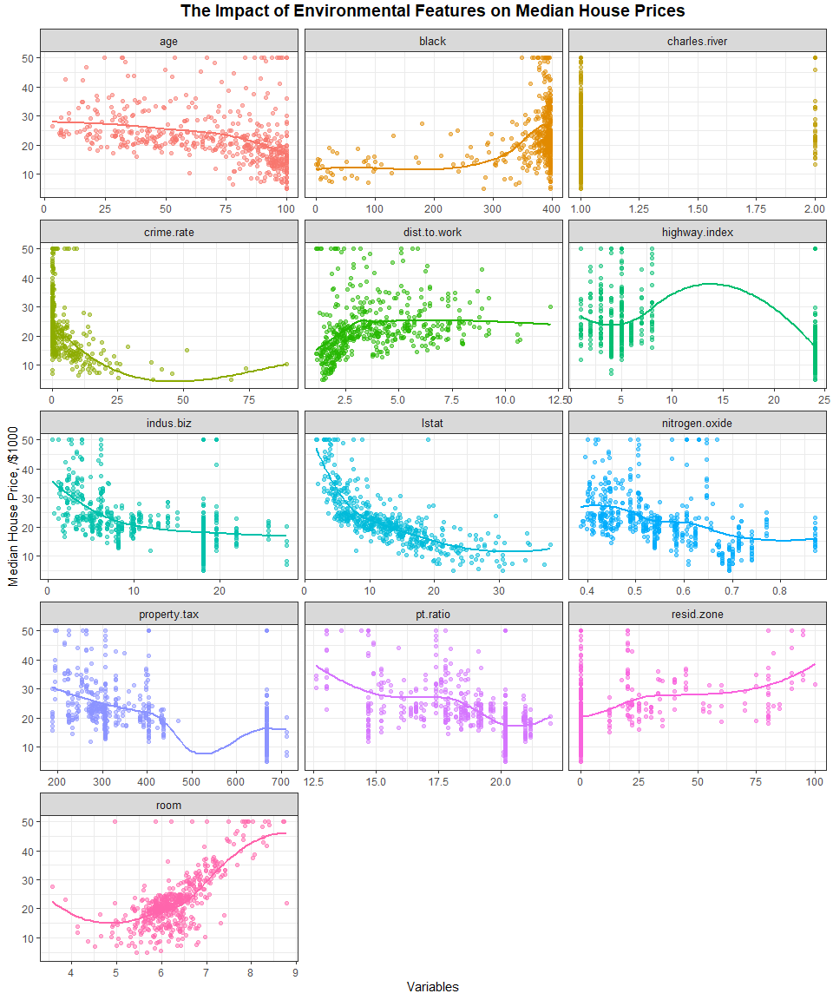
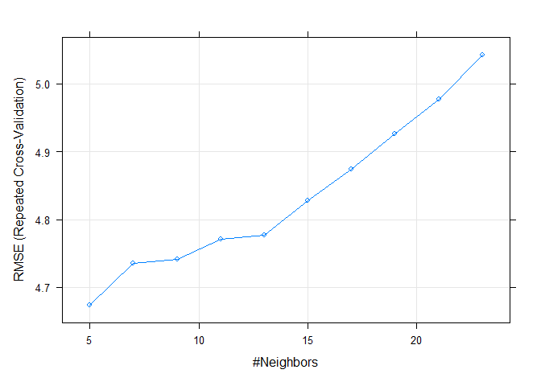
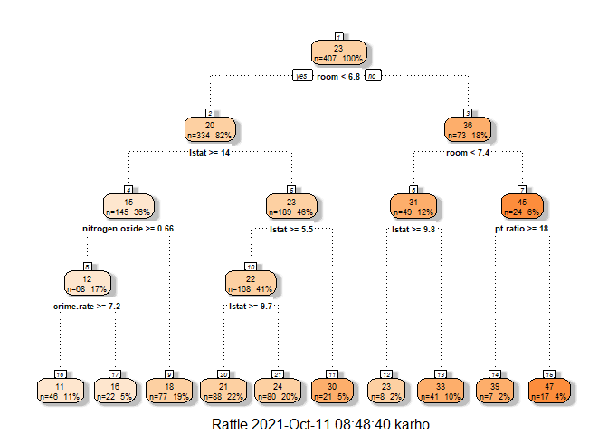
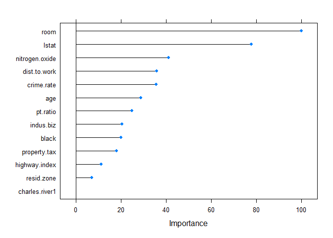

Boston House Prices \[Unique Version\]- Regression Analysis with Machine
Learning
================
Kar Ng
2021

-   [1 R PACKAGES](#1-r-packages)
-   [2 INTRODUCTION](#2-introduction)
-   [3 DATA PREPARATION](#3-data-preparation)
    -   [3.1 Data Import](#31-data-import)
    -   [3.2 Data Description](#32-data-description)
    -   [3.3 Data Exploration](#33-data-exploration)
-   [4 DATA CLEANING](#4-data-cleaning)
    -   [4.1 Column removal and
        factorise](#41-column-removal-and-factorise)
    -   [4.2 NA Imputation](#42-na-imputation)
-   [5 EXPLORATORY DATA ANALYSIS
    (EDA)](#5-exploratory-data-analysis-eda)
    -   [5.1 Distribution Study](#51-distribution-study)
    -   [5.2 Outliers Detection](#52-outliers-detection)
    -   [5.3 Relationships](#53-relationships)
    -   [5.4 Multicollinearity](#54-multicollinearity)
-   [5 Model Building](#5-model-building)
    -   [5.1 Train-test split](#51-train-test-split)
    -   [5.2 Multiple Linear Regression
        (MLR)](#52-multiple-linear-regression-mlr)
    -   [5.3 Assumption tests of Multiple Linear
        Regressions](#53-assumption-tests-of-multiple-linear-regressions)
    -   [5.4 Lasso](#54-lasso)
    -   [5.5 PLS](#55-pls)
    -   [5.6 KNN](#56-knn)
    -   [5.7 Decision Tree / CART](#57-decision-tree--cart)
    -   [5.8 Random Forest](#58-random-forest)
    -   [5.9 Stochastic gradient boosting (*XGBoost*
        in R)](#59-stochastic-gradient-boosting-xgboost-in-r)
    -   [6.0 Final Model Comparison](#60-final-model-comparison)
-   [6 Model for Production](#6-model-for-production)
-   [7 Conclusion](#7-conclusion)
-   [8 LEGALITY](#8-legality)
-   [9 REFERENCE](#9-reference)

------------------------------------------------------------------------


(*Picture by King of Hearts*)

------------------------------------------------------------------------

## 1 R PACKAGES

``` r
# R Libraries

library(tidyverse)
library(skimr)
library(caret)
library(MASS)
library(kableExtra)
library(qqplotr)
library(glmnet)
library(car)
library(corrplot)
library(mgcv)
library(randomForest)
library(doParallel)
library(pls)
library(tidytext)

# R setting

options(scipen = 0)
```

## 2 INTRODUCTION

This project uses a public dataset named “Boston” from a R package -
“MASS”. It is a famous dataset for machine learning practitioners.
However, I have made some adjustments to this dataset to make overall
analysis more interesting and unique.

This Boston dataset studies the effects of a range of variables on
median house prices in Boston in late 70s, United States.

I will statistically analyse the dataset and make predictions with
machine learning algorithms. Then, I will study the effects of each
variables on the median house prices, pick a model that has the highest
predictive power, and build an online interactive application by using
RShiny in *section 6 - Model for Production*.

*Highlights of some upcoming graphs*


## 3 DATA PREPARATION

### 3.1 Data Import

This section imports the edited version of the dataset. Following is 10
rows of data randomly selected from the dataset.

``` r
boston <- read.csv("boston.csv")
sample_n(boston, 10)
```

    ##      X crime.rate resid.zone indus.biz charles.river nitrogen.oxide  room  age
    ## 1  452    5.44114        0.0     18.10             0          0.713 6.655 98.2
    ## 2  127    0.38735        0.0     25.65             0          0.581 5.613 95.6
    ## 3  173    0.13914        0.0      4.05             0          0.510 5.572 88.5
    ## 4  311    2.63548        0.0      9.90             0          0.544 4.973 37.8
    ## 5  289    0.04590       52.5      5.32             0          0.405 6.315 45.6
    ## 6   79    0.05646        0.0     12.83             0          0.437 6.232 53.7
    ## 7  150    2.73397        0.0     19.58             0          0.871 5.597 94.9
    ## 8  208    0.25199        0.0     10.59             0          0.489 5.783 72.7
    ## 9  167    2.01019        0.0     19.58             0          0.605 7.929 96.2
    ## 10  72    0.15876        0.0     10.81             0          0.413 5.961 17.5
    ##    dist.to.work highway.index property.tax pt.ratio  black lstat house.value
    ## 1        2.3552            24          666     20.2 355.29    NA        15.2
    ## 2        1.7572             2          188     19.1 359.29 27.26        15.7
    ## 3        2.5961             5          296     16.6 396.90 14.69        23.1
    ## 4        2.5194             4          304     18.4 350.45 12.64        16.1
    ## 5        7.3172             6          293     16.6 396.90  7.60        22.3
    ## 6        5.0141             5          398     18.7 386.40 12.34        21.2
    ## 7        1.5257             5          403     14.7 351.85 21.45        15.4
    ## 8        4.3549             4          277     18.6 389.43 18.06        22.5
    ## 9        2.0459             5          403     14.7 369.30  3.70        50.0
    ## 10       5.2873             4          305     19.2 376.94  9.88        21.7

### 3.2 Data Description

The dataset has important information regarding factors that may affect
the price of a house in Boston in late 70s. For examples, crime rate,
number of rooms in the house, nitrogen oxides concentration, its
proximity to industrial area, employment centers, highways and etc.

The unit of the house value is “median house price”. Believing this
median values is extracted from multiple houses in the respective
regions in the city.

Following is the data description adapted from the relevant R package.

``` r
Variables <- names(boston[2:15])
Description <- c("Per capita crime rate by town.",
                 "Proportion of residential land zoned for lots over 25,000 sq.ft.",
                 "Proportion of non-retail business acres per town.",
                 "Charles River dummy variable (= 1 if tract bounds river; 0 otherwise).",
                 "Nitrogen oxides concentration (parts per 10 million).",
                 "Average number of rooms per dwelling.",
                 "Proportion of owner-occupied units built prior to 1940.",
                 "Weighted mean of distances to five Boston employment centres.",
                 "Index of accessibility to radial highways.",
                 "Full-value property-tax rate per per $10,000.",
                 "Pupil-teacher ratio by town.",
                 "1000(Bk - 0.63)^2 where Bk is the proportion of blacks by town.",
                 "lower status of the population (percent).",
                 "Median value of owner-occupied homes in per $1000s.")

data.frame(Variables, Description) %>% 
  kbl() %>% 
  kable_styling(bootstrap_options = c("hover", "bordered", "stripped"))
```

<table class="table table-hover table-bordered" style="margin-left: auto; margin-right: auto;">
<thead>
<tr>
<th style="text-align:left;">
Variables
</th>
<th style="text-align:left;">
Description
</th>
</tr>
</thead>
<tbody>
<tr>
<td style="text-align:left;">
crime.rate
</td>
<td style="text-align:left;">
Per capita crime rate by town.
</td>
</tr>
<tr>
<td style="text-align:left;">
resid.zone
</td>
<td style="text-align:left;">
Proportion of residential land zoned for lots over 25,000 sq.ft.
</td>
</tr>
<tr>
<td style="text-align:left;">
indus.biz
</td>
<td style="text-align:left;">
Proportion of non-retail business acres per town.
</td>
</tr>
<tr>
<td style="text-align:left;">
charles.river
</td>
<td style="text-align:left;">
Charles River dummy variable (= 1 if tract bounds river; 0 otherwise).
</td>
</tr>
<tr>
<td style="text-align:left;">
nitrogen.oxide
</td>
<td style="text-align:left;">
Nitrogen oxides concentration (parts per 10 million).
</td>
</tr>
<tr>
<td style="text-align:left;">
room
</td>
<td style="text-align:left;">
Average number of rooms per dwelling.
</td>
</tr>
<tr>
<td style="text-align:left;">
age
</td>
<td style="text-align:left;">
Proportion of owner-occupied units built prior to 1940.
</td>
</tr>
<tr>
<td style="text-align:left;">
dist.to.work
</td>
<td style="text-align:left;">
Weighted mean of distances to five Boston employment centres.
</td>
</tr>
<tr>
<td style="text-align:left;">
highway.index
</td>
<td style="text-align:left;">
Index of accessibility to radial highways.
</td>
</tr>
<tr>
<td style="text-align:left;">
property.tax
</td>
<td style="text-align:left;">
Full-value property-tax rate per per $10,000.
</td>
</tr>
<tr>
<td style="text-align:left;">
pt.ratio
</td>
<td style="text-align:left;">
Pupil-teacher ratio by town.
</td>
</tr>
<tr>
<td style="text-align:left;">
black
</td>
<td style="text-align:left;">
1000(Bk - 0.63)^2 where Bk is the proportion of blacks by town.
</td>
</tr>
<tr>
<td style="text-align:left;">
lstat
</td>
<td style="text-align:left;">
lower status of the population (percent).
</td>
</tr>
<tr>
<td style="text-align:left;">
house.value
</td>
<td style="text-align:left;">
Median value of owner-occupied homes in per $1000s.
</td>
</tr>
</tbody>
</table>

### 3.3 Data Exploration

The dataset has 506 rows of observations and 14 columns of variables.
All variables are in numerical form.

``` r
glimpse(boston) 
```

    ## Rows: 506
    ## Columns: 15
    ## $ X              <int> 1, 2, 3, 4, 5, 6, 7, 8, 9, 10, 11, 12, 13, 14, 15, 16, ~
    ## $ crime.rate     <dbl> 0.00632, 0.02731, 0.02729, 0.03237, 0.06905, 0.02985, 0~
    ## $ resid.zone     <dbl> 18.0, 0.0, 0.0, 0.0, 0.0, 0.0, 12.5, 12.5, 12.5, 12.5, ~
    ## $ indus.biz      <dbl> 2.31, 7.07, 7.07, 2.18, 2.18, 2.18, 7.87, 7.87, 7.87, 7~
    ## $ charles.river  <int> 0, 0, 0, 0, 0, 0, 0, 0, 0, 0, 0, 0, 0, 0, 0, 0, 0, 0, 0~
    ## $ nitrogen.oxide <dbl> 0.538, 0.469, 0.469, 0.458, 0.458, 0.458, 0.524, 0.524,~
    ## $ room           <dbl> 6.575, 6.421, 7.185, 6.998, 7.147, 6.430, 6.012, 6.172,~
    ## $ age            <dbl> 65.2, 78.9, 61.1, 45.8, 54.2, 58.7, 66.6, 96.1, 100.0, ~
    ## $ dist.to.work   <dbl> 4.0900, 4.9671, 4.9671, 6.0622, 6.0622, 6.0622, 5.5605,~
    ## $ highway.index  <int> 1, 2, 2, 3, 3, 3, 5, 5, 5, 5, 5, 5, 5, 4, 4, 4, 4, 4, 4~
    ## $ property.tax   <int> 296, 242, 242, 222, 222, 222, 311, 311, 311, 311, 311, ~
    ## $ pt.ratio       <dbl> 15.3, 17.8, 17.8, 18.7, 18.7, 18.7, 15.2, 15.2, 15.2, 1~
    ## $ black          <dbl> 396.90, 396.90, 392.83, 394.63, 396.90, NA, 395.60, 396~
    ## $ lstat          <dbl> 4.98, 9.14, 4.03, 2.94, 5.33, 5.21, 12.43, 19.15, 29.93~
    ## $ house.value    <dbl> 24.0, 21.6, 34.7, 33.4, 36.2, 28.7, 22.9, 27.1, 16.5, 1~

From observation, “charles.river” is either 0 or 1, and therefore it
should be a categorical variable and it should be assigned with factor
type. The first variable, “x”, has to be removed because it is just row
number and irrelevant.

There are 12 and 17 missing data in the “black” and “lstat” column.
Fortunately, the completeness of these two variables are 97.6% and
96.6%. It is a matter of choice whether one wants to remove these values
or apply imputation techniques. I will go with the later as it is my
purpose to induce these missing values using imputation model using R.

``` r
skim_without_charts(boston)
```

<table style="width: auto;" class="table table-condensed">
<caption>
Data summary
</caption>
<thead>
<tr>
<th style="text-align:left;">
</th>
<th style="text-align:left;">
</th>
</tr>
</thead>
<tbody>
<tr>
<td style="text-align:left;">
Name
</td>
<td style="text-align:left;">
boston
</td>
</tr>
<tr>
<td style="text-align:left;">
Number of rows
</td>
<td style="text-align:left;">
506
</td>
</tr>
<tr>
<td style="text-align:left;">
Number of columns
</td>
<td style="text-align:left;">
15
</td>
</tr>
<tr>
<td style="text-align:left;">
\_\_\_\_\_\_\_\_\_\_\_\_\_\_\_\_\_\_\_\_\_\_\_
</td>
<td style="text-align:left;">
</td>
</tr>
<tr>
<td style="text-align:left;">
Column type frequency:
</td>
<td style="text-align:left;">
</td>
</tr>
<tr>
<td style="text-align:left;">
numeric
</td>
<td style="text-align:left;">
15
</td>
</tr>
<tr>
<td style="text-align:left;">
\_\_\_\_\_\_\_\_\_\_\_\_\_\_\_\_\_\_\_\_\_\_\_\_
</td>
<td style="text-align:left;">
</td>
</tr>
<tr>
<td style="text-align:left;">
Group variables
</td>
<td style="text-align:left;">
None
</td>
</tr>
</tbody>
</table>

**Variable type: numeric**

<table>
<thead>
<tr>
<th style="text-align:left;">
skim\_variable
</th>
<th style="text-align:right;">
n\_missing
</th>
<th style="text-align:right;">
complete\_rate
</th>
<th style="text-align:right;">
mean
</th>
<th style="text-align:right;">
sd
</th>
<th style="text-align:right;">
p0
</th>
<th style="text-align:right;">
p25
</th>
<th style="text-align:right;">
p50
</th>
<th style="text-align:right;">
p75
</th>
<th style="text-align:right;">
p100
</th>
</tr>
</thead>
<tbody>
<tr>
<td style="text-align:left;">
X
</td>
<td style="text-align:right;">
0
</td>
<td style="text-align:right;">
1.00
</td>
<td style="text-align:right;">
253.50
</td>
<td style="text-align:right;">
146.21
</td>
<td style="text-align:right;">
1.00
</td>
<td style="text-align:right;">
127.25
</td>
<td style="text-align:right;">
253.50
</td>
<td style="text-align:right;">
379.75
</td>
<td style="text-align:right;">
506.00
</td>
</tr>
<tr>
<td style="text-align:left;">
crime.rate
</td>
<td style="text-align:right;">
0
</td>
<td style="text-align:right;">
1.00
</td>
<td style="text-align:right;">
3.61
</td>
<td style="text-align:right;">
8.60
</td>
<td style="text-align:right;">
0.01
</td>
<td style="text-align:right;">
0.08
</td>
<td style="text-align:right;">
0.26
</td>
<td style="text-align:right;">
3.68
</td>
<td style="text-align:right;">
88.98
</td>
</tr>
<tr>
<td style="text-align:left;">
resid.zone
</td>
<td style="text-align:right;">
0
</td>
<td style="text-align:right;">
1.00
</td>
<td style="text-align:right;">
11.36
</td>
<td style="text-align:right;">
23.32
</td>
<td style="text-align:right;">
0.00
</td>
<td style="text-align:right;">
0.00
</td>
<td style="text-align:right;">
0.00
</td>
<td style="text-align:right;">
12.50
</td>
<td style="text-align:right;">
100.00
</td>
</tr>
<tr>
<td style="text-align:left;">
indus.biz
</td>
<td style="text-align:right;">
0
</td>
<td style="text-align:right;">
1.00
</td>
<td style="text-align:right;">
11.14
</td>
<td style="text-align:right;">
6.86
</td>
<td style="text-align:right;">
0.46
</td>
<td style="text-align:right;">
5.19
</td>
<td style="text-align:right;">
9.69
</td>
<td style="text-align:right;">
18.10
</td>
<td style="text-align:right;">
27.74
</td>
</tr>
<tr>
<td style="text-align:left;">
charles.river
</td>
<td style="text-align:right;">
0
</td>
<td style="text-align:right;">
1.00
</td>
<td style="text-align:right;">
0.07
</td>
<td style="text-align:right;">
0.25
</td>
<td style="text-align:right;">
0.00
</td>
<td style="text-align:right;">
0.00
</td>
<td style="text-align:right;">
0.00
</td>
<td style="text-align:right;">
0.00
</td>
<td style="text-align:right;">
1.00
</td>
</tr>
<tr>
<td style="text-align:left;">
nitrogen.oxide
</td>
<td style="text-align:right;">
0
</td>
<td style="text-align:right;">
1.00
</td>
<td style="text-align:right;">
0.55
</td>
<td style="text-align:right;">
0.12
</td>
<td style="text-align:right;">
0.38
</td>
<td style="text-align:right;">
0.45
</td>
<td style="text-align:right;">
0.54
</td>
<td style="text-align:right;">
0.62
</td>
<td style="text-align:right;">
0.87
</td>
</tr>
<tr>
<td style="text-align:left;">
room
</td>
<td style="text-align:right;">
0
</td>
<td style="text-align:right;">
1.00
</td>
<td style="text-align:right;">
6.28
</td>
<td style="text-align:right;">
0.70
</td>
<td style="text-align:right;">
3.56
</td>
<td style="text-align:right;">
5.89
</td>
<td style="text-align:right;">
6.21
</td>
<td style="text-align:right;">
6.62
</td>
<td style="text-align:right;">
8.78
</td>
</tr>
<tr>
<td style="text-align:left;">
age
</td>
<td style="text-align:right;">
0
</td>
<td style="text-align:right;">
1.00
</td>
<td style="text-align:right;">
68.57
</td>
<td style="text-align:right;">
28.15
</td>
<td style="text-align:right;">
2.90
</td>
<td style="text-align:right;">
45.02
</td>
<td style="text-align:right;">
77.50
</td>
<td style="text-align:right;">
94.07
</td>
<td style="text-align:right;">
100.00
</td>
</tr>
<tr>
<td style="text-align:left;">
dist.to.work
</td>
<td style="text-align:right;">
0
</td>
<td style="text-align:right;">
1.00
</td>
<td style="text-align:right;">
3.80
</td>
<td style="text-align:right;">
2.11
</td>
<td style="text-align:right;">
1.13
</td>
<td style="text-align:right;">
2.10
</td>
<td style="text-align:right;">
3.21
</td>
<td style="text-align:right;">
5.19
</td>
<td style="text-align:right;">
12.13
</td>
</tr>
<tr>
<td style="text-align:left;">
highway.index
</td>
<td style="text-align:right;">
0
</td>
<td style="text-align:right;">
1.00
</td>
<td style="text-align:right;">
9.55
</td>
<td style="text-align:right;">
8.71
</td>
<td style="text-align:right;">
1.00
</td>
<td style="text-align:right;">
4.00
</td>
<td style="text-align:right;">
5.00
</td>
<td style="text-align:right;">
24.00
</td>
<td style="text-align:right;">
24.00
</td>
</tr>
<tr>
<td style="text-align:left;">
property.tax
</td>
<td style="text-align:right;">
0
</td>
<td style="text-align:right;">
1.00
</td>
<td style="text-align:right;">
408.24
</td>
<td style="text-align:right;">
168.54
</td>
<td style="text-align:right;">
187.00
</td>
<td style="text-align:right;">
279.00
</td>
<td style="text-align:right;">
330.00
</td>
<td style="text-align:right;">
666.00
</td>
<td style="text-align:right;">
711.00
</td>
</tr>
<tr>
<td style="text-align:left;">
pt.ratio
</td>
<td style="text-align:right;">
0
</td>
<td style="text-align:right;">
1.00
</td>
<td style="text-align:right;">
18.46
</td>
<td style="text-align:right;">
2.16
</td>
<td style="text-align:right;">
12.60
</td>
<td style="text-align:right;">
17.40
</td>
<td style="text-align:right;">
19.05
</td>
<td style="text-align:right;">
20.20
</td>
<td style="text-align:right;">
22.00
</td>
</tr>
<tr>
<td style="text-align:left;">
black
</td>
<td style="text-align:right;">
12
</td>
<td style="text-align:right;">
0.98
</td>
<td style="text-align:right;">
355.85
</td>
<td style="text-align:right;">
92.24
</td>
<td style="text-align:right;">
0.32
</td>
<td style="text-align:right;">
374.71
</td>
<td style="text-align:right;">
391.38
</td>
<td style="text-align:right;">
396.12
</td>
<td style="text-align:right;">
396.90
</td>
</tr>
<tr>
<td style="text-align:left;">
lstat
</td>
<td style="text-align:right;">
17
</td>
<td style="text-align:right;">
0.97
</td>
<td style="text-align:right;">
12.59
</td>
<td style="text-align:right;">
7.16
</td>
<td style="text-align:right;">
1.73
</td>
<td style="text-align:right;">
6.86
</td>
<td style="text-align:right;">
11.32
</td>
<td style="text-align:right;">
16.94
</td>
<td style="text-align:right;">
37.97
</td>
</tr>
<tr>
<td style="text-align:left;">
house.value
</td>
<td style="text-align:right;">
0
</td>
<td style="text-align:right;">
1.00
</td>
<td style="text-align:right;">
22.53
</td>
<td style="text-align:right;">
9.20
</td>
<td style="text-align:right;">
5.00
</td>
<td style="text-align:right;">
17.02
</td>
<td style="text-align:right;">
21.20
</td>
<td style="text-align:right;">
25.00
</td>
<td style="text-align:right;">
50.00
</td>
</tr>
</tbody>
</table>

Alternatively, I can examine missing data in the dataset by following
code. There are 12 missing data in the column “black”, and 17 from the
column “lstat”.

``` r
colSums(is.na(boston))
```

    ##              X     crime.rate     resid.zone      indus.biz  charles.river 
    ##              0              0              0              0              0 
    ## nitrogen.oxide           room            age   dist.to.work  highway.index 
    ##              0              0              0              0              0 
    ##   property.tax       pt.ratio          black          lstat    house.value 
    ##              0              0             12             17              0

Following is a summary summarises some basic descriptive statistics of
the dataset.

``` r
summary(boston)
```

    ##        X           crime.rate         resid.zone       indus.biz    
    ##  Min.   :  1.0   Min.   : 0.00632   Min.   :  0.00   Min.   : 0.46  
    ##  1st Qu.:127.2   1st Qu.: 0.08205   1st Qu.:  0.00   1st Qu.: 5.19  
    ##  Median :253.5   Median : 0.25651   Median :  0.00   Median : 9.69  
    ##  Mean   :253.5   Mean   : 3.61352   Mean   : 11.36   Mean   :11.14  
    ##  3rd Qu.:379.8   3rd Qu.: 3.67708   3rd Qu.: 12.50   3rd Qu.:18.10  
    ##  Max.   :506.0   Max.   :88.97620   Max.   :100.00   Max.   :27.74  
    ##                                                                     
    ##  charles.river     nitrogen.oxide        room            age        
    ##  Min.   :0.00000   Min.   :0.3850   Min.   :3.561   Min.   :  2.90  
    ##  1st Qu.:0.00000   1st Qu.:0.4490   1st Qu.:5.886   1st Qu.: 45.02  
    ##  Median :0.00000   Median :0.5380   Median :6.208   Median : 77.50  
    ##  Mean   :0.06917   Mean   :0.5547   Mean   :6.285   Mean   : 68.57  
    ##  3rd Qu.:0.00000   3rd Qu.:0.6240   3rd Qu.:6.623   3rd Qu.: 94.08  
    ##  Max.   :1.00000   Max.   :0.8710   Max.   :8.780   Max.   :100.00  
    ##                                                                     
    ##   dist.to.work    highway.index     property.tax      pt.ratio    
    ##  Min.   : 1.130   Min.   : 1.000   Min.   :187.0   Min.   :12.60  
    ##  1st Qu.: 2.100   1st Qu.: 4.000   1st Qu.:279.0   1st Qu.:17.40  
    ##  Median : 3.207   Median : 5.000   Median :330.0   Median :19.05  
    ##  Mean   : 3.795   Mean   : 9.549   Mean   :408.2   Mean   :18.46  
    ##  3rd Qu.: 5.188   3rd Qu.:24.000   3rd Qu.:666.0   3rd Qu.:20.20  
    ##  Max.   :12.127   Max.   :24.000   Max.   :711.0   Max.   :22.00  
    ##                                                                   
    ##      black            lstat        house.value   
    ##  Min.   :  0.32   Min.   : 1.73   Min.   : 5.00  
    ##  1st Qu.:374.71   1st Qu.: 6.86   1st Qu.:17.02  
    ##  Median :391.38   Median :11.32   Median :21.20  
    ##  Mean   :355.85   Mean   :12.59   Mean   :22.53  
    ##  3rd Qu.:396.12   3rd Qu.:16.94   3rd Qu.:25.00  
    ##  Max.   :396.90   Max.   :37.97   Max.   :50.00  
    ##  NA's   :12       NA's   :17

*Insights*

-   I can see that there are missing values in the “black” and “lstat”
    as represented by “NA”.

-   The feature “charles.river” is a binary type with either 0 or 1.

## 4 DATA CLEANING

This part converts the dataset into a format that is appropriate for
analysis or storage.

Depending on context, my usual cleaning techniques include but not
limited to the following:

-   Renaming of columns and levels if required.  
-   Long-wide structure transformation if required.  
-   Replacing NA by any appropriate imputation means.  
-   Removing variables that do not contribute or irrelevant to the
    prediction of the responding variable.  
-   Removing variables that have too many missing values (generally said
    a 60% missing values).  
-   Removing rows that have many missing values.  
-   Factorise variables (or known as features).  
-   Feature engineering if required.

Several specific cleaning tasks identified from the previous section:

-   Remove the first column “x”.  
-   Convert “charles.river” from integer into factor.  
-   Imputation and create new associated features.

### 4.1 Column removal and factorise

Following code remove first column “X” which is the row number, and
factorise the binary column, “charles.river” to convert it into factor.

``` r
boston <- boston %>% 
  dplyr::select(-1) %>% 
  mutate(charles.river = as.factor(charles.river))
```

### 4.2 NA Imputation

I am applying *caret* function for this imputation. I will first convert
the factor variable “charles river” in the dataset into dummy data as it
is required by the package *caret* imputation to work.

``` r
# Dummy transformation of factorised Charles river because caret function only work with dummy data.  

dummy.variable <-  dummyVars(~., data = boston[, -14])
boston.dummy <- dummy.variable %>% predict(boston[, -14])
```

Assessing again the number of missing values in this transformed
dataset.

``` r
colSums(is.na(boston.dummy)) 
```

    ##      crime.rate      resid.zone       indus.biz charles.river.0 charles.river.1 
    ##               0               0               0               0               0 
    ##  nitrogen.oxide            room             age    dist.to.work   highway.index 
    ##               0               0               0               0               0 
    ##    property.tax        pt.ratio           black           lstat 
    ##               0               0              12              17

Now, I am building an imputation model that uses all columns in the
dataset to predict these missing values, by the method of “Bagged
Decision Trees”.

``` r
# Imputation

imputation.model <- preProcess(boston.dummy, method = "bagImpute")
imputed.boston <- imputation.model %>% predict(boston.dummy)
```

And the missing values have now been filled up by imputation.

``` r
colSums(is.na(imputed.boston))
```

    ##      crime.rate      resid.zone       indus.biz charles.river.0 charles.river.1 
    ##               0               0               0               0               0 
    ##  nitrogen.oxide            room             age    dist.to.work   highway.index 
    ##               0               0               0               0               0 
    ##    property.tax        pt.ratio           black           lstat 
    ##               0               0               0               0

Over-writing the original “black” and “lstat” with the newly imputed
“black” and “lstat” columns.

``` r
boston$black <- imputed.boston[, 13]
boston$lstat <- imputed.boston[, 14]
```

Now, there are no more missing values in the dataset.

``` r
colSums(is.na(boston))
```

    ##     crime.rate     resid.zone      indus.biz  charles.river nitrogen.oxide 
    ##              0              0              0              0              0 
    ##           room            age   dist.to.work  highway.index   property.tax 
    ##              0              0              0              0              0 
    ##       pt.ratio          black          lstat    house.value 
    ##              0              0              0              0

Since the purpose of this project is to assess the effects of each of
these variables in predicting the median house prices. I will keep all
variables at this point. I will make variable selection again in later
analysis.

Let’s have a final glimpse of the data again.

``` r
# Convert 2 integers variable "highway.index" and "property.tax " to double type. 

boston <- boston %>% 
  mutate_if(is.integer, as.double)

glimpse(boston)
```

    ## Rows: 506
    ## Columns: 14
    ## $ crime.rate     <dbl> 0.00632, 0.02731, 0.02729, 0.03237, 0.06905, 0.02985, 0~
    ## $ resid.zone     <dbl> 18.0, 0.0, 0.0, 0.0, 0.0, 0.0, 12.5, 12.5, 12.5, 12.5, ~
    ## $ indus.biz      <dbl> 2.31, 7.07, 7.07, 2.18, 2.18, 2.18, 7.87, 7.87, 7.87, 7~
    ## $ charles.river  <fct> 0, 0, 0, 0, 0, 0, 0, 0, 0, 0, 0, 0, 0, 0, 0, 0, 0, 0, 0~
    ## $ nitrogen.oxide <dbl> 0.538, 0.469, 0.469, 0.458, 0.458, 0.458, 0.524, 0.524,~
    ## $ room           <dbl> 6.575, 6.421, 7.185, 6.998, 7.147, 6.430, 6.012, 6.172,~
    ## $ age            <dbl> 65.2, 78.9, 61.1, 45.8, 54.2, 58.7, 66.6, 96.1, 100.0, ~
    ## $ dist.to.work   <dbl> 4.0900, 4.9671, 4.9671, 6.0622, 6.0622, 6.0622, 5.5605,~
    ## $ highway.index  <dbl> 1, 2, 2, 3, 3, 3, 5, 5, 5, 5, 5, 5, 5, 4, 4, 4, 4, 4, 4~
    ## $ property.tax   <dbl> 296, 242, 242, 222, 222, 222, 311, 311, 311, 311, 311, ~
    ## $ pt.ratio       <dbl> 15.3, 17.8, 17.8, 18.7, 18.7, 18.7, 15.2, 15.2, 15.2, 1~
    ## $ black          <dbl> 396.9000, 396.9000, 392.8300, 394.6300, 396.9000, 386.9~
    ## $ lstat          <dbl> 4.98000, 9.14000, 4.03000, 2.94000, 5.33000, 5.21000, 1~
    ## $ house.value    <dbl> 24.0, 21.6, 34.7, 33.4, 36.2, 28.7, 22.9, 27.1, 16.5, 1~

Perfection.

## 5 EXPLORATORY DATA ANALYSIS (EDA)

Transforming the data frame for effective EDA.

``` r
bos <- boston %>% 
  gather(key = "key", value = "value") %>% 
  mutate(value = as.numeric(value))
```

### 5.1 Distribution Study

This section studies data distribution of each variables. In general,
any non-skewed distribution that closes to a Gaussian distribution would
be more useful for the prediction of the house value. They would have
good relation with the responding variable - “house.value”.

``` r
ggplot(bos, aes(x = value, fill = key)) +
  geom_histogram(colour = "white", bins = 20) +
  facet_wrap(~ key, scale = "free") + 
  theme(legend.position = "none")
```

<!-- -->

Insight:

-   The *charles.river* has a binary distribution with value in either 1
    or 0.  
-   The *room* has a distribution that closes to Gaussian
    distribution.  
-   The y variable *house.value* has a nearly Gaussian distributed
    distribution which is a good sign.  
-   Many variables except *charles.river* and *room* seems to have
    skewed to both directions.

This part would help in manual selection of features when trying to make
the prediction based on traditional linear regression that sensitive to
outliers. Outliers are probably the reasons causing these skews.
However, choosing a type of machine learning model that robust to
outliers, such as decision tree, will be an alternative powerful option.

### 5.2 Outliers Detection

This section uses boxplot as an alternative visualization of outliers.

``` r
ggplot(bos, aes(x = value, fill = key)) +
  geom_boxplot() +
  facet_wrap(~ key, scale = "free") +
  theme(legend.position = "none")
```

<!-- -->

Outliers exists in many variables include *black, crime.rate,
dist.to.work, lstat, house.value, ptratio, resid.zone,* and even in the
Gaussian distributed *room*。

The distribution plots and box plots show that the assumptions of linear
regression have been violated and therefore a non-linear regression
would perform better than linear regression algorithm, such as KNN and
tree-base algorithms.

### 5.3 Relationships

In relation to median house prices, visualisation shows that:

``` r
bos2 <- boston %>% 
  mutate(charles.river = as.numeric(charles.river)) %>% 
  pivot_longer(c(1:13), names_to = "variable", values_to = "result") %>% 
  arrange(variable)

# plot

ggplot(bos2, aes(x = result, y = house.value, colour = variable)) +
  geom_point(alpha = 0.5) +
  facet_wrap(~variable, scales = "free_x", ncol = 3) +
  theme_bw() +
  theme(legend.position = "none",
        plot.title = element_text(face = "bold", size = 14, hjust = 0.5, vjust = 2),
        strip.text = element_text(size = 10)) +
  geom_smooth(se = F) +
  labs(x = "Variables",
       y = "Median House Price, /$1000",
       title = "The Impact of Environmental Features on Median House Prices")
```

<!-- -->

Insights:

-   The variables that related (either positive or negative) the most
    with the median house prices are “*room*”, “*lstat*”, “*pt.ratio*”,
    and probably “*resid.zone*”.

-   The relationships of other variables with the median house price are
    not as much.

-   The relationships between the median house prices and each of the
    independent variables are not linear.

### 5.4 Multicollinearity

This section tests for the existence of multicollinearity within the
dataset. It is a problem when two or more predictor variables are
correlated with each other. One of the assumption of linear regression
is to have predictor variables independent from each other.
Multicollinearity can violate this assumption.

The existence of multicollinearity will increase the standard errors of
coefficients estimates in the linear regression model, eventually alter
the 95% Confidence intervals and finally affect the accuracy of P-values
of each variables in relation to the median house prices. These P-values
are the statistical metrics that we use to evaluate the significance of
relationships between predictors with the median house prices.

A correlogram is graphed to study the interaction between each pair of
the independent variables.

``` r
boston_cor <- boston %>% 
  mutate(charles.river = as.numeric(charles.river)) %>% 
  cor()

corrplot::corrplot(boston_cor, method = "number", type = "lower")
```

<!-- -->

Generally speaking, an absolute correlation value that is around and
higher than 50% indicates a moderate correlation. The closer to 1 in
either positive or negative direction, the higher the relationship
between the two variables. As a rule thumb, multicollinearity problem is
an issue when the correlation between the two independent variables
exceed 0.8 or -0.8.

Therefore, multicollinearity issue is likely to happen between “highway
index” and “property tax”. They have a correlation degree of 0.91. To
avoid multicollinearity problem, one should avoid the coexistence of the
two variables in a model. This can be achieved by manual selection or
auto-selection by machine learning algorithms. Alternatively, a machine
learning algorithm that immune to multicollinearity should be selected
during model building.

An alternative, popular multicollinearity detection method, called
variance inflation factor (VIF) will be performed in next section. This
method requires a model to be built prior to evaluation. VIF will
further confirm the result of multicollinearity detection by this
correlogram.

## 5 Model Building

### 5.1 Train-test split

This section creates data partitions into 80% of train set and 20% test
set. The train set will be used to build models and the test set will be
used to evaluate the performance of each models.

``` r
set.seed(123)

# Create data partition

train.index <- boston$house.value %>% createDataPartition(p = 0.8, list = F)

# Get train and test set

train.data <- boston[train.index, ]
test.data <- boston[-train.index, ]
```

### 5.2 Multiple Linear Regression (MLR)

A multiple linear regression is created to study the effect of each
variables on the median house prices.

``` r
# Using original dataset to include all data into this model

model_mlr <- lm(house.value ~., data = train.data)
```

As mentioned, a variance inflation factor (VIF) evaluation is performed.
A VIF that exceeds 5 indicates a problematic amount of collinearity
(James et al. 2014). The result matches the outcome from the previous
correlogram that “highway.index” and “property.tax” correlated and
should not be coexist in a linear regression model to avoid the issue of
multicollinearity.

``` r
vif(model_mlr)
```

    ##     crime.rate     resid.zone      indus.biz  charles.river nitrogen.oxide 
    ##       1.850426       2.322953       3.954415       1.066675       4.447359 
    ##           room            age   dist.to.work  highway.index   property.tax 
    ##       1.967852       3.218367       4.062105       8.151202       9.660457 
    ##       pt.ratio          black          lstat 
    ##       1.850979       1.358039       3.183534

Following are two linear models built with the exception of either
highway.index or property.tax. Their adjusted R-Squared will be compared
and the model with the higher adjusted R-squared will be selected.

``` r
set.seed(123)

model2 <- lm(house.value ~. - highway.index , data = train.data)

summary(model2)
```

    ## 
    ## Call:
    ## lm(formula = house.value ~ . - highway.index, data = train.data)
    ## 
    ## Residuals:
    ##     Min      1Q  Median      3Q     Max 
    ## -15.111  -2.647  -0.544   1.532  30.661 
    ## 
    ## Coefficients:
    ##                  Estimate Std. Error t value Pr(>|t|)    
    ## (Intercept)     3.005e+01  5.662e+00   5.308 1.86e-07 ***
    ## crime.rate     -5.673e-02  3.956e-02  -1.434  0.15234    
    ## resid.zone      3.190e-02  1.661e-02   1.921  0.05549 .  
    ## indus.biz      -8.867e-02  7.062e-02  -1.256  0.21004    
    ## charles.river1  2.788e+00  9.759e-01   2.857  0.00451 ** 
    ## nitrogen.oxide -1.505e+01  4.495e+00  -3.349  0.00089 ***
    ## room            3.931e+00  4.733e-01   8.306 1.61e-15 ***
    ## age            -8.337e-04  1.616e-02  -0.052  0.95889    
    ## dist.to.work   -1.433e+00  2.407e-01  -5.954 5.78e-09 ***
    ## property.tax    2.306e-03  2.735e-03   0.843  0.39963    
    ## pt.ratio       -8.590e-01  1.544e-01  -5.563 4.92e-08 ***
    ## black           1.003e-02  3.051e-03   3.288  0.00110 ** 
    ## lstat          -5.065e-01  6.292e-02  -8.050 9.87e-15 ***
    ## ---
    ## Signif. codes:  0 '***' 0.001 '**' 0.01 '*' 0.05 '.' 0.1 ' ' 1
    ## 
    ## Residual standard error: 5.012 on 394 degrees of freedom
    ## Multiple R-squared:   0.71,  Adjusted R-squared:  0.7011 
    ## F-statistic: 80.37 on 12 and 394 DF,  p-value: < 2.2e-16

``` r
set.seed(123)

model3 <- lm(house.value ~. - property.tax , data = train.data)

summary(model3)
```

    ## 
    ## Call:
    ## lm(formula = house.value ~ . - property.tax, data = train.data)
    ## 
    ## Residuals:
    ##      Min       1Q   Median       3Q      Max 
    ## -15.3928  -2.9648  -0.4773   1.6840  29.7623 
    ## 
    ## Coefficients:
    ##                  Estimate Std. Error t value Pr(>|t|)    
    ## (Intercept)     34.865352   5.790622   6.021 3.97e-09 ***
    ## crime.rate      -0.097869   0.040475  -2.418 0.016060 *  
    ## resid.zone       0.028180   0.016060   1.755 0.080094 .  
    ## indus.biz       -0.094363   0.066490  -1.419 0.156630    
    ## charles.river1   2.707097   0.961757   2.815 0.005127 ** 
    ## nitrogen.oxide -18.526772   4.464029  -4.150 4.07e-05 ***
    ## room             3.750065   0.471435   7.955 1.93e-14 ***
    ## age              0.002493   0.016013   0.156 0.876347    
    ## dist.to.work    -1.420026   0.237928  -5.968 5.35e-09 ***
    ## highway.index    0.151057   0.048030   3.145 0.001787 ** 
    ## pt.ratio        -1.002199   0.154700  -6.478 2.77e-10 ***
    ## black            0.011176   0.003022   3.698 0.000248 ***
    ## lstat           -0.510478   0.062202  -8.207 3.27e-15 ***
    ## ---
    ## Signif. codes:  0 '***' 0.001 '**' 0.01 '*' 0.05 '.' 0.1 ' ' 1
    ## 
    ## Residual standard error: 4.955 on 394 degrees of freedom
    ## Multiple R-squared:  0.7165, Adjusted R-squared:  0.7079 
    ## F-statistic:    83 on 12 and 394 DF,  p-value: < 2.2e-16

The model without property.tax (model 3) has higher adjusted R-squared
at 0.708 as compared to 0.7012 of the previous model without
highway.index. Additionally, the RSE of this model (model 3) is 4.954
which is lower than the previous model (model 2) built with property tax
at 5.012. Therefore, property.tax should be dropped to avoid
multicollinearity.

**Model performance**

-   P-value of the F-Statistics of this model is &lt; 0.05, indicating
    that there is at least of the predictor variable is significantly
    related to the median house prices.

-   The adjusted R-squared of this model is 0.7091, which is a good
    value indicating that this multiple linear regression model is able
    to explain 70.91% of the variation in the median house prices.

-   The Residual standard error (RSE) is 4.954, This corresponds to an
    error rate of 22%, which is acceptable but high enough to
    investigate a better model for prediction.

``` r
4.954/mean(Boston$medv)
```

    ## [1] 0.2198572

**Insights from coefficient estimates**

Following visualisation indicates the strength of coefficients and
significance level of each variable in relation to the median house
price.

``` r
# set up df

coef_plot <- data.frame(summary(model3)$coef) %>% 
  rownames_to_column(var = "variable") %>% 
  filter(variable != "(Intercept)") %>% 
  rename(P_value = "Pr...t..") %>% 
  mutate(sig = case_when(P_value < 0.05 & P_value > 0.01 ~ "*",
                         P_value < 0.01 & P_value > 0.001 ~ "**",
                         P_value < 0.001 ~ "***",
                         TRUE ~ " "))

# plot

plot_mlr <- ggplot(coef_plot, aes(y = Estimate, x = fct_reorder(variable, -Estimate), fill = variable)) +
  geom_bar(stat = "identity") +
  theme_bw() +
  theme(legend.position = "none",
        axis.text.x = element_text(angle = 20, size = 10, hjust = 0.7),
        plot.margin = unit(c(1,1,1,1), "cm")) +
  geom_text(aes(label = paste0("(", round(Estimate, 2), ")")), vjust = 1) +
  geom_text(aes(label = sig), size = 8) +
  labs(x = "Variables", 
       y = "Coefficient Estimate",
       subtitle = "*: P<0.05, **: P<0.01, ***: P<0.001",
       title = "Coefficient of Variables in Relation to Median House Prices")+
  scale_y_continuous(lim = c(-20, 5), breaks = seq(-20, 5, 5))


plot_mlr
```

<!-- --> Insights
from this section:

-   Variables “resid.zone”, “age”, and “indus.biz” do not have
    significant relationship with the median house prices.

-   Variable “room” has the highest significant positive impact on
    median house prices.

-   Variable “nitrogen oxide” has the highest significant negative
    impact on median house prices.

### 5.3 Assumption tests of Multiple Linear Regressions

This section describes whether the assumptions of linear regression is
fulfilled.

-   The relationship between independent variables and the responding
    variable is non-linear.

``` r
plot(model3, 1)
```

<!-- -->

-   The second assumption is that independent variables should be
    independent from each other. It is not the case in this dataset as
    there is multicollinearity problem between “rad” and “tax”.

-   Following plot the standardised residual against the fitted values
    shows that the amount of error is not similar at each data point of
    the linear model and therefore it has a feature of
    heteroscedasticity.

``` r
plot(model3, 3)
```

<!-- --> \* There is
also no multivariate normality shown by a standard Q-Q plot below formed
by the multiple linear regression model. An ideal trend would be having
all points falling near the straight line in the middle of the plot and
form a line.

``` r
plot(model3, 2)
```

<!-- -->

This dataset has a non-parametric characteristics and therefore a
non-parameter machine learning prediction model should be selected.

### 5.4 Lasso

This section I will still apply a parametric algorithm, Lasso
regression, to check out how would the L1-norm lambda regularisation of
this method performs. The performance metrics of this method will be
used as a baseline model to compared with non-parametric machine
learning algorithms that I am going to apply later.

``` r
set.seed(123)

# build the model

model_lasso <- train(house.value ~., data = boston,
                     method = "glmnet",
                     trControl = trainControl(method = "repeatedcv",
                                              number = 10,
                                              repeats = 3),
                     tuneGrid = expand.grid(alpha = 1,
                                            lambda = 10^seq(-3, 3, length = 100)))
```

From above lasso model, I built a grid that contains many lambda value,
and it seems like the best one will be closing to 0. A best lambda value
is the one that having the lowest RMSE.

``` r
plot(model_lasso)
```

<!-- -->

R *caret* package automatically identified the best lambda for me which
is 0.0284.

``` r
model_lasso$bestTune
```

    ##    alpha     lambda
    ## 25     1 0.02848036

Interesting, many materials state that Lasso regression should be used
when there is multicollinearity issue in the dataset because Lasso will
select 1 variable from the highly correlated group. However, it is not
happening in my case. The “highway.index” and “property.tax” are
correlated with a VIF above 5 and therefore they should not coexist in a
model as it would affect the accuracy of the coefficients.

``` r
coef(model_lasso$finalModel, model_lasso$bestTune$lambda)
```

    ## 14 x 1 sparse Matrix of class "dgCMatrix"
    ##                           s1
    ## (Intercept)     33.356306822
    ## crime.rate      -0.098037818
    ## resid.zone       0.040977343
    ## indus.biz        .          
    ## charles.river1   2.728770377
    ## nitrogen.oxide -16.819538218
    ## room             3.983906294
    ## age             -0.001178914
    ## dist.to.work    -1.393107610
    ## highway.index    0.249337291
    ## property.tax    -0.009863429
    ## pt.ratio        -0.938732462
    ## black            0.010230970
    ## lstat           -0.486118949

It is likely that a the best lambda is determined based on the lowest
point of RMSE. Therefore, I initiate a trade-off here. I manually
selected the lambda value that will exclude either one from the high
correlated group.

``` r
# build the model

model_lasso <- train(house.value ~., data = boston,
                     method = "glmnet",
                     trControl = trainControl(method = "repeatedcv",
                                              number = 10,
                                              repeats = 3),
                     tuneGrid = expand.grid(alpha = 1,
                                            lambda = 0.19)) # I manually found that lambda 0.19 have property.tax removed that is highly correlated with highway.index


coef(model_lasso$finalModel, model_lasso$bestTune$lambda)
```

    ## 14 x 1 sparse Matrix of class "dgCMatrix"
    ##                           s1
    ## (Intercept)     22.705984523
    ## crime.rate      -0.042736919
    ## resid.zone       0.017057697
    ## indus.biz       -0.011979494
    ## charles.river1   2.506987924
    ## nitrogen.oxide -10.274618753
    ## room             4.312002138
    ## age              .          
    ## dist.to.work    -0.853110646
    ## highway.index    0.004299630
    ## property.tax     .          
    ## pt.ratio        -0.835671318
    ## black            0.008703587
    ## lstat           -0.485833341

Following compute the R2 and RMSE of Lasso from predicting the test
data. It will be recorded in the last section for a grand model
comparison.

``` r
# predictions

prediction_lasso <- model_lasso %>% predict(test.data)

# model performance

R2_lasso <- caret::R2(prediction_lasso, test.data$house.value)
RMSE_lasso <- RMSE(prediction_lasso, test.data$house.value)

R2_lasso
```

    ## [1] 0.7658617

``` r
RMSE_lasso
```

    ## [1] 4.658006

### 5.5 PLS

A principle component technique is applied in this section, called
Partial Least Squares (PLS). PLS is a method that can avoid
multicollinearity between PLS summarises the predictors into a few new
variables called principle component. Then, these new variables are fit
to linear regression model.

``` r
set.seed(123)

model_pls <- train(house.value ~., data = train.data,
                   method = "pls",
                   scale = TRUE,
                   trControl = trainControl(method = "repeatedcv",
                                            number = 10, 
                                            repeats = 3),
                   tuneLength = 10)
```

This is a plot showing how are the numbers of principal components (PCs)
in relation to RMSE. The lower the RMSE, the lower the model. The
optimum level of PC should be around 8 to 10.

``` r
plot(model_pls)
```

<!-- -->

R can help to identify the best number of components (ncomp) to be used
in the model, which is 9. This value will be automatically set as the
default “ncomp” to be used during prediction.

``` r
model_pls$bestTune
```

    ##   ncomp
    ## 9     9

Internally, this model captures 90.89% of variation in the 9 components
and 72.21% of the outcome variation.

``` r
summary(model_pls$finalModel)
```

    ## Data:    X dimension: 407 13 
    ##  Y dimension: 407 1
    ## Fit method: oscorespls
    ## Number of components considered: 9
    ## TRAINING: % variance explained
    ##           1 comps  2 comps  3 comps  4 comps  5 comps  6 comps  7 comps
    ## X           46.89    57.25    64.46    69.91    75.73    79.83    83.17
    ## .outcome    48.82    69.04    70.50    71.49    71.89    72.03    72.12
    ##           8 comps  9 comps
    ## X           85.80    90.89
    ## .outcome    72.19    72.19

In predicting the test variable, PLS has done a little better job than
lasso in terms of R2 and RMSE. These metrics will be recorded for final
grand comparison.

``` r
# Predictions

predictions_pls <- model_pls %>% predict(test.data)

# Model performance

caret::R2(predictions_pls, test.data$house.value)
```

    ## [1] 0.7691915

``` r
caret::RMSE(predictions_pls, test.data$house.value)
```

    ## [1] 4.527916

### 5.6 KNN

K-Nearest Neighbors (KNN) is the very first non-parametric model to be
implemented. It does not need to comply with parametric assumptions as
well as the collinearity issue. This method uses the neighboring points
to make estimations during prediction.

``` r
model_knn <- train(house.value ~., data = boston,
                   method = "knn",
                   trControl = trainControl(method = "repeatedcv", 
                                            number = 10,
                                            repeats = 3),
                   preProcess = c("center", "scale"),
                   tuneLength = 10
                   )
```

Grabbing the nearest 5 neighboring points during internal estimation and
prediction had the lowest RMSE. Therefore, it is the optimum “k” nearest
point that this model will be using during prediction on the test
dataset.

``` r
plot(model_knn)
```

<!-- -->

``` r
model_knn$bestTune
```

    ##   k
    ## 1 5

Great, the result has an significant improvement from the parameter
options.

``` r
# Predictions

predictions_knn <- model_knn %>% predict(test.data)

# Model performance

caret::R2(predictions_knn, test.data$house.value)
```

    ## [1] 0.8846717

``` r
caret::RMSE(predictions_knn, test.data$house.value)
```

    ## [1] 3.458302

### 5.7 Decision Tree / CART

Decision tree, also known as CART (Classification and Regression Tree)
is my second non-parametric machine learning algorithm that work should
very well in condition when there is highly non-linear relationship
between the predictors and the responding variable. Decision tree has a
upside-down tree-like structure with decision rules in each of the
branch to guide the prediction of new observations.

I am expecting a better result because decision tree tend to prefer a
situation that a few of variables in the variables list are more
powerful than the others. This house dataset has this characteristic.
Few of the powerful features are nitrogen.oxide, room, and
charles.river. This method is also immune to multicollinearity.

``` r
set.seed(123)

model_DT <- train(house.value ~., data = train.data,
                  method = "rpart", 
                  trControl = trainControl(method = "repeatedcv", 
                                            number = 10,
                                            repeats = 3),
                  tuneLength = 10)   # Specifying the number of possible cp values for pruning, default is 3. 
```

Complexity parameter (CP) is the index set to prune the tree to avoid
overfitting. The best CP detected is 0.0086 with the lowest RMSE.

``` r
plot(model_DT)
```

<!-- -->

``` r
model_DT$bestTune
```

    ##            cp
    ## 1 0.008601926

Following decision tree can help to visualise the important decisions to
be made during each split.

``` r
par(xpd = NA)
plot(model_DT$finalModel, uniform = T, branch = 0.5, compress = T)
text(model_DT$finalModel, col = "darkgreen", fancy = F)
```

<!-- -->

Decision tree specifies the variable “room” as the root node (the node
at the very top) after trying out all variables. On the root node, it
appears that “room” leads to the purest two branches compared to other
variables. Formally, It means that the information gain for the variable
“room” is the highest. From the root node, we will know more about
median house prices after looking at “room” compared to other variables.
In regression decision tree, the value of each split cutoff point (for
example “room &lt; 6.838”) is selected to result the purest branch, or
defined that residual sum of squared error (RSS) is minimized.

This computation is iterated at each resulting branches on sub-samples
resulting from individual parent nodes until either maximum depth of the
tree or when pure branches are achieved. This process is known as
recursive partitioning.

To improve the visual, following is an alternative visual showing the
exact same information as above tree however it shows the number of
samples and associated proportion during each split.

``` r
library(rattle)
```

    ## Loading required package: bitops

    ## 
    ## Attaching package: 'bitops'

    ## The following object is masked from 'package:Matrix':
    ## 
    ##     %&%

    ## Rattle: A free graphical interface for data science with R.
    ## Version 5.4.0 Copyright (c) 2006-2020 Togaware Pty Ltd.
    ## Type 'rattle()' to shake, rattle, and roll your data.

    ## 
    ## Attaching package: 'rattle'

    ## The following object is masked from 'package:randomForest':
    ## 
    ##     importance

``` r
fancyRpartPlot(model_DT$finalModel, palettes = "Oranges")
```

<!-- -->

Following is the decision rules defined in the model.

``` r
model_DT$finalModel
```

    ## n= 407 
    ## 
    ## node), split, n, deviance, yval
    ##       * denotes terminal node
    ## 
    ##  1) root 407 34125.5800 22.51057  
    ##    2) room< 6.8375 334 12681.2200 19.62695  
    ##      4) lstat>=14.4 145  3819.0870 15.30483  
    ##        8) nitrogen.oxide>=0.657 68   876.7047 12.45882  
    ##         16) crime.rate>=7.16463 46   350.9915 10.85870 *
    ##         17) crime.rate< 7.16463 22   161.6695 15.80455 *
    ##        9) nitrogen.oxide< 0.657 77  1905.1950 17.81818 *
    ##      5) lstat< 14.4 189  4075.3230 22.94286  
    ##       10) lstat>=5.51 168  2309.9490 22.09702  
    ##         20) lstat>=9.705 88   616.5777 20.71591 *
    ##         21) lstat< 9.705 80  1340.8690 23.61625 *
    ##       11) lstat< 5.51 21   683.6381 29.70952 *
    ##    3) room>=6.8375 73  5959.9890 35.70411  
    ##      6) room< 7.443 49  2037.2070 31.28367  
    ##       12) lstat>=9.76 8   440.5750 23.02500 *
    ##       13) lstat< 9.76 41   944.5190 32.89512 *
    ##      7) room>=7.443 24  1010.4700 44.72917  
    ##       14) pt.ratio>=17.6 7   465.9686 38.88571 *
    ##       15) pt.ratio< 17.6 17   207.0588 47.13529 *

``` r
# predictions

prediction_DT <- model_DT %>% predict(test.data)

# Model performance

caret::R2(prediction_DT, test.data$house.value)
```

    ## [1] 0.7958708

``` r
caret::RMSE(prediction_DT, test.data$house.value)
```

    ## [1] 4.211489

Decision tree is a powerful machine learning algorithm. However, it do
come with its disadvantages. It is because that only one tree is built
and therefore its result is highly relied on the training set that used
in the split of the decision tree. Therefore, there might be significant
impact on the tree if there is a small change in the dataset. The lower
result above (79.58%) might be because that the decision tree was not
generalise well and overfit the training data.

To solve this problem, next section I will build and aggregate many
trees for do a better prediction, it is known as random forest. I will
hope to see a boost in prediction accuracy on the test dataset.

### 5.8 Random Forest

Random forest, is also known as an ensemble learning or method because
it aggregates many of decision trees, averaging the internally built
models, and creating a final high-performance predictive model compared
to decision tree.

This section will grow a high “data-diversity” random forest like many
other projects in the world that used Random forest. All trees will not
be completely the same. It is because of 2 popular techniques (James et
al. 2014, P. Bruce and Bruce 2017):

-   1.  each of the tree randomly grabs a data subset from the input
        training dataset and averaging the models’ results, it is known
        as *bagging* or *bootstrap aggregating*) and,

-   2.  each of the tree will be given randomly a smaller number of
        variables for them to choose when they do their split in their
        nodes, it is known as *bootstrap sampling*.

``` r
set.seed(123)

model_rf <- train(house.value ~., data = train.data,
               method = "rf",
               trControl = trainControl(method = "repeatedcv",
                                        number = 10,
                                        repeats = 3), 
               importance = T)

model_rf$finalModel
```

    ## 
    ## Call:
    ##  randomForest(x = x, y = y, mtry = min(param$mtry, ncol(x)), importance = ..1) 
    ##                Type of random forest: regression
    ##                      Number of trees: 500
    ## No. of variables tried at each split: 7
    ## 
    ##           Mean of squared residuals: 14.1975
    ##                     % Var explained: 83.07

By default, 500 trees were grown to build the random forest model with
their results averaged. The internal accuracy is 83.29%, which is
considered very good. You will see a much better at 89.9% (or 90%) later
when I predict on the test dataset.

The optimum number (mtry) of predictor variables randomly selected as
variables of choice during each split is 7. Ths value is automatically
discovered by the *caret* package.

``` r
model_rf$bestTune
```

    ##   mtry
    ## 2    7

The prediction result of this random forest model with the test data is:

``` r
# Make predictions

predictions <- model_rf %>% predict(test.data)

# Model performance

caret::R2(predictions, test.data$house.value)
```

    ## [1] 0.9002483

``` r
caret::RMSE(predictions, test.data$house.value)
```

    ## [1] 3.028622

Plotting the variance importance plot of random forest and having
following result. This “importance” plot tells you which variables are
importance in term of their predictive power in relative to each other.
The higher the importance ranking of one variable in the importance
plot, the higher its impact on the outcome variables. It is also
associated with an increase in significance level (lower P-value).

``` r
plot(varImp(model_rf))
```

<!-- -->

This importance plot created by the random forest algorithm is useful in
telling us how far the important features are away from the unimportant
ones. I can see that “lstat” which is the proportion of lower status of
the population in the community and the number of room by “room” are the
two most important features in predicting the median house prices.

This result is the same as the results from multiple regression
regression in previous section 5.2, check out following summary tabels.

``` r
options(scipen = 999)

summary(model_mlr)$coef %>% 
  data.frame() %>% 
  rename(P_Value = Pr...t..) %>% 
  arrange(P_Value) %>% 
  dplyr::select(Estimate, P_Value) %>%  
  mutate(Significance.ordered = case_when(P_Value < 0.05 & P_Value > 0.01 ~ "* (< 0.05)",
                                  P_Value < 0.01 & P_Value > 0.001 ~ "** (< 0.01)",
                                  P_Value < 0.001 ~ "*** (< 0.001)",
                                  TRUE ~ " ")) %>% 
  arrange(P_Value) %>% 
  rownames_to_column(var = "features") %>%
  mutate("no." = row_number()) %>% 
  relocate("no.", .before = features) %>% 
  filter(features != "(Intercept)",
         Estimate > 0) %>% 
  kbl(caption = "Factors that Negatively Correlated with House Prices") %>% 
  kable_paper() 
```

<table class=" lightable-paper" style='font-family: "Arial Narrow", arial, helvetica, sans-serif; margin-left: auto; margin-right: auto;'>
<caption>
Factors that Negatively Correlated with House Prices
</caption>
<thead>
<tr>
<th style="text-align:right;">
no.
</th>
<th style="text-align:left;">
features
</th>
<th style="text-align:right;">
Estimate
</th>
<th style="text-align:right;">
P\_Value
</th>
<th style="text-align:left;">
Significance.ordered
</th>
</tr>
</thead>
<tbody>
<tr>
<td style="text-align:right;">
2
</td>
<td style="text-align:left;">
room
</td>
<td style="text-align:right;">
3.6544550
</td>
<td style="text-align:right;">
0.0000000
</td>
<td style="text-align:left;">
\*\*\* (&lt; 0.001)
</td>
</tr>
<tr>
<td style="text-align:right;">
6
</td>
<td style="text-align:left;">
highway.index
</td>
<td style="text-align:right;">
0.3252202
</td>
<td style="text-align:right;">
0.0000463
</td>
<td style="text-align:left;">
\*\*\* (&lt; 0.001)
</td>
</tr>
<tr>
<td style="text-align:right;">
8
</td>
<td style="text-align:left;">
black
</td>
<td style="text-align:right;">
0.0109016
</td>
<td style="text-align:right;">
0.0003139
</td>
<td style="text-align:left;">
\*\*\* (&lt; 0.001)
</td>
</tr>
<tr>
<td style="text-align:right;">
11
</td>
<td style="text-align:left;">
charles.river1
</td>
<td style="text-align:right;">
2.3451853
</td>
<td style="text-align:right;">
0.0152888
</td>
<td style="text-align:left;">

-   (&lt; 0.05)
    </td>
    </tr>
    <tr>
    <td style="text-align:right;">
    12
    </td>
    <td style="text-align:left;">
    resid.zone
    </td>
    <td style="text-align:right;">
    0.0385636
    </td>
    <td style="text-align:right;">
    0.0189201
    </td>
    <td style="text-align:left;">

    -   (&lt; 0.05)
        </td>
        </tr>
        <tr>
        <td style="text-align:right;">
        14
        </td>
        <td style="text-align:left;">
        age
        </td>
        <td style="text-align:right;">
        0.0038368
        </td>
        <td style="text-align:right;">
        0.8092879
        </td>
        <td style="text-align:left;">
        </td>
        </tr>
        </tbody>
        </table>

``` r
options(scipen = 1)
```

``` r
options(scipen = 999)

summary(model_mlr)$coef %>% 
  data.frame() %>% 
  rename(P_Value = Pr...t..) %>% 
  arrange(P_Value) %>% 
  dplyr::select(Estimate, P_Value) %>%  
  mutate(Significance.ordered = case_when(P_Value < 0.05 & P_Value > 0.01 ~ "* (< 0.05)",
                                  P_Value < 0.01 & P_Value > 0.001 ~ "** (< 0.01)",
                                  P_Value < 0.001 ~ "*** (< 0.001)",
                                  TRUE ~ " ")) %>% 
  arrange(P_Value) %>% 
  rownames_to_column(var = "features") %>%
  mutate("no." = row_number()) %>% 
  relocate("no.", .before = features) %>% 
  filter(features != "(Intercept)",
         Estimate < 0) %>% 
  kbl(caption = "Factors that Negatively Correlated with House Prices") %>% 
  kable_paper() 
```

<table class=" lightable-paper" style='font-family: "Arial Narrow", arial, helvetica, sans-serif; margin-left: auto; margin-right: auto;'>
<caption>
Factors that Negatively Correlated with House Prices
</caption>
<thead>
<tr>
<th style="text-align:right;">
no.
</th>
<th style="text-align:left;">
features
</th>
<th style="text-align:right;">
Estimate
</th>
<th style="text-align:right;">
P\_Value
</th>
<th style="text-align:left;">
Significance.ordered
</th>
</tr>
</thead>
<tbody>
<tr>
<td style="text-align:right;">
1
</td>
<td style="text-align:left;">
lstat
</td>
<td style="text-align:right;">
-0.5092300
</td>
<td style="text-align:right;">
0.0000000
</td>
<td style="text-align:left;">
\*\*\* (&lt; 0.001)
</td>
</tr>
<tr>
<td style="text-align:right;">
4
</td>
<td style="text-align:left;">
pt.ratio
</td>
<td style="text-align:right;">
-0.9713006
</td>
<td style="text-align:right;">
0.0000000
</td>
<td style="text-align:left;">
\*\*\* (&lt; 0.001)
</td>
</tr>
<tr>
<td style="text-align:right;">
5
</td>
<td style="text-align:left;">
dist.to.work
</td>
<td style="text-align:right;">
-1.4195477
</td>
<td style="text-align:right;">
0.0000000
</td>
<td style="text-align:left;">
\*\*\* (&lt; 0.001)
</td>
</tr>
<tr>
<td style="text-align:right;">
7
</td>
<td style="text-align:left;">
nitrogen.oxide
</td>
<td style="text-align:right;">
-17.4399946
</td>
<td style="text-align:right;">
0.0001027
</td>
<td style="text-align:left;">
\*\*\* (&lt; 0.001)
</td>
</tr>
<tr>
<td style="text-align:right;">
9
</td>
<td style="text-align:left;">
property.tax
</td>
<td style="text-align:right;">
-0.0122952
</td>
<td style="text-align:right;">
0.0059351
</td>
<td style="text-align:left;">
\*\* (&lt; 0.01)
</td>
</tr>
<tr>
<td style="text-align:right;">
10
</td>
<td style="text-align:left;">
crime.rate
</td>
<td style="text-align:right;">
-0.0994196
</td>
<td style="text-align:right;">
0.0136800
</td>
<td style="text-align:left;">

-   (&lt; 0.05)
    </td>
    </tr>
    <tr>
    <td style="text-align:right;">
    13
    </td>
    <td style="text-align:left;">
    indus.biz
    </td>
    <td style="text-align:right;">
    -0.0199231
    </td>
    <td style="text-align:right;">
    0.7798097
    </td>
    <td style="text-align:left;">
    </td>
    </tr>
    </tbody>
    </table>

``` r
options(scipen = 1)
```

-   Importance plot shows that “room” is the most important variable,
    which is supported by multiple linear regression summary with
    indication that this relationship is negative.

-   Importance plot shows that “lstat” is the second most important
    variable, which is supported by multiple linear regression summary
    with indication that this relationship is positive.

The results of these two different algorithms usually are not the same.
For example, the relationships between features and the responding
variables in this project is non-linear and the result from multiple
linear regression may not be so correct as compared to random forest
that can digest non-linearity. Results from both algorithm could be
similar (not entire the same) only if predictive power among features
are really outcompete others in a significant way.

Variables “lstat” and “room” are instead supported by the results of the
two different algorithms, and therefore it is robust to say “lstat” and
“room” are the two most important features in the prediction of median
house prices.

### 5.9 Stochastic gradient boosting (*XGBoost* in R)

This section builds an alternative forest, known as “XGBoost”. Compared
to random forest, many trees will also be grown in XGBoost “forest”.
However, trees are now grown sequentially, one by one, by using
information from previously grown trees with an aim to minimise the
error from the previous models (James et al. 2014). Therefore, trees
will become better and better with lesser and lesser error.

In the following, I am applying the *caret* package to combine with the
*xgboost* package to automatically find the best tuning parameters and
fit the final best boosted tree.

``` r
set.seed(123)

model_xgb <- train(house.value ~., data = train.data,
                   method = "xgbTree",
                   trControl = trainControl(method = "repeatedcv",
                                        number = 10,
                                        repeats = 3) 
                   )
```

This *caret* codes help to search a numbers of tuning parameters as
shown below.

``` r
model_xgb
```

    ## eXtreme Gradient Boosting 
    ## 
    ## 407 samples
    ##  13 predictor
    ## 
    ## No pre-processing
    ## Resampling: Cross-Validated (10 fold, repeated 3 times) 
    ## Summary of sample sizes: 366, 367, 366, 366, 366, 366, ... 
    ## Resampling results across tuning parameters:
    ## 
    ##   eta  max_depth  colsample_bytree  subsample  nrounds  RMSE      Rsquared 
    ##   0.3  1          0.6               0.50        50      4.182853  0.7854594
    ##   0.3  1          0.6               0.50       100      4.126536  0.7908102
    ##   0.3  1          0.6               0.50       150      4.161106  0.7861019
    ##   0.3  1          0.6               0.75        50      4.142924  0.7897273
    ##   0.3  1          0.6               0.75       100      4.107600  0.7933788
    ##   0.3  1          0.6               0.75       150      4.120252  0.7913811
    ##   0.3  1          0.6               1.00        50      4.151153  0.7882856
    ##   0.3  1          0.6               1.00       100      4.116424  0.7920502
    ##   0.3  1          0.6               1.00       150      4.124839  0.7913928
    ##   0.3  1          0.8               0.50        50      4.157485  0.7903991
    ##   0.3  1          0.8               0.50       100      4.079975  0.7969387
    ##   0.3  1          0.8               0.50       150      4.048677  0.7988566
    ##   0.3  1          0.8               0.75        50      4.150224  0.7874679
    ##   0.3  1          0.8               0.75       100      4.199768  0.7820608
    ##   0.3  1          0.8               0.75       150      4.195123  0.7827416
    ##   0.3  1          0.8               1.00        50      4.131791  0.7888757
    ##   0.3  1          0.8               1.00       100      4.129239  0.7892943
    ##   0.3  1          0.8               1.00       150      4.128452  0.7898088
    ##   0.3  2          0.6               0.50        50      3.777177  0.8222663
    ##   0.3  2          0.6               0.50       100      3.675503  0.8311953
    ##   0.3  2          0.6               0.50       150      3.667622  0.8318334
    ##   0.3  2          0.6               0.75        50      3.763559  0.8208369
    ##   0.3  2          0.6               0.75       100      3.669985  0.8274995
    ##   0.3  2          0.6               0.75       150      3.608987  0.8333291
    ##   0.3  2          0.6               1.00        50      3.746535  0.8235279
    ##   0.3  2          0.6               1.00       100      3.618285  0.8333832
    ##   0.3  2          0.6               1.00       150      3.586081  0.8353849
    ##   0.3  2          0.8               0.50        50      3.762808  0.8216546
    ##   0.3  2          0.8               0.50       100      3.587117  0.8371032
    ##   0.3  2          0.8               0.50       150      3.556984  0.8390137
    ##   0.3  2          0.8               0.75        50      3.595348  0.8402412
    ##   0.3  2          0.8               0.75       100      3.446987  0.8525955
    ##   0.3  2          0.8               0.75       150      3.432346  0.8537018
    ##   0.3  2          0.8               1.00        50      3.723154  0.8225154
    ##   0.3  2          0.8               1.00       100      3.639498  0.8286580
    ##   0.3  2          0.8               1.00       150      3.593235  0.8325319
    ##   0.3  3          0.6               0.50        50      3.610050  0.8380176
    ##   0.3  3          0.6               0.50       100      3.546845  0.8426869
    ##   0.3  3          0.6               0.50       150      3.553873  0.8426153
    ##   0.3  3          0.6               0.75        50      3.629149  0.8367095
    ##   0.3  3          0.6               0.75       100      3.596844  0.8382378
    ##   0.3  3          0.6               0.75       150      3.589758  0.8382567
    ##   0.3  3          0.6               1.00        50      3.572412  0.8393511
    ##   0.3  3          0.6               1.00       100      3.539100  0.8416870
    ##   0.3  3          0.6               1.00       150      3.540782  0.8413578
    ##   0.3  3          0.8               0.50        50      3.764554  0.8255141
    ##   0.3  3          0.8               0.50       100      3.746043  0.8260430
    ##   0.3  3          0.8               0.50       150      3.733853  0.8267933
    ##   0.3  3          0.8               0.75        50      3.645393  0.8317390
    ##   0.3  3          0.8               0.75       100      3.606017  0.8342552
    ##   0.3  3          0.8               0.75       150      3.612220  0.8336288
    ##   0.3  3          0.8               1.00        50      3.472483  0.8494223
    ##   0.3  3          0.8               1.00       100      3.430406  0.8519789
    ##   0.3  3          0.8               1.00       150      3.423115  0.8525365
    ##   0.4  1          0.6               0.50        50      4.242024  0.7809725
    ##   0.4  1          0.6               0.50       100      4.176060  0.7868365
    ##   0.4  1          0.6               0.50       150      4.151872  0.7873821
    ##   0.4  1          0.6               0.75        50      4.228494  0.7852974
    ##   0.4  1          0.6               0.75       100      4.205671  0.7837945
    ##   0.4  1          0.6               0.75       150      4.231413  0.7795390
    ##   0.4  1          0.6               1.00        50      4.189509  0.7830316
    ##   0.4  1          0.6               1.00       100      4.131326  0.7880123
    ##   0.4  1          0.6               1.00       150      4.140639  0.7873879
    ##   0.4  1          0.8               0.50        50      4.233230  0.7819111
    ##   0.4  1          0.8               0.50       100      4.155860  0.7884511
    ##   0.4  1          0.8               0.50       150      4.195970  0.7866299
    ##   0.4  1          0.8               0.75        50      4.162934  0.7889422
    ##   0.4  1          0.8               0.75       100      4.151237  0.7888796
    ##   0.4  1          0.8               0.75       150      4.165509  0.7865194
    ##   0.4  1          0.8               1.00        50      4.147841  0.7866652
    ##   0.4  1          0.8               1.00       100      4.138036  0.7883324
    ##   0.4  1          0.8               1.00       150      4.117973  0.7905922
    ##   0.4  2          0.6               0.50        50      3.826323  0.8168702
    ##   0.4  2          0.6               0.50       100      3.780867  0.8187857
    ##   0.4  2          0.6               0.50       150      3.719562  0.8236568
    ##   0.4  2          0.6               0.75        50      3.682837  0.8313142
    ##   0.4  2          0.6               0.75       100      3.589292  0.8377619
    ##   0.4  2          0.6               0.75       150      3.575998  0.8386209
    ##   0.4  2          0.6               1.00        50      3.806052  0.8132234
    ##   0.4  2          0.6               1.00       100      3.714299  0.8207919
    ##   0.4  2          0.6               1.00       150      3.670559  0.8244077
    ##   0.4  2          0.8               0.50        50      3.776071  0.8227278
    ##   0.4  2          0.8               0.50       100      3.755586  0.8253629
    ##   0.4  2          0.8               0.50       150      3.740228  0.8269079
    ##   0.4  2          0.8               0.75        50      3.625007  0.8351658
    ##   0.4  2          0.8               0.75       100      3.508651  0.8451157
    ##   0.4  2          0.8               0.75       150      3.493164  0.8460368
    ##   0.4  2          0.8               1.00        50      3.689192  0.8295638
    ##   0.4  2          0.8               1.00       100      3.604157  0.8355012
    ##   0.4  2          0.8               1.00       150      3.584599  0.8370836
    ##   0.4  3          0.6               0.50        50      3.910812  0.8171158
    ##   0.4  3          0.6               0.50       100      3.894401  0.8176998
    ##   0.4  3          0.6               0.50       150      3.868580  0.8195093
    ##   0.4  3          0.6               0.75        50      3.612758  0.8358911
    ##   0.4  3          0.6               0.75       100      3.617881  0.8349569
    ##   0.4  3          0.6               0.75       150      3.621635  0.8349276
    ##   0.4  3          0.6               1.00        50      3.558495  0.8408873
    ##   0.4  3          0.6               1.00       100      3.547564  0.8414694
    ##   0.4  3          0.6               1.00       150      3.546732  0.8416371
    ##   0.4  3          0.8               0.50        50      3.766353  0.8249109
    ##   0.4  3          0.8               0.50       100      3.769196  0.8223233
    ##   0.4  3          0.8               0.50       150      3.776131  0.8219151
    ##   0.4  3          0.8               0.75        50      3.587272  0.8369683
    ##   0.4  3          0.8               0.75       100      3.586344  0.8371400
    ##   0.4  3          0.8               0.75       150      3.593978  0.8369866
    ##   0.4  3          0.8               1.00        50      3.504237  0.8481865
    ##   0.4  3          0.8               1.00       100      3.518748  0.8461964
    ##   0.4  3          0.8               1.00       150      3.529298  0.8450712
    ##   MAE     
    ##   2.900754
    ##   2.803454
    ##   2.806837
    ##   2.841964
    ##   2.769818
    ##   2.741878
    ##   2.861273
    ##   2.788297
    ##   2.759423
    ##   2.895077
    ##   2.799370
    ##   2.755008
    ##   2.853392
    ##   2.826829
    ##   2.790949
    ##   2.843929
    ##   2.786062
    ##   2.759977
    ##   2.641128
    ##   2.567048
    ##   2.530043
    ##   2.588745
    ##   2.497320
    ##   2.464712
    ##   2.545620
    ##   2.444827
    ##   2.416717
    ##   2.605044
    ##   2.495232
    ##   2.475766
    ##   2.477564
    ##   2.372487
    ##   2.357415
    ##   2.517459
    ##   2.425566
    ##   2.388926
    ##   2.530563
    ##   2.480395
    ##   2.493422
    ##   2.461517
    ##   2.430207
    ##   2.422150
    ##   2.400758
    ##   2.373322
    ##   2.385540
    ##   2.579637
    ##   2.565885
    ##   2.576543
    ##   2.486560
    ##   2.458141
    ##   2.458571
    ##   2.390172
    ##   2.352385
    ##   2.352459
    ##   2.978555
    ##   2.878119
    ##   2.838157
    ##   2.916006
    ##   2.829245
    ##   2.803125
    ##   2.877125
    ##   2.788637
    ##   2.757291
    ##   2.984032
    ##   2.875600
    ##   2.862312
    ##   2.917135
    ##   2.830734
    ##   2.803543
    ##   2.878896
    ##   2.827634
    ##   2.795371
    ##   2.660083
    ##   2.606812
    ##   2.578052
    ##   2.567962
    ##   2.523099
    ##   2.519504
    ##   2.567428
    ##   2.492046
    ##   2.464206
    ##   2.607522
    ##   2.592710
    ##   2.590052
    ##   2.520089
    ##   2.432883
    ##   2.416543
    ##   2.493979
    ##   2.421174
    ##   2.411651
    ##   2.701700
    ##   2.713348
    ##   2.705727
    ##   2.503308
    ##   2.520742
    ##   2.522791
    ##   2.434217
    ##   2.428093
    ##   2.428280
    ##   2.621254
    ##   2.624871
    ##   2.617245
    ##   2.413185
    ##   2.426654
    ##   2.441374
    ##   2.414667
    ##   2.427397
    ##   2.440096
    ## 
    ## Tuning parameter 'gamma' was held constant at a value of 0
    ## Tuning
    ##  parameter 'min_child_weight' was held constant at a value of 1
    ## RMSE was used to select the optimal model using the smallest value.
    ## The final values used for the model were nrounds = 150, max_depth = 3, eta
    ##  = 0.3, gamma = 0, colsample_bytree = 0.8, min_child_weight = 1 and subsample
    ##  = 1.

The final values used for the model were nrounds = 100, max\_depth = 3,
eta = 0.4, gamma = 0, colsample\_bytree = 0.8, min\_child\_weight = 1
and subsample = 1.

``` r
model_xgb$bestTune
```

    ##    nrounds max_depth eta gamma colsample_bytree min_child_weight subsample
    ## 54     150         3 0.3     0              0.8                1         1

Making prediction on the test data using this xgb\_model.

``` r
# predictions

predictions <- model_xgb %>% predict(test.data)

# model performance

caret::R2(predictions, test.data$house.value)
```

    ## [1] 0.9007896

``` r
caret::RMSE(predictions, test.data$house.value)
```

    ## [1] 2.97001

This model has results that are not too far away from random forest.
Next section will create a graph to compare the performance metrics of
all machine learning models I have trained.

### 6.0 Final Model Comparison

``` r
# set up dataframe

Model <- c("Lasso", 
           "PLS",
            "KNN",
           "Decision Tree",
           "Random Forest",
           "XGBoost")

R2_value <- c(0.7652148,
              0.7687147,
              0.8841925,
              0.7953629,
              0.8996801,
              0.8844266)
              
RMSE_value <- c(4.663365,
                4.531626,
                3.46252,
                4.217293,
                3.038207, 
                3.190433
                )

models <- data.frame(Model, R2_value, RMSE_value)

models <- models %>% 
  mutate(R2_percentage = round(R2_value*100, 2),
         Error_rate_percent = RMSE_value/mean(test.data$house.value),
         Error_rate_percent = round(Error_rate_percent * 100,2)) %>% 
  pivot_longer(c(4:5), names_to = "metrics", values_to = "results") %>% 
  mutate(Model = reorder_within(x = Model, by = results, within = metrics))
  

# plot

ggplot(models, aes(x = fct_reorder(Model, -results), y = results, fill = metrics)) +
  geom_bar(stat = "identity") +
  facet_wrap(~metrics, scale = "free_x") +
  theme_bw() +
  theme(legend.position = "none",
        axis.text.x = element_text(angle = 10),
        plot.title = element_text(face = "bold")) +
  scale_x_reordered() +
  labs(x = "Models",
       y = "%",
       title = "Comparing Performance Metrics of All ML Models") +
  geom_text(aes(label = paste0(results, "%"), vjust = 1.5))
```

<!-- -->

From this result, I conclude that random forest algorithm has the
highest prediction performance on the randomly sampled test dataset in
this project. It has the highest good R-squared value (R2, %) at 89.97%,
or 90%.

The 89.97% R-squared value means that the predicted outcome values by
the Random Forest using the test dataset has a high correlation with the
observed values in the test dataset. Alternatively, results are
approximately 90% similar. Random forest has also the lowest prediction
error rate at 13.43% (RMSE divided by the mean of the y variables in
test dataset).

## 6 Model for Production

This section uses RShiny to produce an online interactive application to
make predictions using the random forest algorithm.

Demo picture:


**Visit this link to use the app:**

<https://karhou.shinyapps.io/boston/>

**Visit this github link to view the codes I used to program this app.**

<https://github.com/KAR-NG/Predicting-House-Prices-in-Boston_UniqueVersion/blob/main/app.R>

## 7 Conclusion

In conclusion, 7 different models were built to study this dataset,
included multiple linear regression (MLR), Lasso regression, Partial
Least Squares (PLS), K-Nearest Neighbor (KNN), Decision tree, random
forest, and stochastic gradient boosted random forest (XGBoost).

-   Random forest model had the best predictive power at 90% compared to
    all other models and should be used for prediction. A RShiny app has
    been built to make this model into production.

-   The variable “*age*” that stands for “Proportion of owner-occupied
    units built prior to 1940” and the variable “*indus*” that stands
    for “Proportion of non-retail business acres per town” are **not
    related** in the house prices with P higher than 0.05.

-   The **3 most positively related** variables are the *number of
    rooms* that affects house prices the most with the most significance
    level (lowest P-value with a value of &lt; 0.001), followed by the
    *proportion of black community* (P-value &lt;0.001) and the *index
    of accessibility to radial highway* (P-value &lt;0.001).

-   The **3 most negatively related** variables are the *lower status of
    the population* (percent) (P-value &lt;0.001), followed by the
    second ranked *nitrogen oxide concentration* (P-value &lt;0.001),
    and the third negative variable is *crime rate* (P-value &lt; 0.05).
    The higher the values of these variables, house prices are
    negatively impacted the most.

-   In overall, the most important 2 variables related to the Boston
    median house prices in the late 70s are the number of room (positive
    related) and the proportion of lower status population in the
    community (negative related).

*Thank you for reading*

## 8 LEGALITY

The purpose of this project is for educational and skills demonstration
ONLY.

## 9 REFERENCE

Boston thumbnail picture By King of Hearts - Own work, CC BY-SA 4.0,
<https://commons.wikimedia.org/w/index.php?curid=62981160>

Belsley D.A., Kuh, E. and Welsch, R.E. (1980) Regression Diagnostics.
Identifying Influential Data and Sources of Collinearity. New York:
Wiley.

Brownlee J 2016, *How to Work Through a Regression Machine Learning
Project in Weka*, viewed 26 September 2021,
<https://machinelearningmastery.com/regression-machine-learning-tutorial-weka/>

Data Professor 2020, *Web Apps in R: Building the Machine Learning Web
Application in R \| Shiny Tutorial Ep 4*, viewed 4 October 2021,
<https://www.youtube.com/watch?v=ceg7MMQNln8&t=847s>

Harrison, D. and Rubinfeld, D.L. (1978) Hedonic prices and the demand
for clean air. J. Environ. Economics and Management 5, 81–102.

James, Gareth, Daniela Witten, Trevor Hastie, and Robert Tibshirani.
2014. An Introduction to Statistical Learning: With Applications in R .
Springer Publishing Company, Incorporated.

Minitab Blog Editor 2013, *Enough Is Enough! Handling Multicollinearity
in Regression Analysis*, viewed 25 September 2021,
<https://blog.minitab.com/en/understanding-statistics/handling-multicollinearity-in-regression-analysis>

Sivakumar C 2017, *<https://rpubs.com/chocka314/251613>*, viewed 28
September 2021, <https://rpubs.com/chocka314/251613>

<https://cran.r-project.org/web/packages/MASS/MASS.pdf>
